TCP在第四层——Transport层，第四层的数据叫Segment

IP在第三层——Network层，在第三层上的数据叫Packet

ARP在第二层——Data Link层，在第二层上的数据叫Frame

TCP协议头：

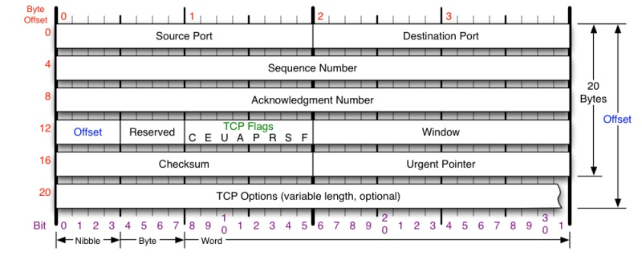


* **Sequence Number**是包的序号seq，**用来解决网络包乱序（reordering）问题。**
* **Acknowledgement Number**就是ACK——用于确认收到，**用来解决不丢包的问题**。
* **Window又叫Advertised-Window**，也就是著名的滑动窗口（Sliding Window），**用于解决流控的**。
* **TCP Flag** ，也就是包的类型，**主要是用于操控TCP的状态机的**。
TCP协议需要解决：顺序问题，丢包问题，连接维护，流量控制，拥塞控制；

TCP用四个元组来表示是同一个连接（src_ip, src_port, dst_ip, dst_port），“连接”其实只不过是在通讯的双方维护一个“连接状态”，让它看上去好像有连接一样。所以，TCP的状态变换是非常重要的。


TCP状态机：  “**TCP建链接**”、“**TCP断链接**”、“**传数据**” 

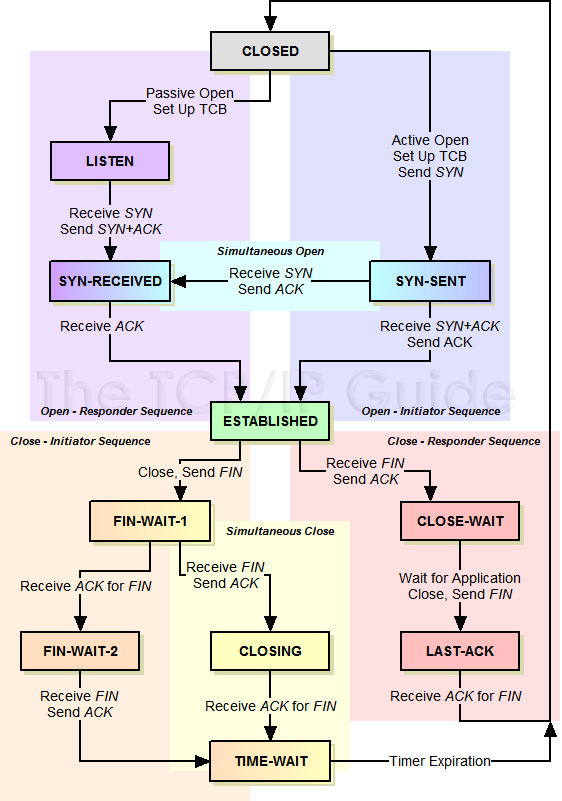


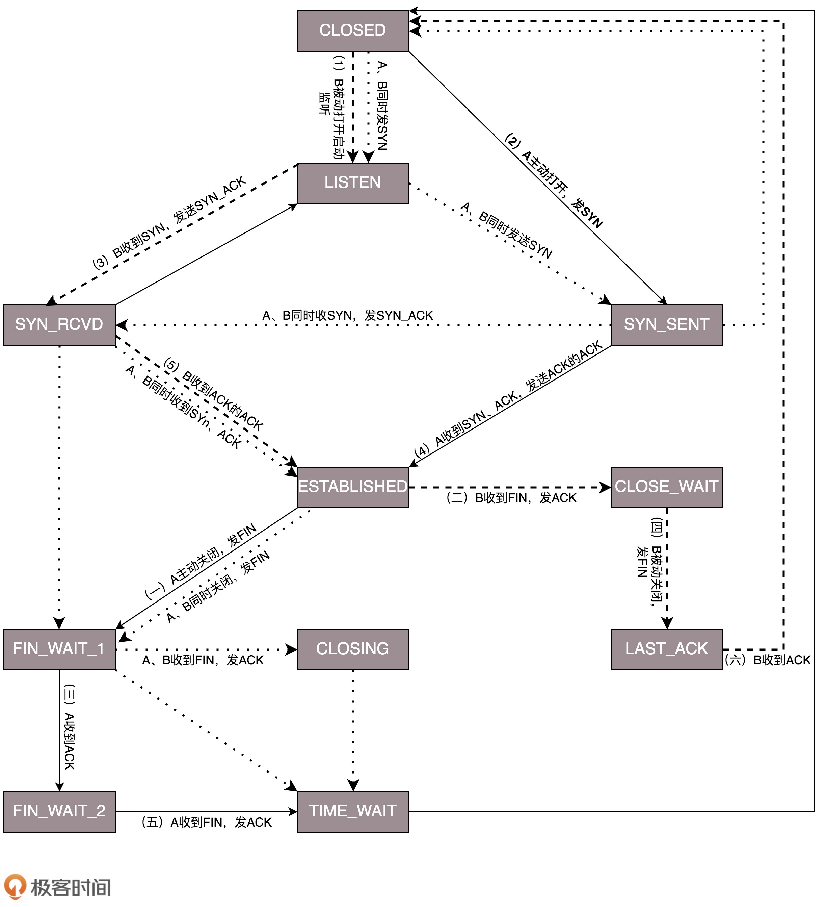


    在这个图中，加黑加粗的部分，是上面说到的主要流程，其中阿拉伯数字的序号，是连接过程中的顺序，而大写中文数字的序号，是连接断开过程中的顺序。加粗的实线是客户端A的状态变迁，加粗的虚线是服务端B的状态变迁。


泳道图：

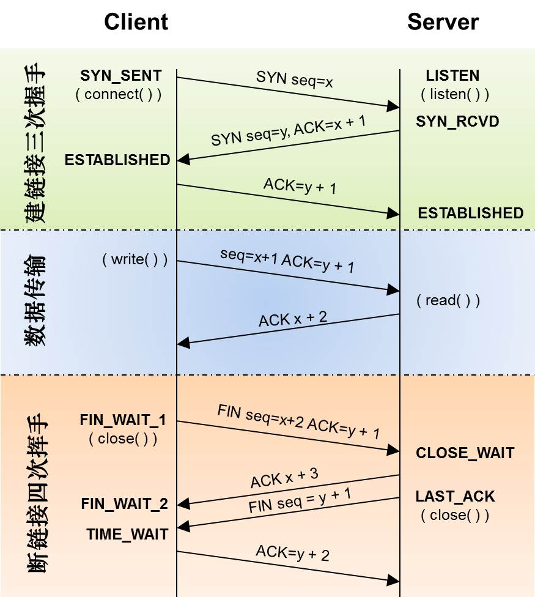


* **对于建链接的3次握手，**主要是要初始化Sequence Number 的初始值。通信的双方要互相通知对方自己的初始化的Sequence Number（缩写为ISN：Inital Sequence Number）——所以叫SYN，全称Synchronize Sequence Numbers。也就上图中的 x 和 y。这个号要作为以后的数据通信的序号，以保证应用层接收到的数据不会因为网络上的传输的问题而乱序（TCP会用这个序号来拼接数据）。
* **对于4次挥手，**其实你仔细看是2次，因为TCP是全双工的，所以，发送方和接收方都需要Fin和Ack。只不过，有一方是被动的，所以看上去就成了所谓的4次挥手。如果两边同时断连接，那就会就进入到CLOSING状态，然后到达TIME_WAIT状态。
* 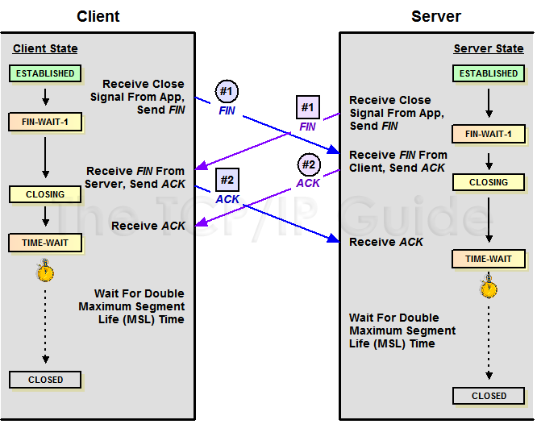

关于建连接时SYN超时

关于SYN Flood攻击

关于ISN的初始化

关于 MSL 和 TIME_WAIT

关于TIME_WAIT数量太多


# 数据传输中的Sequence Number

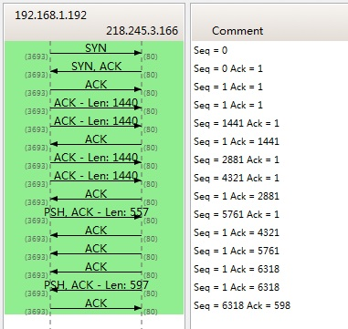


**SeqNum的增加是和传输的字节数相关的**。上图中，三次握手后，来了两个Len:1440的包，而第二个包的SeqNum就成了1441。然后第一个ACK回的是1441，表示第一个1440收到了。


# TCP的RTT算法

用于超时重传，这个超时时间在不同的网络的情况下，无法设置一个死的值，只能动态地设置。 为了动态地设置，TCP引入了RTT——Round Trip Time，也就是一个数据包从发出去到回来的时间。这样发送端就大约知道需要多少的时间，从而可以方便地设置Timeout——RTO（Retransmission TimeOut）

算法：

**a. 经典算法：**

1）首先，先采样RTT，记下最近好几次的RTT值。

2）然后做平滑计算SRTT（ Smoothed RTT）。公式为：（其中的 α 取值在0.8 到 0.9      之间，这个算法英文叫Exponential weighted moving average，中文叫：加权移动      平均） **SRTT = ( α * SRTT ) + ((1- α) * RTT)**

3）开始计算RTO。公式如下：

**RTO = min [ UBOUND,  max [ LBOUND,   (β * SRTT) ]  ]**

其中：

            * UBOUND是最大的timeout时间，上限值
            * LBOUND是最小的timeout时间，下限值
            * β 值一般在1.3到2.0之间。
**b. Karn / Partridge 算法：**

**忽略重传，不把重传的RTT做采样。但是如果网络闪动，突然变慢了，产生了比较大的延时，这个延时导致要重转所有的包（因为之前的RTO很小），因为重转的不算，所以，RTO就不会被更新，这是一个灾难**。 于是Karn算法用了一个取巧的方式——只要一发生重传，就对现有的RTO值翻倍（这就是所谓的 Exponential backoff）

**c. Jacobson / Karels 算法（目前在用）**

    解决前两者加权移动平均算法导致波动被平滑掉的问题。这个算法引入了最新的RTT的采样和平滑过的SRTT的差距做因子来计算。 公式如下：（其中的DevRTT是Deviation RTT的意思）

**SRTT = SRTT + α (RTT – SRTT)**—— 计算平滑RTT

**DevRTT = (1-β)*DevRTT + β*(|RTT-SRTT|)**——计算平滑RTT和真实的差距（加权移动平均）

**RTO= µ * SRTT + ∂ *DevRTT**—— 神一样的公式

（其中：在Linux下，α = 0.125，β = 0.25， μ = 1，∂ = 4 ——这就是算法中的“调得一手好参数”，nobody knows why, it just works…）


# TCP重传机制

目的：

TCP要保证所有的数据包都可以到达，所以，必需要有重传机。

**SeqNum和Ack是以字节数为单位，所以ack的时候，不能跳着确认，只能确认最大的连续收到的包。**

举例：发送端发了1,2,3,4,5一共五份数据，接收端收到了1，2，于是回ack 3，然后收到了4（注意此时3没收到），此时的TCP会怎么办？

## **超时重传机制：**

不回ack，死等3，当发送方发现收不到3的ack超时后，会重传3。一旦接收方收到3后，会ack 回 4——意味着3和4都收到了。此时会引发：接收端虽然4和5即便已经收到了，因为没有ack，发送方也完全不知道发生了什么事。所以发送方可能会悲观地认为也丢了，可能也会导致4和5的重传。

解决方法：

    * 此时一种是仅重传timeout的包。也就是第3份数据。
    * 另一种是重传timeout后所有的数据，也就是第3，4，5这三份数据。

## 快速重传机制：

**引入Fast Retransmit** 的算法，**不以时间驱动，而以数据驱动重传。**

算法：

如果，包没有连续到达，就ack最后那个可能被丢了的包，如果发送方连续收到3次相同的ack，就重传。Fast Retransmit的好处是不用等timeout了再重传。

举例：

如果发送方发出了1，2，3，4，5份数据，第一份先到送了，于是就ack回2，结果2因为某些原因没收到，3到达了，于是还是ack回2，后面的4和5都到了，但是还是ack回2，因为2还是没有收到，于是发送端收到了三个ack=2的确认，知道了2还没有到，于是就马上重转2。然后，接收端收到了2，此时因为3，4，5都收到了，于是ack回6

快速重传示意图：

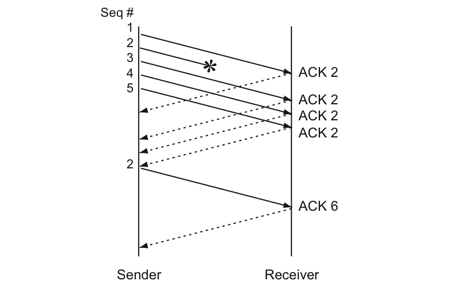


Fast Retransmit只解决了timeout的问题，并未解决后续数据是否全部重传。

## SACK 方法：

**Selective Acknowledgment (SACK)，**这种方式需要在TCP头里加一个SACK的东西，ACK还是Fast Retransmit的ACK，SACK则是汇报收到的数据碎版。（相当于在ack时，待上sack信息，告诉客户端哪些碎片数据已接收到，不需要重传）

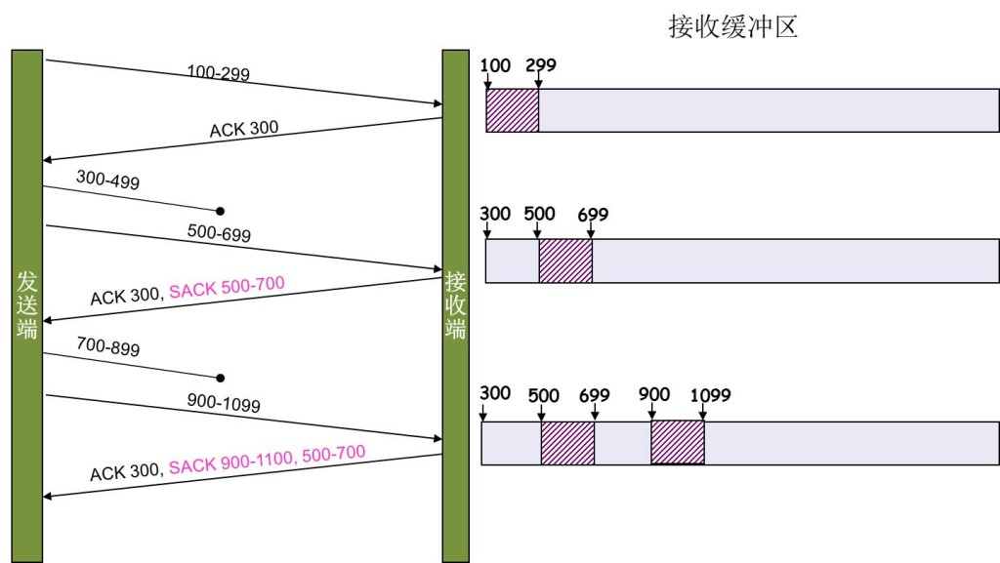


SACK会消费发送方的资源，所以存在**接收方Reneging（所谓Reneging的意思就是接收方有权把已经报给发送端SACK里的数据给丢了）**。这样干是不被鼓励的，因为这个事会把问题复杂化了，但是接收方这么做可能会有些极端情况，比如要把内存给别的更重要的东西。**所以发送方也不能完全依赖SACK，还是要依赖ACK，并维护Time-Out，如果后续的ACK没有增长，那么还是要把SACK的东西重传，另外接收端这边永远不能把SACK的包标记为Ack。**

## Duplicate SACK – 重复收到数据的问题。

又称D-SACK，**其主要使用了SACK来告诉发送方有哪些数据被重复接收了**。

D-SACK使用了SACK的第一个段来做标志，

* 如果SACK的第一个段的范围被ACK所覆盖，那么就是D-SACK
* 如果SACK的第一个段的范围被SACK的第二个段覆盖，那么就是D-SACK

**ACK丢包：**

下面的示例中，丢了两个ACK，所以，发送端重传了第一个数据包（3000-3499），于是接收端发现重复收到，于是回了一个SACK=3000-3500，因为ACK都到了4000意味着收到了4000之前的所有数据，所以这个SACK就是D-SACK——旨在告诉发送端我收到了重复的数据，而且我们的发送端还知道，数据包没有丢，丢的是ACK包。

```plain
  Transmitted  Received    ACK Sent
  Segment      Segment     (Including SACK Blocks)
  3000-3499    3000-3499   3500 (ACK dropped)
  3500-3999    3500-3999   4000 (ACK dropped)
  3000-3499    3000-3499   4000, SACK=3000-3500
                                        ---------
```

**网络延误：**

下面的示例中，网络包（1000-1499）被网络给延误了，导致发送方没有收到ACK，而后面到达的三个包触发了“Fast Retransmit算法”，所以重传，但重传时，被延误的包又到了，所以，回了一个SACK=1000-1500，因为ACK已到了3000，所以，这个SACK是D-SACK——标识收到了重复的包。

这个案例下，发送端知道之前因为“Fast Retransmit算法”触发的重传不是因为发出去的包丢了，也不是因为回应的ACK包丢了，而是因为网络延时了。

```plain
  Transmitted    Received    ACK Sent
    Segment        Segment     (Including SACK Blocks)
    500-999        500-999     1000
    1000-1499      (delayed)
    1500-1999      1500-1999   1000, SACK=1500-2000
    2000-2499      2000-2499   1000, SACK=1500-2500
    2500-2999      2500-2999   1000, SACK=1500-3000
    1000-1499      1000-1499   3000
                   1000-1499   3000, SACK=1000-1500
                                          ---------
```

## D-SACK好处：

1）可以让发送方知道，是发出去的包丢了，还是回来的ACK包丢了。

2）是不是自己的timeout太小了，导致重传。

3）网络上出现了先发的包后到的情况（又称reordering）

4）网络上是不是把我的数据包给复制了。


# TCP滑动窗口：网络流控

目的：

TCP必需要知道网络实际的数据处理带宽或是数据处理速度，这样才不会引起网络拥塞，导致丢包。

window含义：

**这个字段是接收端告诉发送端自己还有多少缓冲区可以接收数据**。**于是发送端就可以根据这个接收端的处理能力来发送数据，而不会导致接收端处理不过来**。

数据结构：

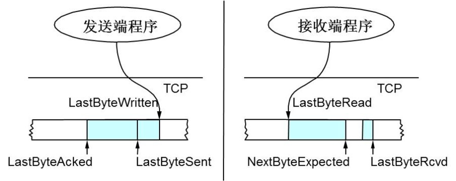


发送方滑动窗口示意图：

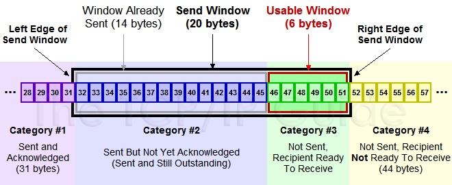
# 

滑动后的示意图（收到36的ack，并发出了46-51的字节）

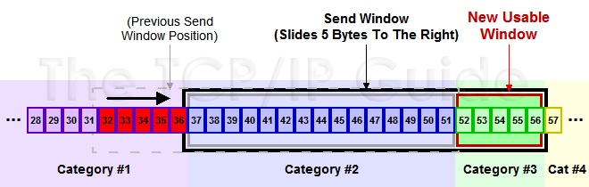


接收端控制发送端窗口大小流程图（数值计算有误）

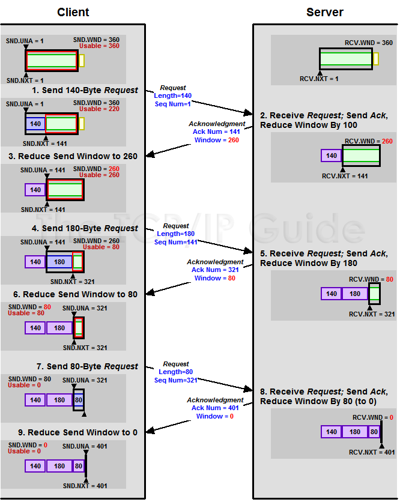
# 

# zero window

当接受端处理缓慢时，发送端的window可能会变为0。如果发送端不发数据了，接收方一会儿Window size 可用了，怎么通知发送端呢？解决这个问题，TCP使用了Zero Window Probe技术，缩写为ZWP，也就是说，发送端在窗口变成0后，会发ZWP的包给接收方，让接收方来ack他的Window尺寸，一般这个值会设置成3次，第次大约30-60秒（不同的实现可能会不一样）。如果3次过后还是0的话，有的TCP实现就会发RST把链接断了。

# Silly Window Syndrome “糊涂窗口综合症” 

### MTU 

    对于以太网来说，MTU是1500字节，除去TCP+IP头的40个字节，真正的数据传输可以有1460，这就是所谓的MSS。

    TCP的RFC定义这个MSS的默认值是536，因为任何一个IP设备都得最少接收576尺寸的大小（实际上来说576是拨号的网络的MTU，而576减去IP和TCP头的40个字节就是536）。

**如果你的网络包可以塞满MTU，那么你可以用满整个带宽，如果不能，那么你就会浪费带宽**。（大于MTU的包有两种结局，一种是直接被丢了，另一种是会被重新分块打包发送） 

### 解决办法：

        a. 如果问题是由Receiver端引起的，那么就会使用 David D Clark’s 方案。

在receiver端，如果收到的数据导致window size小于某个值，可以直接ack(0)回sender，这样就把window给关闭了，也阻止了sender再发数据过来，等到receiver端处理了一些数据后windows size 大于等于了MSS，或者，receiver buffer有一半为空，就可以把window打开让send 发送数据过来。

b. 如果这个问题是由Sender端引起的，那么就会使用著名的 [Nagle’s algorithm](https://en.wikipedia.org/wiki/Nagle%27s_algorithm)。这个算法的思路也是延时处理，他有两个主要的条件：1）要等到 Window Size>=MSS 或是 Data Size >=MSS，2）收到之前发送数据的ack回包，他才会发数据，否则就是在攒数据。

    TCP_CORK其实是更新激进的Nagle算法。完全禁止小包发送，而Nagle算法没有禁止小包发送，只是禁止了大量的小包发送


# TCP 拥塞处理（动态限流）

## 概念：

    因为Sliding Window需要依赖于连接的发送端和接收端，其并不知道网络中间发生了什么。TCP仅仅做到流控并不够，因为流控只是网络模型4层以上的事，TCP的还应该更聪明地知道整个网络上的事。

    TCP通过一个timer采样了RTT并计算RTO，但是，**如果网络上的延时突然增加，那么TCP对这个事做出的应对只有重传数据。但是重传会导致网络的负担更重，于是会导致更大的延迟以及更多的丢包，就可能进入恶性循环而被不断地放大，形成“网络风暴”。**

# cwnd全称Congestion Window

# 拥塞控制主要是四个算法：

* TCP-Tahoe   提出
    * 1）慢启动
    * 2）拥塞避免
    * 3）拥塞发生时的快速重传。
* TCP Reno 在Tahoe的基础上增加
    * 4）快速恢复

**1）慢启动**

慢启动的意思是，刚刚加入网络的连接，一点一点地提速，不要一上来就像那些特权车一样霸道地把路占满。

算法：

1）连接建好的开始先初始化cwnd = 1，表明可以传一个MSS大小的数据。

2）每当收到一个ACK，cwnd++; 呈线性上升

3）每当过了一个RTT，cwnd = cwnd*2; 呈指数让升

4）还有一个ssthresh（slow start threshold），是一个上限，当cwnd >= ssthresh时，就会进入“拥塞避免算法”。

所以，我们可以看到，如果网速很快的话，ACK也会返回得快，RTT也会短，那么，这个慢启动就一点也不慢。

**2）拥塞避免**

**算法：**

前面说过，还有一个ssthresh（slow start threshold），是一个上限，当cwnd >= ssthresh时，就会进入“拥塞避免算法”。一般来说ssthresh的值是65535，单位是字节，当cwnd达到这个值时后

1）收到一个ACK时，cwnd = cwnd + 1/cwnd

2）当每过一个RTT时，cwnd = cwnd + 1

这样就可以避免增长过快导致网络拥塞，慢慢的增加调整到网络的最佳值。很明显，是一个线性上升的算法。


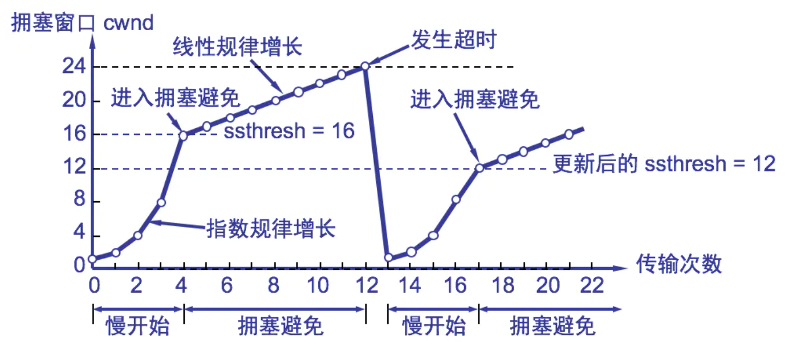


**3）拥塞发生（见上面   TCP重传机制）**

当丢包的时候，会有两种情况：

1）超时重传（TCP Tahoe使用，已废弃）-- 等到RTO超时，重传数据包。TCP认为这种情况太糟糕，反应也很强烈。

    * sshthresh =  cwnd /2
    * cwnd 重置为 1
    * 进入慢启动过程
2）快速重传-- 在收到3个duplicate ACK时就开启重传，而不用等到RTO超时。

    * TCP Reno的实现是：
        * cwnd = cwnd /2
        * sshthresh = cwnd
        * 进入快速恢复算法—— Fast Recovery
上面我们可以看到RTO超时后，sshthresh会变成cwnd的一半，这意味着，如果cwnd<=sshthresh时出现的丢包，那么TCP的sshthresh就会减了一半，然后等cwnd又很快地以指数级增涨爬到这个地方时，就会成慢慢的线性增涨。我们可以看到，TCP是怎么通过这种强烈地震荡快速而小心得找到网站流量的平衡点的。


**4）快速恢复**

**算法：**

  **tcp reno**

快速重传和快速恢复算法一般同时使用。快速恢复算法是认为，你还有3个Duplicated Acks说明网络也不那么糟糕，所以没有必要像RTO超时那么强烈。 注意，正如前面所说，进入Fast Recovery之前，cwnd 和 sshthresh已被更新：

        * cwnd = cwnd /2
        * sshthresh = cwnd
然后，真正的Fast Recovery算法如下：

        * cwnd = sshthresh  + 3 * MSS （3的意思是确认有3个数据包被收到了）
        * 重传Duplicated ACKs指定的数据包
        * 如果再收到 duplicated Acks，那么cwnd = cwnd +1
        * 如果收到了新的Ack，那么，cwnd = sshthresh ，然后就进入了拥塞避免的算法了。
    缺点：**它依赖于3个重复的Acks**。注意，3个重复的Acks并不代表只丢了一个数据包，很有可能是丢了好多包。但这个算法只会重传一个，而剩下的那些包只能等到RTO超时，于是，进入了恶梦模式——超时一个窗口就减半一下，多个超时会超成TCP的传输速度呈级数下降，而且也不会触发Fast Recovery算法了。

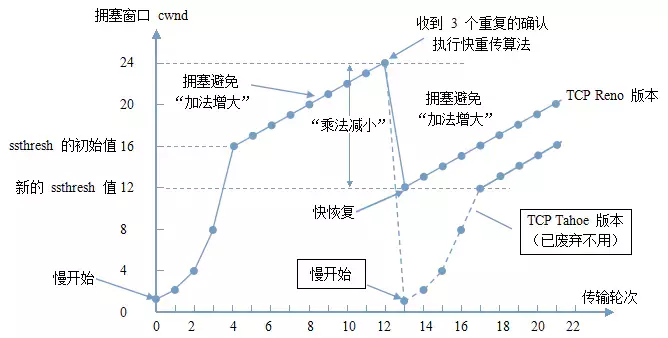


**tcp new reno (无sack)**

    *     当sender这边收到了3个Duplicated Acks，进入Fast Retransimit模式，开发重传重复Acks指示的那个包。如果只有这一个包丢了，那么，重传这个包后回来的Ack会把整个已经被sender传输出去的数据ack回来。如果没有的话，说明有多个包丢了。我们叫这个ACK为Partial ACK。
    * 一旦Sender这边发现了Partial ACK出现，那么，sender就可以推理出来有多个包被丢了，于是乎继续重传sliding window里未被ack的第一个包。直到再也收不到了Partial Ack，才真正结束Fast Recovery这个过程
    延长了Fast Retransmit和Fast Recovery的过程。


## 拥塞控制状态流转图：

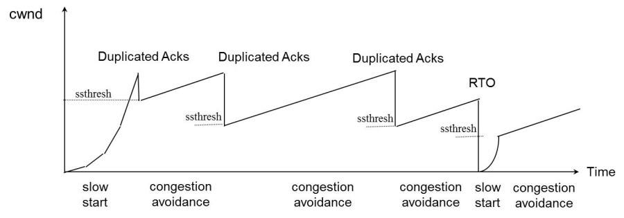


## 拥塞控制其他算法：

* TCP Vegas 拥塞控制算法
* HSTCP(High Speed TCP) 算法
* TCP BIC 算法
* TCP WestWood算法


参考：

1. <<TCP/IP详解，卷一：协议>>
2. [https://www.cnblogs.com/kubidemanong/p/9987810.html](https://www.cnblogs.com/kubidemanong/p/9987810.html)
3. [https://coolshell.cn/articles/11609.html](https://coolshell.cn/articles/11609.html)
4. [https://juejin.im/post/5d7ed78c518825250177933e](https://juejin.im/post/5d7ed78c518825250177933e)
5. [https://blog.csdn.net/q1007729991/article/details/70185266](https://blog.csdn.net/q1007729991/article/details/70185266)


