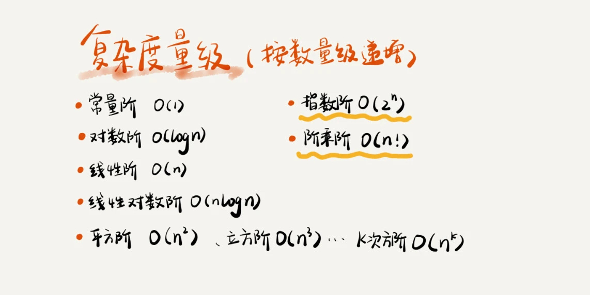
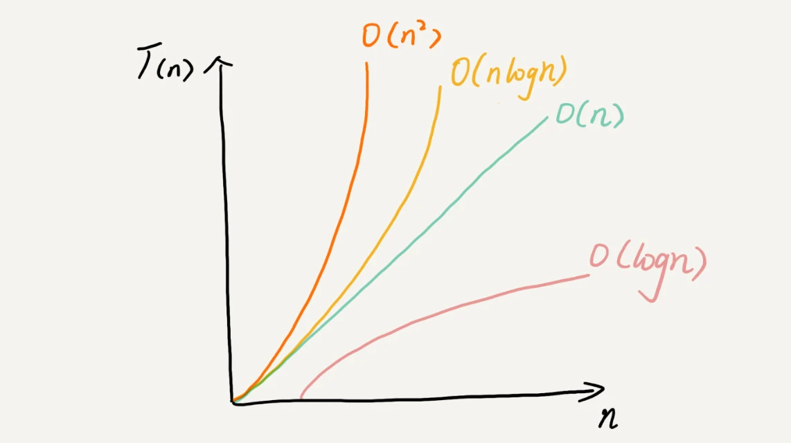

时间复杂度：

  全称是渐进时间复杂度，表示算法的执行时间与数据规模之间的增长关系。

1. 只关注循环执行次数最多的一段代码

2. 加法法则：总复杂度等于量级最大的那段代码的复杂度

3. 乘法法则：嵌套代码的复杂度等于嵌套内外代码复杂度的乘积

常见时间复杂度：

空间复杂度：

  渐进空间复杂度，表示算法的存储空间与数据规模之间的增长关系。我们说空间复杂度的时候，是指除了原本的数据存储空间外，算法运行还需要额外的存储空间。

常见的空间复杂度： 

    O(1)、O(n)、O(n

最好情况时间复杂度

最坏情况时间复杂度

平均情况时间复杂度（也叫加权平均时间复杂度/ 期望时间复杂度）

均摊时间复杂度（类似P99指标）

