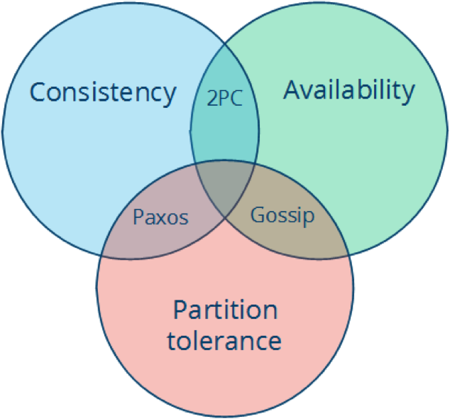
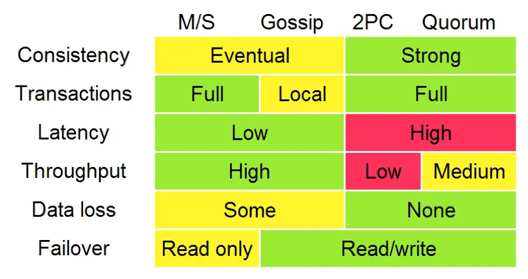

# CAP定理

* **一致性（Consistency）**：每次读取要么获得最近写入的数据，要么获得一个错误。
* **可用性（Availability）**：每次请求都能获得一个（非错误）响应，但不保证返回的是最新写入的数据。
* **分区容忍（Partition tolerance）**：尽管任意数量的消息被节点间的网络丢失（或延迟），系统仍继续运行。
* 这里需要注意的是，CAP定理中的一致性与ACID数据库事务中的一致性截然不同。
* CAP关注的粒度是**数据**，而不是整个系统。
* CAP是忽略网络延迟的。

# 常见组合：

* CA (consistency + availability)，这样的系统关注一致性和可用性，它需要非常严格的全体一致的协议，比如“两阶段提交”（2PC）。CA系统不能容忍网络错误或节点错误，一旦出现这样的问题，整个系统就会拒绝写请求，因为它并不知道对面的那个结点是否挂掉了，还是只是网络问题。唯一安全的做法就是把自己变成只读的。
* CP (consistency + partition tolerance)，这样的系统关注一致性和分区容忍性。它关注的是系统里大多数人的一致性协议，比如：Paxos算法（Quorum类的算法）。这样的系统只需要保证大多数结点数据一致，而少数的结点会在没有同步到最新版本的数据时变成不可用的状态。这样能够提供一部分的可用性。
* AP (availability + partition tolerance)，这样的系统关心可用性和分区容忍性。因此，这样的系统不能达成一致性，需要给出数据冲突，给出数据冲突就需要维护数据版本。Dynamo就是这样的系统。

# 一致性算法：2PC、3PC、Paxos、Raft、ZAB、NWR

