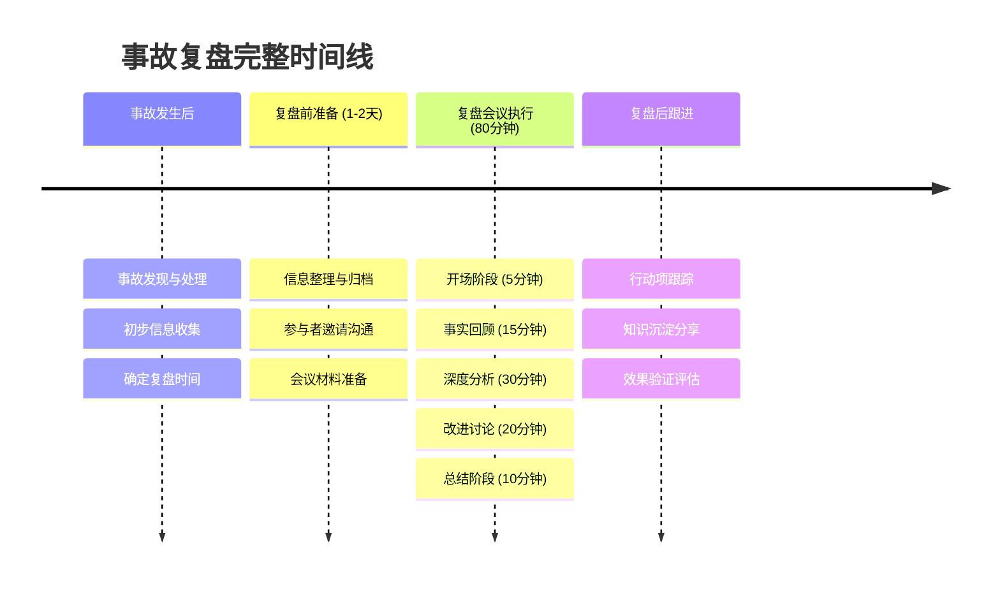

# 事故复盘体系化方案

## 事故复盘时间线流程图



## 复盘流程设计与具体方法

### 一、复盘前准备阶段

#### 信息收集与整理（组织者核心工作）
**具体方法：**
- **建立事故档案模板**
  ```
  事故基本信息表：
  - 事故编号：[自动生成]
  - 发生时间：[精确到分钟]
  - 发现时间：[精确到分钟]
  - 影响范围：[具体业务模块]
  - 影响时长：[分钟/小时]
  - 涉及人员：[角色+姓名]
  - 业务影响：[具体指标]
  ```

- **核心提问清单（5W2H）**
  - **What（发生了什么）**：
    - "请描述一下事故的具体表现是什么？"
    - "用户看到了什么异常现象？"
    - "系统日志显示了什么错误信息？"
  
  - **When（时间节点）**：
    - "事故最早出现的时间点是什么时候？"
    - "什么时候被发现的？"
    - "从发现到解决用了多长时间？"
    - "各个处理阶段的时间节点是什么？"
  
  - **Where（影响范围）**：
    - "哪些系统/模块受到了影响？"
    - "影响的地理区域或用户群体是什么？"
    - "依赖的服务是否也出现了问题？"
  
  - **Who（相关人员）**：
    - "事故处理过程中涉及了哪些角色？"
    - "每个角色的具体职责是什么？"
    - "决策链上的关键人物是谁？"
  
  - **Why（根本原因）**：
    - "直接触发事故的原因是什么？"
    - "为什么会出现这个触发条件？"
    - "更深层次的系统性原因是什么？"
  
  - **How（发生过程）**：
    - "事故是如何逐步演化的？"
    - "处理过程中采取了哪些措施？"
    - "哪些措施有效，哪些无效？"
  
  - **How Much（影响程度）**：
    - "对业务的具体影响是什么？"
    - "用户投诉数量是多少？"
    - "经济损失如何量化？"

#### 参与者准备与氛围营造
**具体方法：**
- **参与者邀请策略**
  - 必须参与者：直接责任人、技术负责人、业务负责人
  - 建议参与者：相关开发、测试、运维人员
  - 可选参与者：产品经理、项目经理
  
- **会议前沟通技巧**
  - 提前1-2天发送事故时间线给所有参与者
  - 单独与直接责任人沟通，缓解心理压力
  - 明确会议目标："学习改进，非指责追责"
  - 强调保密原则，避免信息外泄

### 二、复盘会议执行阶段

#### 开场阶段（5分钟）- 建立基调

**核心要点：**
1. 明确会议目标和原则
2. 营造安全开放的讨论氛围
3. 建立参与规则和期望

**关键技巧：**
1. 使用积极正面的开场白，避免紧张氛围
2. 主动承认不足，树立榜样作用
3. 设置安全机制，保护参与者心理安全

**具体方法：**
- **开场白模板**
  ```
  "大家好，今天我们召开XX事故的复盘会议。
  首先明确一下，这次会议的目的是：
  1. 全面了解事故的来龙去脉
  2. 找出根本原因和系统性因素
  3. 制定具体的改进措施
  4. 避免类似事故再次发生
  
  重要原则：
  - 对事不对人，聚焦问题本身
  - 鼓励开放讨论，不要有顾虑
  - 我们的目标是学习和改进"
  ```

- **建立参与规则**
  - 明确"每个人都有发言权，没有对错之分"
  - 设置"举手发言"或"轮流发言"机制
  - 鼓励"即使想法不成熟也要说出来"
  - 设置"安全词"，任何人感到不适可以喊停

#### 事实回顾阶段（15分钟）- 建立共同认知

**核心要点：**
1. 按时间线梳理事故全过程
2. 确认关键节点和决策点
3. 识别信息缺失和不确定点

**关键技巧：**
1. 使用可视化时间轴，让信息更直观
2. 轮流发言机制，确保全员参与
3. 主动询问和验证，避免信息遗漏

**具体方法：**
- **时间线梳理法**
  ```
  在白板/屏幕上绘制时间轴：
  T-0: 事故发生
  T+5: 首次发现
  T+15: 初步分析
  T+30: 开始处理
  T+60: 问题解决
  T+120: 服务恢复
  ```

- **轮流发言机制**
  - 按座位顺序让每个人补充时间线上的细节
  - 使用"张三，你能补充一下T+15这个时间点发生了什么吗？"
  - 鼓励"还有谁记得这个时间点的其他细节？"

- **信息补充技巧**
  - 主动询问："李四，你当时在做什么？"
  - 鼓励补充："王五，你觉得还有什么遗漏的吗？"
  - 验证信息："大家觉得这个时间线准确吗？"

- **打破沉默的方法**
  - 使用"让我们听听不同的声音"
  - 鼓励"即使是不确定的信息也请说出来"
  - 设置"每人至少说一句话"的规则

#### 深度分析阶段（30分钟）- 挖掘根本原因

**核心要点：**
1. 使用5Why分析法挖掘根本原因
2. 从技术、流程、管理三个层面分析
3. 识别系统性因素和潜在风险

**关键技巧：**
1. 分组讨论，激发不同角度的思考
2. 角色扮演，从不同视角分析问题
3. 头脑风暴，鼓励创新和突破性想法

**具体方法：**
- **5Why分析法实操**
  ```
  主持人："系统为什么会宕机？"
  回答："数据库连接超时"
  主持人："为什么连接会超时？"
  回答："连接池配置不合理"
  主持人："为什么配置不合理？"
  回答："没有进行压力测试"
  主持人："为什么没有压力测试？"
  回答："时间不够"
  主持人："为什么时间不够？"
  回答："项目排期太紧"
  ```

- **分组讨论法**
  - 将参会者分为3-4人小组
  - 每个小组负责一个分析角度（技术/流程/管理）
  - 5分钟后各组汇报讨论结果
  - 鼓励组内不同意见的碰撞

- **角色扮演法**
  - 让不同角色的人从自己角度分析问题
  - "作为开发，你觉得问题出在哪里？"
  - "作为运维，你的看法是什么？"
  - "作为测试，你觉得哪里可以改进？"

- **系统性分析框架**
  - **技术层面**：
    - "这个技术方案的选择是否合理？"
    - "有没有更好的技术方案？"
    - "监控和报警是否覆盖了关键点？"
  
  - **流程层面**：
    - "变更流程是否规范？"
    - "审批环节是否到位？"
    - "回滚机制是否有效？"
  
  - **管理层面**：
    - "资源配置是否合理？"
    - "人员技能是否匹配？"
    - "时间安排是否充足？"

- **头脑风暴技巧**
  - 使用"不评判"原则，鼓励所有想法
  - 设置"每人至少提3个想法"的目标
  - 使用"如果...会怎样？"的假设性问题
  - 鼓励"看似不相关的想法也要说出来"

#### 改进讨论阶段（20分钟）- 制定行动计划

**核心要点：**
1. 制定短期、中期、长期改进措施
2. 责任人主动提出建议和认领任务
3. 建立效果评估和跟踪机制

**关键技巧：**
1. 主动认领机制，让责任人自愿承担任务
2. 创意激发法，鼓励创新和突破性方案
3. 责任驱动法，基于责任范围提出改进建议

**具体方法：**
- **改进措施分类法**
  ```
  短期措施（1周内）：
  - 具体任务1（负责人：，截止时间：）
  - 具体任务2（负责人：，截止时间：）
  
  中期措施（1个月内）：
  - 具体任务1（负责人：，截止时间：）
  - 具体任务2（负责人：，截止时间：）
  
  长期措施（3个月内）：
  - 具体任务1（负责人：，截止时间：）
  - 具体任务2（负责人：，截止时间：）
  ```

- **主动认领机制**
  - 使用"谁愿意负责这个任务？"
  - 鼓励"即使不擅长也可以尝试"
  - 设置"每人至少认领一个任务"的规则
  - 允许"结对子"共同负责

- **责任驱动建议法**
  - 让每个角色基于自己的责任范围提出改进建议
  - "作为开发，你觉得代码质量方面需要哪些改进？"
  - "作为测试，你觉得测试流程上有什么可以优化的？"
  - "作为运维，你觉得监控和部署方面需要哪些改进？"

- **创意激发法**
  - 使用"如果给你无限资源，你会怎么做？"
  - 鼓励"天马行空的想法"
  - 设置"最创新方案"奖励
  - 允许"看似不切实际"的建议

- **建议收集和整理**
  - 让每个人先写下自己的建议（3分钟）
  - 轮流分享建议，其他人可以补充
  - 对相似建议进行合并和优化
  - 按优先级排序，确定最终方案

- **效果评估标准**
  - 量化指标：响应时间、错误率、用户满意度
  - 定性指标：团队能力提升、流程优化程度
  - 验证方法：测试、演练、监控

#### 总结阶段（10分钟）- 固化成果

**核心要点：**
1. 总结关键收获和重要发现
2. 确认行动项和责任人
3. 建立后续跟踪和反馈机制

**关键技巧：**
1. 轮流总结法，让每个人分享收获
2. 承诺确认法，确保责任明确
3. 积极结束，建立团队信心

**具体方法：**
- **总结模板**
  ```
  今天的关键收获：
  1. 技术层面：[具体发现]
  2. 流程层面：[具体发现]
  3. 管理层面：[具体发现]
  
  下一步行动：
  1. [具体任务] - 负责人：[姓名] - 截止时间：[日期]
  2. [具体任务] - 负责人：[姓名] - 截止时间：[日期]
  
  下次复盘安排：
  - 时间：[具体时间]
  - 重点：[检查改进措施落实情况]
  ```

- **轮流总结法**
  - 让每个人用一句话总结今天的收获
  - 使用"今天你最大的收获是什么？"
  - 鼓励"即使是很小的发现也要说出来"
  - 记录每个人的关键收获

- **承诺确认法**
  - 让每个人确认自己的行动项
  - 使用"你能重复一下你的任务吗？"
  - 鼓励"如果有困难，现在就说出来"
  - 建立"互相支持"的氛围

- **反馈收集法**
  - 让每个人给这次复盘打分（1-10分）
  - 收集"下次可以改进的地方"
  - 鼓励"即使是不满也要说出来"
  - 承诺"我们会认真考虑每一条建议"

- **结束仪式**
  - 让每个人说一句鼓励的话
  - 使用"让我们一起努力，避免类似问题"
  - 建立"我们是一个团队"的认同感
  - 以积极正面的方式结束会议

### 三、 复盘后跟进阶段

#### 行动项跟踪（组织者核心工作）
**具体方法：**
- **建立跟踪机制**
  ```
  行动项跟踪表：
  | 任务 | 负责人 | 截止时间 | 当前状态 | 完成度 | 备注 |
  |------|--------|----------|----------|--------|------|
  | 任务1 | 张三 | 2024-01-15 | 进行中 | 60% | 需要支持 |
  | 任务2 | 李四 | 2024-01-20 | 已完成 | 100% | 已验证 |
  ```

- **定期检查技巧**
  - 每周一次进度检查会议
  - 及时识别和解决阻塞问题
  - 调整优先级和资源分配
  - 记录经验教训

#### 知识沉淀与分享