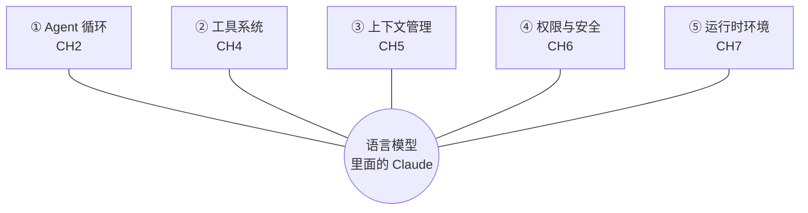
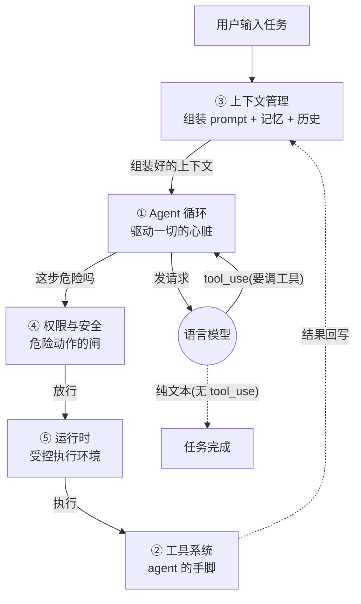
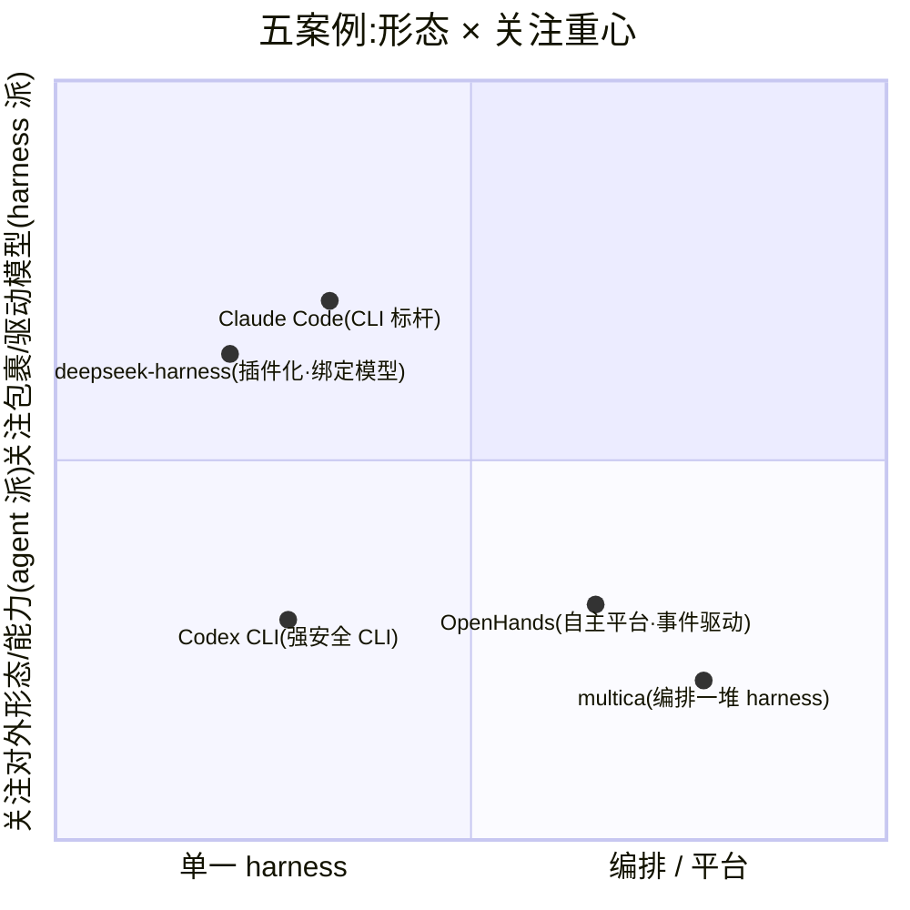

# 到底什么是 harness

开始造之前,先讲清楚你要造的是什么。这一节让你能用一句话定义 harness、说清它的五项职责,并理解一件有意思的事——业界连"harness"这个词都还没统一,而这种分歧恰恰揭示了它的本质。

## 同一层东西,四个名字

先看一个事实:主流项目对"包裹 LLM、让它能干活的那层软件",叫法完全不同。

| 项目 | 用不用 "harness" | 官方原话 |
| --- | --- | --- |
| Claude Code | ✓ 正式定义 | "Claude Code **is the harness**; Claude is the model inside it." |
| deepseek-harness | ✓ 写进名字 | "DeepSeek Harness (dsh) is an open-source **agent harness**." |
| Codex / OpenAI | ✗ 回避 | 叫 "coding agent" / "scaffold" |
| opencode | ✗ 不用 | "The open source **AI coding agent**." |

术语不统一,不是大家糊涂,而是这层软件**太新、边界还在流动**。看懂这四个定义的交集,你就抓住了 harness 的不变内核。

## 最完整的官方定义

Claude Code 官方术语表给了目前最完整的定义,值得逐句拆:

> **Agentic Harness · 官方定义**
>
> The **tools**, **context management**, and **execution environment** that turn a language model into a capable coding agent. Claude Code is the harness; Claude is the model inside it. The harness supplies **file access, shell execution, permission gating, memory loading, and the loop** that chains actions together.

## 从定义拆出五项职责

这句定义直接推导出整门课的结构——每一块职责就是后面的一章:

*模型负责"想",harness 负责让它能"看、做、记、守、跑"。这五块分别对应 CH2(循环)、CH4(工具)、CH5(上下文)、CH6(权限)、CH7(运行时)。*

另一个独立项目 deepseek-harness 的架构文档,列出的核心职责几乎完全一样(agent-loop、tool registry、session log、model adapter、sandbox)。**两个互不相干的项目收敛到同一组职责——这就是 harness 的"最大公约数"。**

## 五项职责如何协作:一台机器，不是五个孤岛

上面那张图讲的是"每项职责对模型做什么"，但它是**轮辐结构**——只画了各职责与模型的关系，没画职责**彼此之间**怎么衔接。而 harness 真正的精髓，恰恰在这些衔接上。下面这张图把五项职责按**真实的数据与控制流**连起来:

*五项职责的真实连线。实线是"一次行动"的传递路径，虚线是闭环回流。看这张图，你就明白它们不是五个并列的部件，而是一条环。*

**三条核心链，把五项职责串成一个闭环:**

- **供数链（谁喂谁）**：`③上下文 → ①循环 → 模型`。上下文管理负责"组装喂给模型的东西"，循环负责"把它发出去"。没有上下文，循环无米下锅。
- **执行链（一次行动怎么传递）**：`①循环 → ④权限 → ⑤运行时 → ②工具`。模型决定调工具后，循环不会直接执行——先过权限闸（该不该做），再进运行时（在哪做），最后才落到工具（怎么做）。**这四棒接力，是 harness 最关键的一段协作。**
- **回流链（闭环）**：`②工具结果 → ③上下文`。工具执行的结果不是终点，而是回写进上下文，成为模型下一轮决策的依据。这个"回流"正是 [CH2](../02-agent循环/ch2-loop-paradigms.md) ReAct 的 observe 环节，也是 agent 能自我纠错的根源。

> **系统视角的一句话**
>
> 循环是**心脏**（驱动节奏），上下文是**血液**（承载信息流动），权限和运行时是**关节与手脚**（把决策变成受控的动作），工具是**触达外界的末端**。任何一环缺失或错位，整台机器就转不起来——这也是为什么后面每一章讲某个职责时，都会回指它在这条环里的位置。

## 从名字反推设计重心

有共识也有分歧。理解"为什么有人不叫它 harness",能让你学会看穿一个项目的重心:

- **Codex 用 "scaffold(脚手架)"**:强调"帮模型发挥的临时支架",重心在**模型**。harness 一词它只留给评测设施。
- **opencode 用 "AI coding agent"**:强调 client/server 架构,重心在"**怎么被多端调用**"。

**关键规律**

> 叫 **harness** 的(CC/deepseek)→ 强调"包裹与驱动模型"。叫 **agent/scaffold** 的(opencode/Codex)→ 强调"对外形态与能力"。读任何新项目,先看它自称什么,基本能猜到它的设计重心。

## 本课的工作定义与边界

> **本课统一采用**
>
> **Harness = 把无状态的语言模型,包裹成有状态、能行动、可循环的 agent 的软件层。**它至少承担五项职责:① agent 循环 ② 工具系统 ③ 上下文管理 ④ 权限与安全 ⑤ 模型交互(含执行环境)。

harness **不是**:模型(那是"里面的 Claude")、prompt 工程(那是喂什么,harness 是决定怎么喂的机制)、编排框架(LangChain 那种是积木库,harness 是完整运行时)、评测 harness(OpenAI 语境里的另一个意思)。

**它擅长**:可验证、可迭代、有明确完成信号的任务(改 bug、加功能、重构)。**不擅长**:目标模糊、无反馈信号、无法验证对错的任务。

## 全景坐标:五个案例

*五案例在"形态 × 关注重心"两维上的定位。这是全课地图——每个案例代表一种取舍组合。*

## 接下来你将学到什么

**四条主线并行**

- **概念**:每个部件的原理与设计问题。
- **任务**:[一条真实任务](lifecycle.md)串起全流程。
- **精读**:五个真实 harness 的源码。
- **动手**:从零造一个能跑的 harness。

学完你能:解剖任意 harness、造一个能跑真实编码任务的 harness、科学改进它、为场景做取舍。

下一站:先看[一条任务的完整生命周期](lifecycle.md),建立全局感,再逐章深入。
