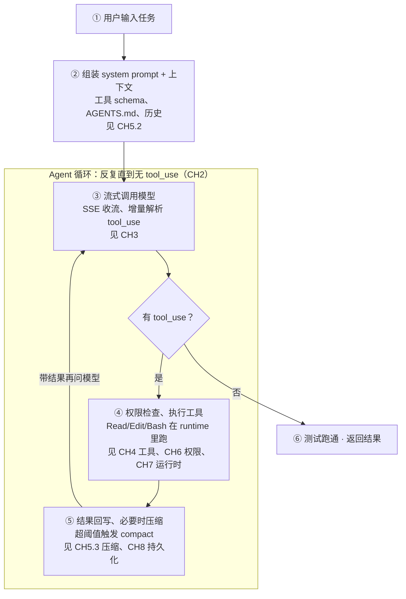

# 一条任务的完整生命周期

在拆开任何单个部件之前,先完整看一遍:当你在终端敲下一句话,harness 内部到底发生了什么。这条任务会贯穿全课——后面每一章,都是把这里的某一步"放大来讲"。

## 这条任务长什么样

我们全程用一个具体、真实的编码任务作为主角。它足够小,能一步步看清;又足够完整,覆盖 harness 的每一个部件:

> **贯穿全课的示例任务**
>
> 项目里有个 `parseDate(s)` 函数,你在终端对 agent 说:
>
> "给 `parseDate` 补一个带时区的单元测试,并确保测试跑通。"

这句话看起来简单,但要完成它,agent 必须:读懂现有代码 → 想清楚测哪些情况 → 写测试文件 → 运行测试 → 看报错 → 修 → 再跑,直到绿。这一连串动作背后,harness 要驱动循环、组装上下文、调用工具、管权限、可能还要压缩历史。下面把这条链路完整走一遍。

## 全流程总览图

这张图是全课的"地图"。每个方块是 harness 的一个环节,右侧标签是它对应的章节——你现在不需要看懂每一步,只要建立"它们如何串成一条链"的整体感。

*一条任务从输入到完成,经过组装上下文 → 循环(调模型 → 解析 → 权限 → 执行 → 回写 → 压缩)→ 完成。标签指向深入讲解该环节的章节。此外,错误处理与恢复(CH9)、可观测与评测(CH10)贯穿全程。*

## 逐步拆解:12 步走完一条任务

下面把上图展开成 12 个具体步骤,配上我们那条 `parseDate` 任务里真实会发生的事。每步末尾标明"深入见哪章"。

| # | 发生了什么 | parseDate 任务里的具体表现 | 深入 |
| --- | --- | --- | --- |
| 1 | 接收用户输入 | terminal 收到"给 parseDate 补时区单测并跑通" | — |
| 2 | 加载记忆与规则 | 读 AGENTS.md/CLAUDE.md,得知项目用 pytest、测试放 tests/ | CH5.2 |
| 3 | 组装 system prompt | 系统提示 + 全部工具的 schema + 记忆 + 历史,拼成首轮输入 | CH5.2 |
| 4 | 流式调用模型 | 发请求,SSE 逐 token 回来,harness 边收边解析 | CH3.1 |
| 5 | 解析出 tool_use | 从流里解析出模型要"读 parseDate 所在文件"的工具调用 | CH3.1 |
| 6 | 权限检查 | 读文件是安全操作 → 放行(若是写/执行则可能要审批) | CH6 |
| 7 | 在运行时执行工具 | FileRead 在受控 runtime 里读出源码,返回给 harness | CH4 · CH7 |
| 8 | 结果回写上下文 | 文件内容作为 tool_result 追加进 messages,再次调模型 | CH2 |
| 9 | 模型决定写测试 | 模型基于源码,生成 FileWrite/FileEdit 调用,写出测试文件 | CH4.2 |
| 10 | 跑测试(危险操作) | 模型请求 Bash 跑 pytest → 触发权限判断 → 在 runtime 执行 | CH6 · CH7 |
| 11 | 看报错→修→再跑 | 测试红了,报错回写,模型改测试再跑——循环若干轮 | CH2 · CH9 |
| 12 | 压缩与完成 | 历史太长则 compact;测试全绿,模型不再调工具 → 自然结束 | CH5.3 · CH8 |

**关键观察**

> 注意第 8→9→10→11 步:这是同一个 **Agent 循环**转了好几圈。每圈 = 一次"调模型→解析→权限→执行→回写"。循环不是跑一次,而是转到模型不再要工具为止——这正是 [CH2](../02-agent循环/ch2-loop-paradigms.md) 要深挖的心脏。而"组装什么喂给模型"(CH5)、"工具怎么定义和执行"(CH4)、"危险操作怎么管"(CH6)、"在哪跑"(CH7),都是这一圈里的某个环节被放大。

## 这张地图怎么用

接下来的每一章,开头都会有一个"回到任务"的小节,把你拉回这张地图,指明"本章讲的是第几步"。这样你永远不会在细节里迷路——你始终知道当前学的部件,在整条链路里处于哪个位置、和前后如何咬合。

建议:**把这一页留在手边**。学完每一章回来看一眼这张图,你对"harness 如何把一句话变成跑通的测试"的理解会越来越立体。

**动手前的自测**

> 合上这一页,试着用自己的话复述:从"用户说一句话"到"测试跑通",中间 harness 转了几圈循环?每圈里工具执行前为什么要先过权限?压缩是在什么时候、为什么发生?能讲清这三点,你就抓住了主干。
