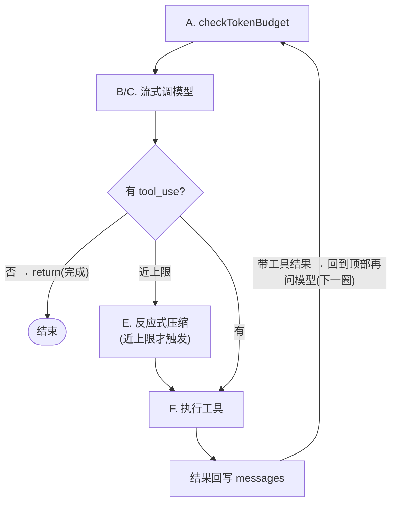

# Claude Code:生成器编排的循环

上一节讲了循环的"设计问题"。这一节钻进 Claude Code 的真实源码,看它如何用一个 `async function*` 生成器,把"调模型 → 解析 → 执行工具 → 回写 → 再问"这一圈优雅地串起来。

> **关于本节源码**
>
> Claude Code 是闭源产品,本节基于其发行包泄露的 source map 还原代码(来源见[附录 C](../15-收尾/appendix.md))。为合规,本节**只讲架构、模块职责、数据流与文件/函数定位**,代码块均为**原创伪代码示意**,不复制真实源码。这足以让你理解设计并自己实现。

## 回到任务

[任务地图](../01-基础/lifecycle.md)第 ③~⑤ 步那圈循环,在 Claude Code 里就是 `src/query.ts` 的 `queryLoop`。我们那条 `parseDate` 任务"读源码→写测试→跑→改"的每一轮,都是这个生成器 `yield` 出一批事件、执行完工具、再转回顶部的过程。

## 整体结构:三层

Claude Code 的循环相关代码集中在 `src/query.ts`(约 1700 行)与 `src/query/` 子目录。它分三层,职责清晰:

| 层 | 位置 | 职责 |
| --- | --- | --- |
| **入口** | `query.ts` → `query()` | 导出的 async generator,对外的统一入口;做初始化、异常兜底,把驱动权交给 queryLoop |
| **驱动器** | `query.ts` → `queryLoop()` | `while(true)` 主循环;每圈调模型、流式产出、收集 tool_use、执行、回写、判停 |
| **决策件** | `query/tokenBudget.ts` · `query/stopHooks.ts` · `query/config.ts` | 可插拔的终止/预算/停止钩子判断,从主循环里抽出来单独管 |

`src/query.ts` 里能看到 `export async function* query(...)` 和内部的 `async function* queryLoop(...)`——前者是门面,后者是发动机。把驱动逻辑单独抽成 `queryLoop`,好处是入口层可以专注做异常兜底与初始化,循环体保持纯粹。

## queryLoop 逐圈拆解

把 `queryLoop` 的控制流抽象成伪代码(变量名与结构为教学还原,非原码):

```javascript
async function* queryLoop(state) {
  while (true) {
    // A. 每圈开头:判预算/停止钩子,决定要不要继续
    const decision = checkTokenBudget(state)
    if (decision.action === 'stop') return decision.completionEvent

    // B. 通知外层"要开始一轮模型请求了"(流式起点)
    yield { type: 'stream_request_start' }

    // C. 流式调模型,边收边解析出 tool_use
    const toolUses = []
    for await (const chunk of streamModel(state.messages, state.tools)) {
      yield chunk                       // 文本增量实时给 UI
      if (isCompleteToolUse(chunk)) toolUses.push(chunk)
    }

    // D. 没有工具调用 → 模型只说话 → 任务自然完成
    if (toolUses.length === 0) return

    // E. 上下文快满?先压缩再继续(反应式 compact)
    if (isReactiveCompactEnabled() && nearLimit(state))
      state.messages = await tryReactiveCompact(state)   // → CH5.3

    // F. 执行工具(可并发),结果 yield 回去 + 追加进 messages
    for await (const result of StreamingToolExecutor(toolUses, state)) {
      yield { type: 'tool_result', result }   // → CH4 执行 / CH6 权限
      state.messages.push(toToolResultMsg(result))
    }
    // G. 回到顶部,带着工具结果再问模型
  }
}
```

这段结构里,每个环节都对应后面的一章:C 段流式解析是 [CH3](../03-模型交互/ch3-io-streaming.md);E 段压缩是 [CH5.3](../05-上下文/ch5-ctx-compact.md);F 段工具执行与权限是 [CH4](../04-工具系统/ch4-tools-claude-code.md)/[CH6](../06-权限安全/ch6-perm-principles.md)。**循环是把它们串起来的主干**。



*图 2.2-1:queryLoop 一圈:判预算 → 流式调模型 → 判有无 tool_use →(近上限则压缩)→ 执行工具 → 回写 → 带结果回到顶部。无 tool_use 则 return 结束。*

## 四类 yield 事件:生成器的"对外语言"

生成器最妙的地方是:它不直接操作 UI,而是 `yield` 出一串**事件**,让外层(终端 UI、SDK、上层编排)自己决定怎么消费。`src/query.ts` 里能看到几类事件类型:

| 事件 type | 含义 | 外层怎么用 |
| --- | --- | --- |
| `stream_request_start` | 一轮模型请求开始 | UI 显示"思考中"、开始计时 |
| (流式文本 chunk) | 模型输出的增量 token | 逐字渲染到终端 |
| `tool_result` | 一个工具执行完的结果 | 渲染工具卡片、更新状态 |
| `max_turns_reached` | 达到最大轮数上限 | 提示用户、停止 |
| `tombstone` | 收尾/终结标记 | 清理、结束会话 |

**为什么用生成器**

三个好处:① **流式与控制流统一**——`yield` 让"边生成边渲染"和"边解析边收集工具"写在同一段线性代码里,不用回调地狱。② **可组合**——`yield*` 把子过程(执行工具、子 agent)的事件透传给上层,循环可嵌套而代码仍线性。③ **背压天然**——生成器是拉模式,上层消费多快循环就推进多快。

## 何时停:token 预算与停止钩子

循环的"何时停"(设计问题二)被 Claude Code 抽成独立文件 `src/query/tokenBudget.ts`。它导出一个决策函数,返回 `continue` 或 `stop`:

```typescript
// 返回联合类型:继续 或 停止
type Decision = { action: 'continue' } | { action: 'stop', completionEvent }

function checkTokenBudget(state): Decision {
  if (state.turns >= state.maxTurns)  return { action: 'stop', completionEvent: maxTurnsEvent }
  if (state.budget.remaining() <= 0)  return { action: 'stop', completionEvent: null }
  return { action: 'continue' }
}
```

此外 `src/query/stopHooks.ts` 提供可配置的"停止钩子",`src/utils/QueryGuard.ts` 做循环卫生(防空转)——这些都在 [CH9](../09-错误处理/ch9-errors.md) 深入。把"何时停"从主循环抽出来单独管,是保持 `queryLoop` 主体清爽的关键设计。

**一个真实细节:反应式压缩在循环里**

注意伪代码 E 段:Claude Code 在循环内判断上下文是否接近上限(`isReactiveCompactEnabled` / `tryReactiveCompact`),必要时先压缩再继续下一圈。**压缩不是外挂,而是循环的一环**——这解释了为什么长任务能一直跑不炸([CH5.3](../05-上下文/ch5-ctx-compact.md) 详解 compact 子系统)。

## 设计取舍

> **生成器内联的取舍**
>
> **得**:代码线性可读、流式交织优雅、低延迟、单进程简单。非常适合 CLI——单用户、就在你终端里跑。
> **失**:控制流"锁"在生成器调用栈里,想做"跨进程持久化/中途接管/分布式"就别扭(状态在栈上,不在总线上)。
>
> 这正是下一节 OpenHands 用事件驱动换取的东西——它把控制流搬到总线上,牺牲一点简洁,换来可回放、可接管、可分布式。

## 本节小结

> **要点**
>
> 1. Claude Code 循环 = `query()` 门面 + `queryLoop()` 生成器驱动 + 抽出的决策件(tokenBudget/stopHooks)。
> 2. 一圈 = 判预算 → 流式调模型 → 判 tool_use →(近上限则压缩)→ 执行工具 → 回写 → 回顶。
> 3. 生成器 `yield` 事件给外层消费,实现流式与控制流统一、可组合、天然背压。
> 4. "何时停"被抽成独立文件;压缩是循环内的一环,不是外挂。
> 5. 取舍:简洁+低延迟(适合 CLI),代价是难做跨进程接管——引出下一节 OpenHands。
