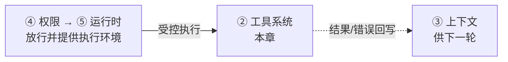
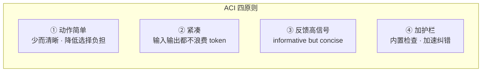

# ACI 理念与 MCP

循环让 agent 会"想",工具让它能"做"。但工具不是随便包个函数就行——为 agent 设计的接口(ACI),和为人设计的命令行,是两回事。这一节讲清工具设计的第一性原则,以及为什么模型接口设计本身就是一根能力杠杆。

> **回到任务**：[任务地图](../01-基础/lifecycle.md)第 ⑦、⑨ 步："执行工具""模型决定写测试"。`parseDate` 任务里 agent 要读文件、写测试、跑 pytest——这些能力全靠工具提供。工具设计得好不好,直接决定 agent 能不能高效完成任务。这一章就讲怎么设计好工具。

**本章在系统中的位置**



*工具是执行链的末端:上游是权限放行、运行时提供的受控环境，工具在其中真正"动手"；执行完的结果回写进上下文，闭合 ReAct 的 observe 环节。它是 agent 触达外界的末端（[全景协作图见 intro](../01-基础/intro.md)）。*

## 工具是 agent 的手脚

一个工具在 harness 里有两半：

- **schema**：给模型看的说明书——工具叫什么、干什么、要哪些参数。模型据此决定何时调、传什么。
- **执行函数**：真正干活的代码——读文件、跑命令、调 API。

你在 CH2 已经写过一个 `read_file`。但当工具从 1 个变成 40 个、从"读文件"变成"跑任意 bash",设计的讲究就来了。

## ACI：为 agent 设计接口,而不是复用人的接口

核心理念来自 SWE-agent（Princeton/Stanford,arXiv 2405.15793）：**Agent-Computer Interface（ACI）**。

> **核心洞察**：LM agent 是一类**新的终端用户**。就像我们为人类精心设计 IDE、GUI,也应该**专门为 agent 设计接口**,而不是让它复用为人设计的命令（cd/ls/cat/grep）。

为什么不能直接把 shell 甩给模型？`cat` 一个大文件会**淹没上下文**；`grep` 吐几百行信噪比极低；`sed` 报的语法错模型看不懂怎么改。为人优化的接口,对 agent 往往是毒药。



*图 4.1-1：SWE-agent 提出的 ACI 四原则。原则 4（护栏）被消融实验证明贡献显著。*

> **消融证据：接口设计是能力杠杆**
>
> SWE-agent 论文用消融实验证明：去掉专用编辑器 → 成功率 **-7.7%**；去掉 linting 护栏 → **-3.0%**。**同一个模型,只改工具接口,成功率就明显变化**。这说明 harness 的工具设计不是模型能力的附庸,而是一根独立的能力杠杆——这也是为什么本章值得单独深挖。

## Anthropic《Writing Tools for Agents》的工程清单

Anthropic 官方博客给出与 ACI 呼应的实操原则：

- **工具少而精**：重叠的工具让模型选择困难。
- **合并多步**：总要连着调 3 个工具的,考虑合并成 1 个。
- **命名空间前缀**：`github_create_issue` 而非裸 `create`,避免混淆。
- **返回高信号结果**：用人类可读的名字而非 UUID；只返回下一步真正需要的信息。
- **错误能指导纠错**：报错要说"错在哪、怎么改",而非甩个栈。（你在 CH2 的 `read_file` 里已经这么做了——返回 `"错误:{e}"` 而非抛异常。）

> **学界与工业界的共识**：SWE-agent 的学术四原则和 Anthropic 的工程清单,**独立收敛到了同一组结论**。这不是巧合——它反映了"为 agent 设计接口"这件事的客观规律。记住这组原则,你设计任何工具都有了标尺。

## MCP：工具的"USB 接口"

**MCP（Model Context Protocol）** 已成为工具扩展的事实标准。本课五个案例几乎全支持：Claude Code、OpenHands、deepseek-harness（`mcp/` 包）、multica（`runtime_mcp.go` 桥接）。

它的意义：工具不必都内建在 harness 里,可以通过外部 MCP server 挂进来。harness 只需实现**"内置核心工具 + MCP 扩展"**两层,工具生态就和 harness 本体解耦了——就像电脑不用内置所有外设,留个 USB 口即可。

> **内置 vs MCP 扩展**
>
> **内置工具**：性能好、能深度定制护栏（如 BashTool 的 AST 安全分析）,但改动要发版。**MCP 工具**：即插即用、生态共享,但多一层进程/协议开销,护栏能力受限。实战：核心高频、需强护栏的工具内置（读写/执行）；长尾、领域特定的走 MCP。

**MCP 工具怎么进循环**

从 harness 的角度，接入一个 MCP server 只做三件事，模型全程无感：

```python
# 1. 启动时：握手 + 发现工具
for server in config.mcp_servers:          # 读配置里的 MCP server 列表
    conn = connect(server)                  # 建立连接（stdio / SSE）
    remote_tools = conn.request("tools/list")  # 拉取该 server 暴露的工具 schema

    for t in remote_tools:
        name = f"{server.name}__{t.name}"   # 加命名空间前缀，防重名
        tool_registry[name] = MCPProxy(conn, t.name)  # 注册成一个代理工具

# 2. 组装 system prompt 时：MCP 工具 schema 和内置工具 schema 合并成一份清单
# 3. 循环里模型发 tool_use 时：按前缀路由
#    - 无前缀 → 本地执行内置工具
#    - 有前缀 → 转发给对应 server 的 tools/call，结果按同样格式回写
```

关键洞察：**模型看到的是一份统一的工具清单，分不清（也不需要分清）哪个是内置、哪个来自 MCP**。这正是"USB 口"的价值——对上（模型）透明，对下（工具来源）解耦。

**代价一：命名空间与"工具过多"**

MCP 让"加工具"变成配置而非写代码，副作用是**太容易加了**。连 3-5 个 MCP server，工具清单轻松涨到几十上百个，直接违反 ACI 原则 2（紧凑）——撑爆上下文、模型选择困难。生产实践：

- **加前缀防撞名**（`github__search` vs `slack__search`）。
- **按需/分阶段加载**，不要把所有 server 的工具一次性全塞进 system prompt。
- **对连接新 server 保持保守**——即插即用是把双刃剑。

**代价二：MCP 工具在信任边界之外**

内置工具是你自己写的，MCP server 往往是第三方进程。这带来三重新风险（详见 [CH6](../06-权限安全/ch6-perm-principles.md)）：

| 风险 | 说明 |
| --- | --- |
| 绕过护栏 | MCP 工具在自己进程里执行，跳过你内置的 AST 安全分析等护栏——harness 需对 MCP 调用**统一过权限闸** |
| 结果即注入面 | MCP 返回值直接进上下文，恶意 server 可在输出里夹指令操纵模型——**MCP 结果要当不可信数据**（prompt injection，见 CH6） |
| 供应链 | 接一个不明来源的 server = 在你的循环里跑别人的代码——凭证按最小权限授予，只连可信来源 |

一句话：**MCP 把"加工具"从写代码降成配置，极大降低扩展成本；但因为它把工具挪到了信任边界之外，权限闸和"结果当不可信数据"这两条对 MCP 工具比对内置工具更重要。**

### 本地调用 vs 远程 MCP：架构差异一览

内置工具是**本地函数调用**，远程 MCP 是**跨进程/跨网络的 RPC（Remote Procedure Call，远程过程调用）**。这个本质区别，让远程 MCP 把一整套分布式系统的老问题重新带了回来：

| 维度 | 本地工具 | 远程 MCP 工具 |
| --- | --- | --- |
| 进程边界 | 同进程/子进程 | 独立进程，常跨网络 |
| 调用开销 | 函数调用，近乎零 | 序列化 + 网络往返（stdio / HTTP+SSE） |
| 失败模式 | 异常、超时 | 异常、超时、**连接断开、server 崩溃** |
| 重试 | 简单重试即可 | 需指数退避 + 幂等考量（呼应 [CH3.2](../03-模型交互/ch3-io-reliability.md)） |
| 超时 | 短超时够用 | 要更宽松超时 + **熔断**（呼应 [CH13](../13-生产化/ch13-production.md)） |
| 可观测 | 本地日志 | 需**跨进程 trace**，串起调用链 |
| 护栏 | 可深度定制（如 AST 分析） | 只能靠 harness 侧**统一权限闸**兜底 |

> **一句话记住**
>
> 远程 MCP 本质是"把工具调用变成一次 RPC"——所以凡是分布式系统会遇到的（超时、重试、熔断、部分失败、可观测），远程 MCP 一个都躲不掉。选型时问自己：这个工具值不值得为它承担一层网络的复杂度？高频、强护栏的留本地；长尾、领域特定的才走远程。

## 本节小结

1. 工具 = **schema（给模型看）+ 执行函数（真干活）**。
2. **ACI**：为 agent 设计接口,别复用为人设计的命令。四原则：简单、紧凑、高信号反馈、护栏。
3. 消融证据：**接口设计是独立能力杠杆**（去编辑器 -7.7%,去 linting -3%）。
4. 学界（SWE-agent）与工业界（Anthropic）独立收敛到同一组原则。
5. **MCP** 是工具的 USB 口,让工具生态与 harness 解耦。下一节看 Claude Code 怎么把这些落进 42 个真实工具。
