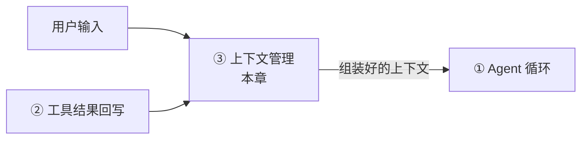
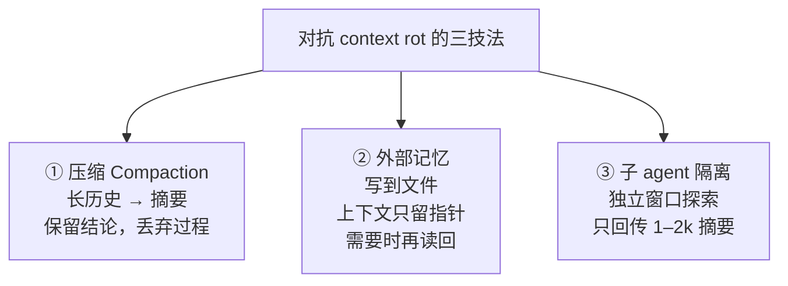

# context rot 与三大技法

CH4 结束时 tinyharness 有个致命隐患：它把每一轮的历史无限堆进上下文。长任务必然撑爆或跑偏。这一章解决它。上下文管理是 harness 最深的护城河——循环好写，但"喂什么给模型"是拉开差距的地方。

> **回到任务**
> [任务地图](../01-基础/lifecycle.md)第 ⑤/⑫ 步"必要时压缩"。`parseDate` 任务里 agent 读了源码、跑了几轮测试、看了几屏报错——这些全堆在上下文里。跑到第十几轮，要么超出窗口崩溃，要么模型被噪声淹没、忘了最初目标。上下文管理就是让长任务能一直清醒地跑下去。

**本章在系统中的位置**

*上下文管理是"供数链"的源头:它汇聚用户输入 + 工具结果回写，组装成喂给循环的输入。它像血液——承载全系统的信息流动；工具结果回流到这里，正是闭环的落点（[全景协作图见 intro](../01-基础/intro.md)）。*

## 为什么是"最深的护城河"

回忆 CH2：核心循环可能就 300 行。那 harness 的真正难度在哪？**大半在上下文管理。** 一个 agent 跑长任务会产生海量中间信息：读过的文件、跑过的命令输出、报过的错、试过的方案。全塞进去会有两个后果：

- **撑爆窗口**：超出模型上下文长度上限，直接报错。
- **context rot（上下文腐烂）**：即使没爆，上下文越长、噪声越多，模型抓重点的能力越差、越容易跑偏。

> **上下文管理的目标（Anthropic）**
> 找到**最小的高信号 token 集**——用尽量少的 token，承载模型下一步真正需要的信息。这是一门"减法艺术"。

## context rot 是真实的

很多人以为"上下文窗口越大越好，塞满就行"。错。**长上下文会稀释模型的注意力**——相关信息淹没在无关历史里，模型可能忽略关键约束、重复已做的事、忘记最初目标。这不是容量问题，是信噪比问题。所以哪怕窗口够大，也要主动做减法。

## Anthropic 三大技法

出自 Anthropic《Effective Context Engineering》（官方工程博客）。三招从不同角度做减法：

*图 5.1-1：三大技法从不同角度做减法。生产级 harness 通常三者叠加使用。*

- **① 压缩（Compaction）**：把一段冗长历史（尤其旧工具输出）总结成简短摘要替换原文。保留结论，丢弃过程。（5.3 深剖 Claude Code 的 compact 子系统）
- **② 外部 note-taking（文件即记忆）**：别把所有东西留在上下文，让 agent 写到外部文件，需要时读回。上下文只留"指针"。
- **③ Sub-agent 隔离**：把子任务丢给子 agent，它在独立窗口里探索（读一堆文件、试一堆命令），完成后只回传 1-2k token 摘要。主 agent 上下文不被子任务过程污染。（→ [CH12](../12-多agent/ch12-multi-agent.md)）

## Manus 手艺：更具体的工程招数

出自 Manus《Context Engineering for AI Agents》。如果说 Anthropic 讲"原则"，Manus 讲"手艺"：

- **KV-cache 友好**：前缀要稳定。每轮改开头（如插时间戳）会让缓存全失效（CH3.2 讲过）。稳定的放前面，变动的放后面。
- **Mask, Don't Remove**：某工具当前不该用时，别从工具列表删掉（破坏缓存和历史一致性），用 logit masking 屏蔽。
- **文件系统即外部记忆**：与 Anthropic ② 呼应，把文件系统当 agent 无限容量的外部内存。
- **Recitation（复述）**：维护一个 `todo.md`，不断把目标和进度复述到上下文末尾，防止长任务中注意力漂移。
- **保留错误痕迹**：别擦掉失败尝试。把"试了 X 报了 Y 错"留着，模型据此避免重蹈覆辙。反直觉但关键。（呼应 CH2.1 的 Reflexion）

> **一条最容易被忽视的：KV-cache**
> KV-cache 友好性对成本和延迟的影响最大，却最常被忽视。你的 tinyharness 如果每轮在 messages 开头插入变动内容，缓存命中率就是 0，成本翻几倍。**把 system prompt、工具 schema、项目记忆这些不变的放最前面**——这正是下一节"system prompt 组装"要处理的顺序问题。

## 三类上下文：为什么必须分开管

前面讲的都是"上下文整体"怎么管。但真要做对，还得先看清：上下文不是一锅粥，它由**三种来源、三种信任级别、三种生命周期**完全不同的内容拼成。分不清它们，是长任务翻车的常见根因。

| 类型 | 来源 | 信任级别 | 生命周期 |
| --- | --- | --- | --- |
| **系统上下文** | harness 自己注入：system prompt、工具 schema、项目记忆 | 完全可信（你写的） | 稳定，跨轮不变 |
| **用户上下文** | 用户输入的任务、追问 | 较可信（但可能误导） | 随对话累积 |
| **工具上下文** | 工具返回：文件内容、命令输出、MCP 结果 | **不可信**（可能藏注入） | 一次性，可压缩/丢弃 |

**为什么必须分开：三个维度都不同**

- **信任不同** → 工具上下文可能藏 prompt injection（见 [CH6](../06-权限安全/ch6-perm-principles.md)），必须当"数据"而非"指令"隔离标注；系统上下文才是唯一权威指令源。混在一起，模型就分不清"谁在下命令"。
- **稳定性不同** → 系统上下文要放最前面吃满 KV-cache；工具上下文频繁变动，只能放后面。混排会让缓存命中率崩掉（上一条已讲）。
- **生命周期不同** → 压缩（compact）时，工具上下文（尤其大段命令输出）是首选压缩/丢弃对象；系统上下文和用户任务必须保留。不区分就压，要么误删关键指令，要么留着一堆没用的旧输出。

> **混在一起的典型故障**
>
> 把三类上下文当成同质文本平铺，会引出三个经典 bug：① **注入越权**——文件里一句"忽略之前指令"被当成系统指令执行；② **缓存击穿**——工具输出插在前面，每轮缓存全失效，成本翻倍；③ **压缩误伤**——一刀切截断，把用户的原始任务或系统规则也切掉了，agent 突然"失忆跑偏"。分开管，这三个问题在源头上就不会发生。

## 本节小结

1. 上下文管理是 harness 最深的护城河，目标是"**最小的高信号 token 集**"。
2. 两大威胁：**撑爆窗口** + **context rot**（长上下文稀释注意力）。
3. **Anthropic 三技法**：压缩、外部记忆、子 agent 隔离。
4. **Manus 手艺**：KV-cache 友好、Mask-Don't-Remove、Recitation、保留错误痕迹。
5. 减法是分层的：能压则压、能外置则外置、能隔离则隔离，生产级往往多技法叠加。
