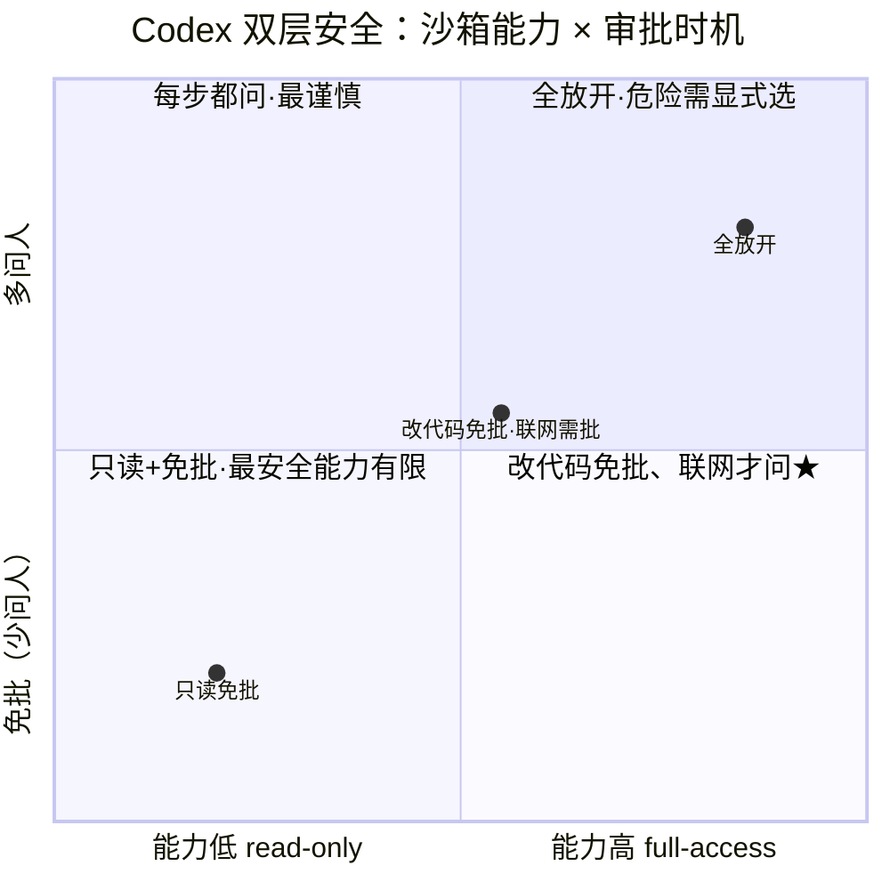

# Codex 的双层安全模型

6.1 说安全是"审批 × 沙箱"两层。Codex CLI 把这个思想做成了业界最完备的实现：两个正交的维度协同，让 agent 能"改代码时自由、联网时才问你"。这一节拆开这个二维模型。

> **关于本节**：Codex CLI 为开源项目（Apache-2.0，`github.com/openai/codex`，Rust）。本节基于其公开配置与文档讲解安全模型设计。

> **回到任务**：[任务地图](../01-基础/lifecycle.md)第 ⑥/⑩ 步。`parseDate` 任务里，你希望 agent 改代码、跑测试都别打扰你，但如果它突然要联网下载什么，你想被问一下。Codex 的双层模型正好能表达这种"分级信任"。

## 关键洞察：两个正交轴，不是一个滑块

新手常把安全想成一个滑块（松 ←→ 紧）。Codex 的设计告诉你：它是**二维**的——"能力上限"和"自主边界"是两个独立的轴，分别调。

- **轴一 · `sandbox_mode`**：沙箱允许 agent 做什么（能力上限）。
- **轴二 · `approval_policy`**：agent 在多大范围内可以不问人（自主边界）。

*图 6.2-1：横轴 sandbox_mode（能力上限）× 纵轴 approval_policy（自主边界）。星标区示范"改代码自由、联网才问人"——两轴独立配置才能表达这种精细策略。*

## 轴一：sandbox_mode 三档

| 档位 | 能力 | 适用 |
| --- | --- | --- |
| `read-only` | 只能读，不能改任何东西 | 代码审查、分析，最安全 |
| `workspace-write` | 能改工作区；工作区外只读；**网络默认禁** | 日常开发，平衡点 |
| `danger-full-access` | 完全放开 | 特殊场景，需显式选择 |

技术实现：macOS 用系统级沙箱 **Seatbelt** 强制这些边界。注意 `workspace-write` 里**网络单独禁**——这直接呼应 6.1 说的"网络是头号高危通道"。

## 轴二：approval_policy

这一轴控制"agent 遇到什么情况要停下来问你"。典型策略：从不问（全自动）、只在危险操作时问、每步都问。它和沙箱**独立**——同样是 `workspace-write` 沙箱，你可以配"改代码免批，但联网要批"。

**为什么要两轴独立**：如果只有一个滑块，你没法表达"改代码可以放手、但联网必须问我"这种精细策略——因为"改代码"和"联网"在一个滑块上分不开。两轴独立后：沙箱定能力上限（联网这档默认关），审批定在允许范围内哪些还要额外确认。**组合出的策略空间，远比单滑块丰富。**

## 协同：那个"星标区"

回到图里的星标区——这是最常用、也最能体现设计精妙的配置：

**workspace-write + 联网需批 = 既自主又安全**。agent 可以自由读写工作区代码、跑测试（沙箱允许，审批放行）——你不会被 pytest 每次都打扰。但它一旦想联网（沙箱这档默认禁），就得请求你批准。

对 `parseDate` 任务：整个"读→写→跑→改"流程丝滑无打扰；而如果 agent 被某个 injection 诱导要往外发数据，这道网络闸立刻拦下并问你。**自主性和安全性，在这个组合里同时拿到了。**

还有一个工程细节：Codex 的配置是**分层**的（CLI flags → 项目 `.codex/config.toml` → 用户 → 系统），团队能在项目里固定安全基线，个人再按需微调。

## 本节小结

1. 安全是**二维**的，不是一个滑块：`sandbox_mode`（能力上限）× `approval_policy`（自主边界），两轴独立。
2. **sandbox_mode 三档**：read-only / workspace-write（网络默认禁）/ danger-full-access；macOS 用 Seatbelt 强制。
3. 两轴独立才能表达"**改代码自由、联网才问人**"这种精细策略。
4. 星标区（workspace-write + 联网需批）= 既自主又安全，是最实用的默认。
5. 下一节：看 CC/deepseek/Aider 的不同做法，并给 tinyharness 加真正的权限层。
