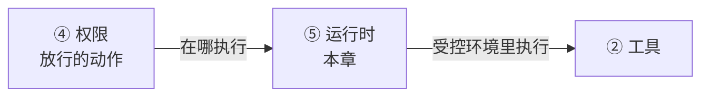
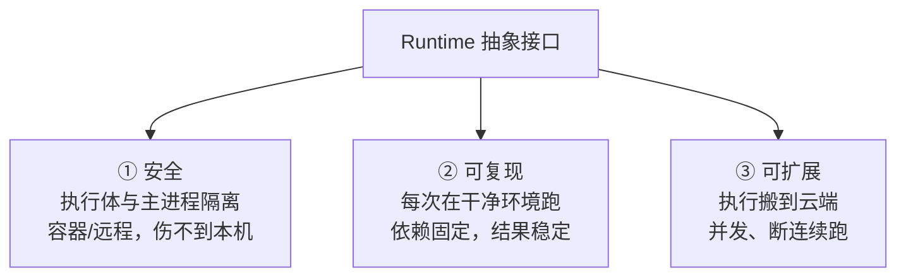
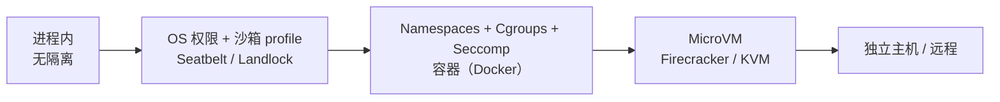

# 为何要抽象 Runtime

CH6 让 agent 安全了，但工具还是在你本机裸跑——同一个进程、同一个文件系统。这一章讲怎么把"执行动作的地方"抽象成一个可替换的后端：本地、容器、还是远程云机器。这是 harness 从"能跑"到"能规模化、可复现、真隔离"的关键一步。

> **回到任务**：[任务地图](../01-基础/lifecycle.md)第 ⑦ 步"在运行时执行工具"。`parseDate` 任务里 agent 跑 `pytest`——这条命令到底在哪执行？CH2-6 里是在你本机进程直接跑。但如果这是不可信代码、或你要同时跑 50 个任务，就需要把执行"搬"到隔离环境。本章讲这个"搬"怎么设计。

**本章在系统中的位置**

*运行时是执行链的"场所":权限决定"能做"，运行时决定"在哪做"——本机进程、容器、还是远程云机。它为工具执行提供受控环境（沙箱正是在这里落地，与 CH6 权限共用这个手段）。权限放行但运行时不隔离，等于沙箱形同虚设（[全景协作图见 intro](../01-基础/intro.md)）。*

## agent 的动作到底在哪里执行

回到 CH0 的定义：harness 提供 "execution environment"。CH6 讲了执行要**安全**；本章讲执行要**可解耦、可替换**。问题很实在——agent 的 bash、文件操作，在哪跑？

| 方案 | 问题 |
| --- | --- |
| 直接在 harness 进程里执行（你现在的 tinyharness） | 不安全（能碰你所有文件）、无法换环境、无法并发隔离 |
| 在一个**可替换的"运行时"**里执行 | 可以是本地子进程 / Docker 容器 / 远程机器，harness 主逻辑不关心 |

## Runtime 抽象：把"执行的地方"变成可插拔后端

> **核心思想**：定义一个统一的 **Runtime 接口**（execute(action) → observation），让 harness 主逻辑只依赖这个接口，不关心背后是本地、容器还是远程。换后端 = 换一个 Runtime 实现，上层零改动。

这就是软件工程里的**依赖倒置**：高层（agent 循环）依赖抽象（Runtime 接口），而非具体（某个执行方式）。你在 CH3.3 已经体验过一次同样的模式——把 `call_model` 抽象出来，换 provider 不动循环。Runtime 是同一招用在"执行"上。

## 这个抽象换来三个价值

*图 7.1-1：Runtime 抽象一次性解决三件事：执行隔离（安全）、干净环境（可复现）、云端执行（可扩展）。*

- **安全**：执行体和 harness 主进程隔离（容器/远程），就算 agent 干了坏事也困在盒子里。这是 CH6 沙箱的"物理层"。
- **可复现**：每次在定义好的干净环境里跑，依赖固定，不受你本机脏状态影响。评测（SWE-bench）靠这个。
- **可扩展**：执行可以搬到云端，支持并发跑很多任务、断连后继续。

**抽象是关键，后端是次要**：本章最重要的可迁移经验——**无论你最终用本地还是容器，都应先抽象出统一的 Runtime 接口**。这样后端可换、上层不动。下一节看 OpenHands 把这个抽象做到了什么程度。

## 沙箱技术光谱：从进程隔离到微虚拟机

Runtime 抽象讲的是"接口"，那接口底下的**后端**具体有哪些？沙箱不是一个非黑即白的选择，而是一条**"隔离强度 × 启动/运行开销"递增的光谱**。它们全部借自操作系统与虚拟化领域的成熟技术——理解这条光谱，你才能为场景选对隔离级别。

*从左到右：隔离越来越强，启动与运行开销也越来越大。选型就是在这条光谱上按场景取一个点。eBPF 是正交的一层——不提供隔离，而是在内核层监控沙箱内行为。*

| 技术 | 借自 | 隔离强度 | 启动开销 | 典型选型 |
| --- | --- | --- | --- | --- |
| **OS 权限 / 沙箱 profile** | macOS Seatbelt、Linux Landlock | 中（限文件/网络/系统调用） | 近乎零 | Codex CLI（Seatbelt，见 [CH6.2](../06-权限安全/ch6-perm-codex.md)） |
| **Namespaces + Cgroups v2 + Seccomp** | Linux 容器三件套 | 强（PID/NET/MNT 隔离 + 资源限额 + 系统调用过滤） | 中（容器启动） | OpenHands、Docker 类沙箱 |
| **MicroVM（Firecracker/KVM）** | 轻量级硬件虚拟化 | 极强（硬件级，独立内核） | 低（<100ms，接近容器） | E2B、Modal 等云端 agent 沙箱 |
| **OverlayFS 增量快照** | Linux 联合文件系统 | —（正交：状态回滚） | 毫秒级 undo | SWE-agent、Devin 类（据公开信息） |
| **eBPF 运行时监控** | Linux 内核可观测 | —（正交：审计而非隔离） | 无侵入挂钩 | 企业级审计层（方向，非某开源 harness 定案） |

**三个关键理解：**

- **强度与开销成正比，按场景选点。** 单用户本地 CLI 用 OS 权限 profile 就够（Codex）；多租户云平台要 MicroVM 的硬件级隔离（E2B）。这正是 [CH6](../06-权限安全/ch6-perm-principles.md)"能力越大，隔离越强"在技术选型上的落地。
- **OverlayFS 是正交的"快照"能力，不是隔离手段。** 它用只读镜像层（`lowerdir`）+ 读写增量层（`upperdir`）实现毫秒级环境回滚——这是"可复现"价值的底层实现，让每个任务能从干净状态开始、结束后一键重置。
- **eBPF 也正交：它管"看得见"，不管"关得住"。** 在内核层无侵入挂钩 `execve`/`connect` 等事件，实时感知沙箱内的隐秘进程与外联——补的是可观测（[CH10](../10-可观测/ch10-observability.md)）而非隔离，是生产审计层的方向。

> **和 CH6 的关系：一个手段，两个视角**
>
> CH6 从"权限"角度问"要不要隔离、隔离到什么程度"（决策）；本章从"运行时"角度答"用什么技术隔离"（实现）。沙箱是这两章共用的手段——[附录 E](../15-收尾/appendix.md) 的工程溯源表把这类"跨职责借用的经典技术"集中列出。

## 本节小结

1. agent 的动作要有"执行的地方"；裸在主进程跑不安全、不可换、不可并发隔离。
2. **Runtime 抽象**：统一接口（execute→observation），后端可插拔（本地/容器/远程）。
3. 本质是**依赖倒置**——和 CH3.3 抽象 call_model 是同一招。
4. 三个价值：**安全（隔离）、可复现（干净环境）、可扩展（云端并发）**。
5. 先抽象接口，再谈后端——这是核心经验。
