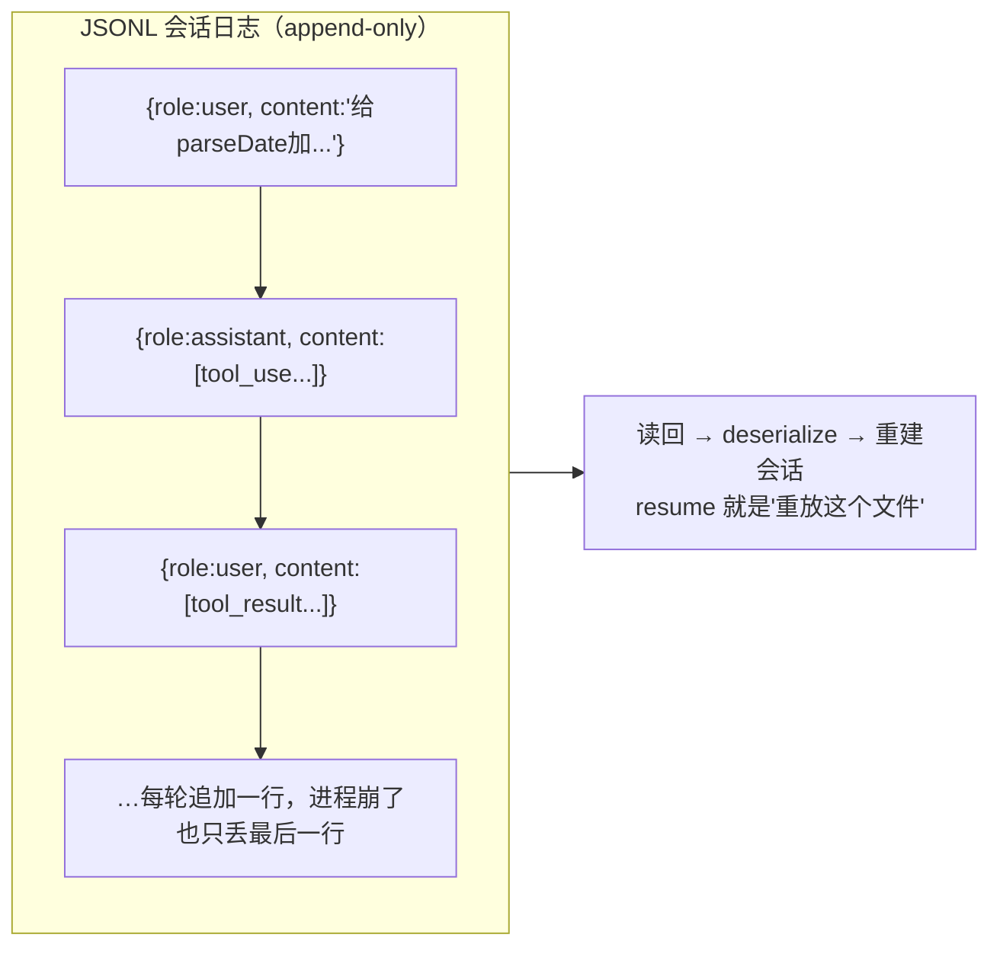

# 状态持久化与恢复

你的 tinyharness 一旦进程退出，整个会话灰飞烟灭。真实 harness 能关掉再打开接着干、能崩溃后恢复、能把长会话的记忆沉淀下来。这一章讲状态存哪、怎么存、怎么恢复。

> **关于本节源码**：基于 Claude Code 泄露 source map 还原（来源见[附录 C](../15-收尾/appendix.md)）。只讲架构与文件职责，代码为原创伪代码示意。

> **回到任务**：[任务地图](../01-基础/lifecycle.md)贯穿全程。`parseDate` 任务跑到一半你想去吃个饭、或网断了、或不小心关了终端——回来还能接着跑吗？生产级 harness 的答案是"能"。这靠的就是本章的持久化与恢复。

## 状态到底是什么、在哪里

一个 agent 会话的"状态"，核心就是 **messages 历史**（CH5 讲过它是 agent 的记忆）。持久化状态 = 把这段历史可靠地存到磁盘，能读回来重建。Claude Code 里相关文件很多：`src/history.ts`（历史读写）、`src/services/SessionMemory/`（会话记忆）、`src/utils/conversationRecovery.ts`（恢复）、`src/assistant/sessionHistory.ts`。

**呼应 CH2.3**：还记得 OpenHands 的事件流吗？它"整个历史 = 一条可序列化事件序列"，所以天生可持久化。Claude Code 虽是生成器循环（状态在栈上），但它把 messages 历史落盘成文件，达到同样效果。**两条路殊途同归：要能持久化，历史就得是可序列化的数据。**

## JSONL 事件日志：一行一条，只追加

主流做法是把历史存成 **JSONL**（每行一个 JSON 对象）。Claude Code 的 `conversationRecovery.ts` 有 `loadMessagesFromJsonlPath()`，`history.ts` 有 `makeHistoryReader()` 这样的异步读取器——都指向 JSONL 存储。

**为什么是 JSONL 而非一个大 JSON**：

1. **只追加（append-only）**：每产生一条消息就追加一行，不用重写整个文件——快、且崩溃时最多丢最后一行。
2. **可流式读取**：能一行行读回来重建，不必一次载入整个大对象。
3. **可回放/审计**：一行一条事件，天然是一条可回放的时间线（和 OpenHands 事件流同构）。

这就是为什么 append-only 日志是 harness 持久化的主流选择——deepseek 的 `core/session` 也是 append-only 事件日志。



*图 8-1：JSONL 会话日志：每轮追加一行。恢复（resume）本质就是把这个文件读回、反序列化、重建 messages。*

## 恢复：反序列化 + 中断检测

恢复看似简单（读文件重建），但有个坑：**上次可能是中断在半路的**——比如 agent 发了个 tool_use 请求，但工具还没执行完进程就挂了。这时历史里有个"悬空"的 tool_use 没有对应的 tool_result，直接喂给模型会报错。

Claude Code 的 `conversationRecovery.ts` 专门有 `deserializeMessagesWithInterruptDetection()`、`loadConversationForResume()` 处理这个——**检测并修复中断点**，让恢复出来的历史是合法可续的。

**中断检测为什么重要**：回忆 CH2，一轮循环是"assistant 发 tool_use → 追加 tool_result"配对的。如果崩在两者之间，历史就"缺了一半"。恢复时要么补一个"[已中断]"的 tool_result 占位，要么回退到上一个完整轮次。不处理就会在恢复后第一次调模型时直接 400 报错。这是 CH9 错误处理的近亲。

## 会话记忆：跨会话的沉淀

比"恢复单次会话"更进一步的是**会话记忆**——把一次会话里学到的持久信息（项目结构、用户偏好、反复用到的命令）提炼出来，存成跨会话可用的记忆。Claude Code 的 `SessionMemory/` 有 `shouldExtractMemory()`（判断何时该提炼）、`manuallyExtractSessionMemory()`（提炼）。

这其实是 CH5"外部记忆"技法的持久化版：短期用 notes.md，长期沉淀成会话记忆，下次开新会话时加载回来（接回 CH5.2 的 AGENTS.md 组装）。

## 持久化分层：什么落库、什么内存、什么丢弃

不是所有状态都值得落库。全落库排查方便但成本高、拖慢吞吐（[CH13](../13-生产化/ch13-production.md) 的"写放大"瓶颈）；全内存快但重启即丢、并发易 OOM（Out Of Memory，内存耗尽）。生产做法是**按"要不要恢复 + 要不要排查"两个问题分层**：

| 数据 | 该放哪 | 理由 |
| --- | --- | --- |
| 会话元信息（id、模型、创建时间） | **必须落库** | 恢复和检索的入口，量小 |
| 消息历史（含 tool_use/result） | **必须落库** | 恢复会话的核心；崩溃后靠它续跑 |
| 工具执行日志 | **落库（可只存摘要）** | 排查"agent 干了什么"的关键；大输出可截断存摘要 |
| 完整 trace（每轮耗时、token 拆解） | **视需要**：短期留存/采样 | 性能分析和调试用，量大，常采样或设 TTL（Time To Live，存活时限） |
| 流式中间态、KV-cache、临时缓冲 | **可丢弃** | 纯运行时状态，重算即可，落库无意义 |

> **两个判断问题**
>
> 决定一份状态放哪，问两句就够：① **重启后需要它才能继续吗？** 需要 → 必须落库（消息历史、会话元信息）。② **出问题时排查需要它吗？** 需要但不影响恢复 → 落库或采样（工具日志、trace）。两个都否 → 丢弃（中间态）。**别把"排查友好"和"恢复必需"混为一谈**——前者可采样、可降级，后者一条都不能少。

## 动手：给 tinyharness 加持久化

```python
# tinyharness.py — JSONL 持久化 + resume
import json, os

def append_jsonl(path, msg):
    with open(path, "a") as f:
        f.write(json.dumps(msg, ensure_ascii=False) + "\n")

def load_session(path):
    if not os.path.exists(path): return []
    msgs = [json.loads(l) for l in open(path) if l.strip()]
    # 中断检测：末尾若是"悬空"的 assistant（带tool_use但无tool_result），补占位
    if msgs and has_dangling_tool_use(msgs[-1]):
        # ⚠ 别写"未执行"——工具可能已经执行了，只是结果没落盘！
        msgs.append({"role":"user","content":[{"type":"tool_result",
            "tool_use_id": dangling_id(msgs[-1]),
            "content":"[上次中断，此工具执行结果未知。若为写/命令类操作，请先核查外部状态再决定是否重做，避免重复执行]"}]})
    return msgs

# 循环里：每追加一条消息就 append_jsonl；启动时若有 --resume 就 load_session
```

> **关键：中断的工具是"结果未知"，不是"未执行"**。崩溃点可能在工具执行**之前、之中、之后但结果没落盘**——你无法只凭日志区分。如果直接补"未执行"然后让 agent 重做，而工具其实已经执行了（比如 `write_file` 已写、`bash` 已 `git push`、外部 API 已下单），就会**重复执行、造成二次副作用**。
>
> 正确做法：恢复时把它标为**"执行结果未知"**，并让 agent（或 harness）**先核查外部真实状态**再决定是否重做——文件是否已存在？命令是否已生效？这与 CH9 的"错误恢复"和幂等性直接相关。**幂等操作可以放心重做，非幂等操作重做前必须先查。**

## 里程碑 7 · 自测清单

- [ ] 会话历史实时写入 .jsonl
- [ ] `--resume` 能读回历史接着跑
- [ ] 处理了"悬空 tool_use"的中断情况
- [ ] 能说清为什么用 JSONL append 而非一个大 JSON

## 本章要点

1. 会话状态核心 = **messages 历史**；持久化 = 可靠落盘 + 可读回重建。
2. **JSONL append-only**：快、崩溃只丢一行、可流式读、可回放（与事件流同构）。
3. 恢复要做**中断检测**：修复"悬空 tool_use"，否则续跑即报错。
4. **会话记忆**是外部记忆的持久化版，跨会话沉淀，加载回 system prompt。
