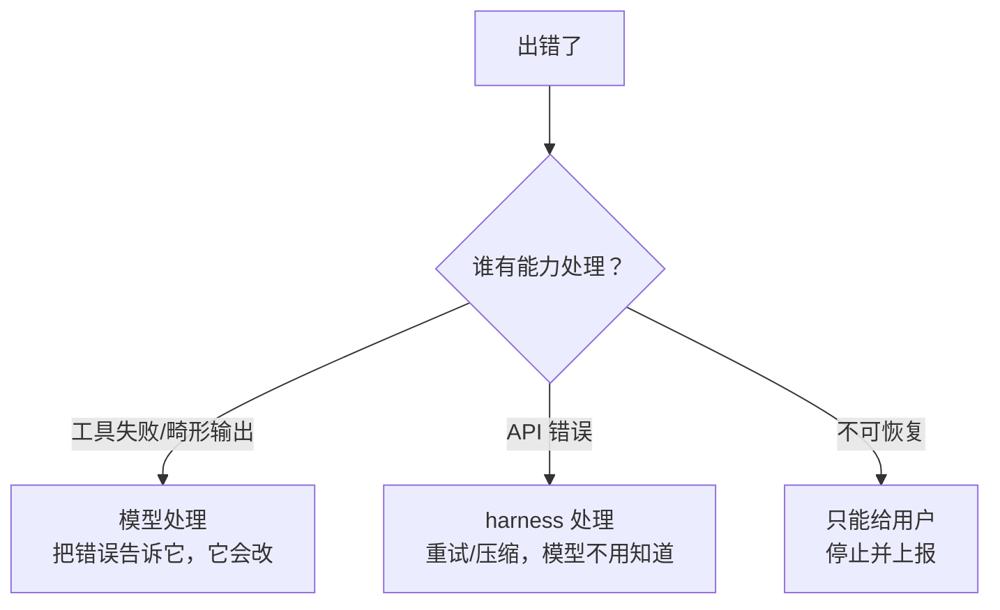

# 错误处理与恢复体系

真实任务里，出错是常态而非例外：工具失败、模型吐出畸形调用、上下文溢出、API 挂掉。生产 harness 的水平，很大程度体现在"出错后能不能优雅地恢复继续"，而不是崩溃。这一章建立系统的错误处理心智。

> **回到任务**：[任务地图](../01-基础/lifecycle.md)第 ⑪ 步"看报错→修→再跑"，以及贯穿全程的错误恢复。`parseDate` 任务里 pytest 报错是**正常流程的一部分**——agent 就是靠看报错来修的。但还有另一类错误（API 挂、畸形调用）是 harness 自己要扛的。本章区分并处理这两类。

## 先给错误分四类

处理错误的第一步是分类——不同类错误的应对完全不同。Claude Code 有 `src/constants/errorIds.ts`、`src/utils/toolErrors.ts`、`src/services/api/errors.ts` 一整套错误定义。归纳成四类：

| 类别 | 例子 | 应对 | 谁来看 |
| --- | --- | --- | --- |
| **工具执行失败** | pytest 报错、文件不存在、命令非零退出 | 作为 tool_result 回给模型 | 模型（它来修） |
| **模型输出畸形** | tool_use 参数不合 schema、JSON 坏 | 校验+高信号反馈，让模型重来 | 模型 |
| **API 层错误** | 限流、超时、529、prompt 超长 | 重试/压缩（CH3.2） | harness |
| **不可恢复** | 鉴权失败、余额不足、磁盘满 | 停止，报给用户 | 用户 |

**最重要的分野：谁来处理**。关键不是"错误多严重"，而是"**谁有能力处理它**"。



*图 9-1：把错误路由给对的处理者，是错误体系的核心。工具失败和畸形输出模型能处理；API 错误 harness 处理；不可恢复只能给用户。*

## 错误即上下文：把失败喂回给模型

这是 agent 时代最反直觉、也最关键的一点：**工具失败不是要"处理掉"的异常，而是要"喂回去"的信息**。

回到 `parseDate`：pytest 报 `AssertionError` 不是 bug，是 agent 修代码的**依据**。harness 要做的不是捕获它、隐藏它，而是把完整报错作为 tool_result 送回模型，让模型基于它决定下一步。这呼应 CH5.1 Manus 的"保留错误痕迹"和 CH2.1 的 Reflexion——**错误是 agent 自我纠正的燃料**。

**你早就在做了**：你 CH2 的 `read_file` 返回 `"错误：{e}"` 而非抛异常，CH6 权限拒绝返回 `"[权限拒绝] 原因"`——这就是"错误即上下文"。`toolErrors.ts` 的 `formatError()`、`formatZodValidationError()` 就是把各种错误格式化成模型能读懂、能据以纠错的文本。**格式化质量直接影响模型能否自己修好。**

## 畸形 tool call：模型也会犯错

模型有时吐出的 tool_use 参数不合 schema（少了必填字段、类型错、JSON 截断）。这时不能直接执行，也不该崩溃——要**校验 + 高信号反馈**：

```python
# 参数校验后再执行
def safe_execute(tool_use):
    schema = registry[tool_use.name].schema
    ok, err = validate_against_schema(tool_use.input, schema)
    if not ok:
        # 不执行，把校验错误当 tool_result 回给模型 → 它会重发
        return tool_result(tool_use.id,
            f"参数校验失败：{err}。请按 schema 重新调用。")
    return tool_result(tool_use.id, run_tool(tool_use.name, tool_use.input))
```

Claude Code 用 `formatZodValidationError()`（Zod 是 TS 的 schema 校验库）把校验错误变成清晰的自然语言反馈。**关键：校验失败也走"错误即上下文"——告诉模型哪个字段错了、该怎么改，它下一轮就能修正。**

## 循环卫生：防止"错误循环"

最危险的不是单次错误，而是 agent 陷入**错误循环**——反复调同一个失败的工具、同样的错、无限烧钱。Claude Code 有 `src/utils/QueryGuard.ts`，deepseek 有 `guard/` 的 `repeat-tool-reminder`（CH6.3 提过），都是防这个。

**三道循环卫生防线**：

1. **max_turns**（你 CH2 加的）：硬上限，兜底。
2. **重复检测**：检测"连续 N 次调同一工具、同样参数、同样失败" → 提醒模型换个思路，或直接停。
3. **无进展检测**：若干轮没有任何有效状态变化 → 判定卡住。

这些保护的是成本和体验——别让 agent 安静地烧掉你 100 刀还在原地打转。

**三种典型死循环 + 对应拦截**

"错误循环"不止一种。认清三种典型形态，才能对症下药——单靠 max_turns 只能兜底，拦不住前两种的浪费：

| 死循环场景 | 长什么样 | 拦截方案 |
| --- | --- | --- |
| **原地重试** | 连续调同一工具、同参数、同样失败（如反复读一个不存在的文件） | **重复检测**：连续 N 次 `(tool, args)` 相同且失败 → 高信号提醒模型"换个方法" |
| **拉锯循环** | 两个动作互相撤销：A 改成 X，下一轮又改回 Y，再改回 X…… | **无进展检测**：追踪关键状态（文件内容/测试结果）的哈希，若干轮无实质变化 → 判卡住 |
| **计划震荡** | 模型在两三个方案间反复横跳，每个都浅尝辄止不深入 | **max_turns + Recitation**：硬上限兜底 + 维护 `todo.md` 复述目标（见 [CH5.1](../05-上下文/ch5-ctx-principles.md)），把模型拉回主线 |

> **为什么三种要分开拦**
>
> 三种循环的"信号"不同：原地重试看 **tool+args 重复**，拉锯看 **状态无变化**，震荡看 **注意力漂移**。只靠 max_turns，得等烧到上限才停——白白浪费几十轮。前两道检测能在几轮内就掐断，这才是省钱的关键。这也是为什么"何时停"（[CH2](../02-agent循环/ch2-loop-paradigms.md)）的兜底条件要多管齐下，而非只设一个轮数上限。

## 动手：给 tinyharness 加错误恢复

```python
# tinyharness.py — 参数校验 + 重复检测
_fails = []   # 只记录最近"失败"的 (tool, args)——成功不计

def _record_fail(sig):
    _fails.append(sig); _fails[:] = _fails[-6:]   # 只保留最近几条失败

def execute_safely(tu):
    sig = (tu.name, json.dumps(tu.input, sort_keys=True))
    # 1. 重复检测（循环卫生）：只数"连续失败"的重复，成功读同一文件不该触发
    if _fails.count(sig) >= 3:
        return "[卫生] 此调用已连续失败 3 次，请换一种方法或说明卡在哪。"
    # 2. 参数校验（畸形调用）
    if tu.name not in _REGISTRY:
        _record_fail(sig)
        return f"[错误] 未知工具 {tu.name}，可用：{list(_REGISTRY)}"
    # 3. 执行，任何异常都格式化回给模型（错误即上下文）
    try:
        out = run_tool(tu.name, tu.input)
        _fails[:] = [s for s in _fails if s != sig]   # 成功 → 清掉该调用的失败记录
        return out
    except TypeError as e:
        _record_fail(sig)
        return f"[参数错误] {e}，请检查参数。"
    except Exception as e:
        _record_fail(sig)
        return f"[执行失败] {e}"
```

## 里程碑 8 · 自测清单

- [ ] 工具失败作为 tool_result 回给模型，而非崩溃
- [ ] 未知工具/参数错有高信号反馈
- [ ] 重复同一失败调用会被卫生拦截
- [ ] API 错误走 CH3.2 的重试；prompt 超长走压缩
- [ ] 能说清"错误即上下文"和"谁来处理错误"两个原则

## 本章要点

1. 错误分**四类**，核心分野是"**谁有能力处理**"：工具失败/畸形→模型；API 错→harness；不可恢复→用户。
2. **错误即上下文**：工具失败要喂回模型当纠错燃料，不是隐藏的异常。格式化质量决定模型能否自修。
3. **畸形 tool call**：校验+高信号反馈，让模型重来。
4. **循环卫生**：max_turns + 重复检测 + 无进展检测，防错误循环烧钱。
