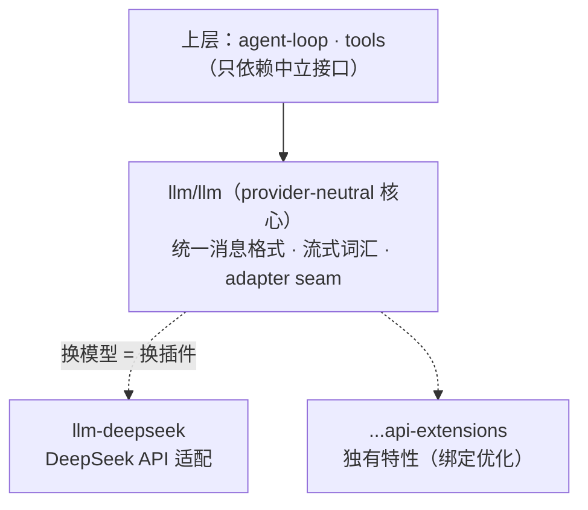
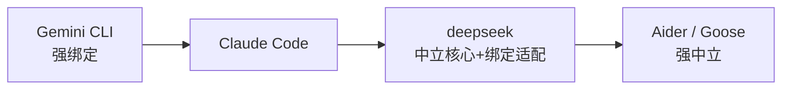

# 模型绑定 vs 模型中立

你在 CH3.3 把 `call_model` 抽象成了一个函数——那是**迈向**模型中立的第一步，但离"真正中立"还差得远。这一章把这个决策讲透：harness 该绑死一个模型换深度优化，还是保持中立换通用性？以及"中立"到底要做到什么程度才算数。

> **关于本节**：deepseek-harness 为开源项目（MIT）。本节基于其公开架构讲解，代码为教学示意。

## 一个绕不开的架构决策

harness 要调模型，第一个架构问题就是：**绑定一个，还是支持任意？**

- **绑定（model-bound）**：与特定模型深度耦合，为它定制 prompt、吃它的独有特性（原生 tool-calling 格式、缓存定价、超长上下文）。
- **中立（model-neutral）**：通过抽象接口支持多个模型，用户自由切换。

这决定了 harness 的优化上限、迁移自由度，甚至商业模式。

> **先纠一个常见误解：封装 call_model ≠ 模型中立**
>
> 你 CH3.3 把调用包成 `call_model(...)`，只是把"调模型"收到了一个函数里。但你的循环**仍然依赖 Anthropic 的具体形状**：`resp.content` 里的 `tool_use` 块结构、`stop_reason` 的取值、`usage` 字段、异常类型……换成 OpenAI/Gemini，这些全都不一样。

**真正的模型中立要在中立接口层统一这五样：**

1. **消息格式**：各家 messages 结构不同。
2. **工具调用**：tool_use / function_call / 各家 JSON 形状。
3. **终止原因**：stop_reason / finish_reason 的取值映射。
4. **用量**：usage 字段名与口径。
5. **错误类型**：限流/超时/超长的异常各不同。

而且——**只有真正接上第二个 provider 跑通，才算验证了中立**。没接过第二家的"中立接口"往往藏着没发现的耦合。所以你的 tinyharness 现在是"*朝中立迈了一步*"，不是"已经中立"。

## deepseek：中立核心 + 专属适配器

deepseek-harness 给出"既绑定又中立"的分层答案。它的 `llm/` 包组：核心 `llm/llm` 保持 provider-neutral，再挂 `llm-deepseek`（适配器）和 `deepseek-llm-api-extensions`（独有特性）。

*图 11-1：上层只依赖 provider-neutral 核心（不知底下是哪个模型），DeepSeek 的适配与独有特性下沉到适配器/扩展插件。绑定优化不外泄到核心。*

> **为什么这是好设计**
>
> **依赖倒置**：上层依赖抽象（中立接口），不依赖具体模型——换模型加个适配器插件即可。**绑定优化不外泄**：独有能力放 extensions，既吃优化红利，又不让核心失去中立。这解决了"绑定 vs 中立"的伪二选一——和你 CH3.3 抽象 call_model、CH7 抽象 Runtime 是**同一招**（依赖倒置）在模型层的应用。

## 面向中文生态的工程取舍

deepseek 还展示"为特定生态设计"：**全仓库中英双语**（几乎每个源文件配 `.zh.md` + `.i18n.yaml`），文档、提示、界面都做中文一等公民。

> **事实与推断**
>
> 确证的是：provider-neutral 核心 + DeepSeek 适配器 + 中英双语。而"低缓存定价/1M 上下文优化"等具体宣称，仓库文档未直接佐证，属**推断的动因**，不作定论。

**取舍不只是技术的**：harness 的取舍也是**生态和市场**的。面向中文开发者、成本敏感的 harness，自然倾向绑定国产模型 + 中文一等支持——这是场景驱动的合理选择，不是技术优劣。

## 绑定-中立光谱

*图 11-2：绑定—中立光谱，从左（强绑定/深度优化）到右（强中立/迁移自由）。deepseek 用适配器站在中间：中立核心保迁移自由，专属扩展吃绑定红利。*

> **两面 + 一条主线**
>
> **绑定**：prompt 深度定制、吃独有特性、可能有成本优势；代价是换模型难、供应商锁定。**中立**：迁移自由、避免锁定；代价是只能用"最大公约数"能力、适配层维护。
>
> 一条主线（接 CH2/CH4）：**模型越强，harness 越可简化**。绑定 harness 能紧跟单一模型演进做精准适配；中立 harness 抗单点风险。选哪种，取决于你赌不赌某个模型持续领先。

## 本章小结

1. 核心决策：**绑定单模型（深度优化）vs 中立（通用自由）**。
2. **deepseek 用适配器化解伪二选一**：中立核心 + 专属扩展——和 CH3.3/CH7 是同一招依赖倒置。
3. 取舍也是**生态/市场**的（中文一等支持、绑定国产模型）。
4. 光谱：Gemini（强绑定）↔ deepseek（中间）↔ Aider/Goose（强中立）。
5. 你的 tinyharness 只是**朝中立迈了一步**（抽象了 call_model），要真中立还需统一消息/工具调用/终止原因/用量/错误五样，并接上第二个 provider 验证——想加绑定优化，则在适配器里加，别污染循环层。
