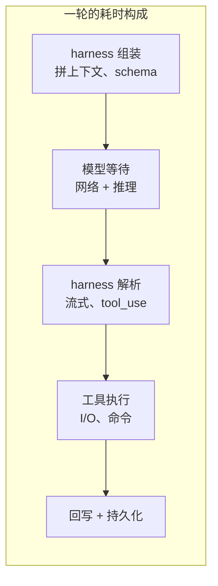
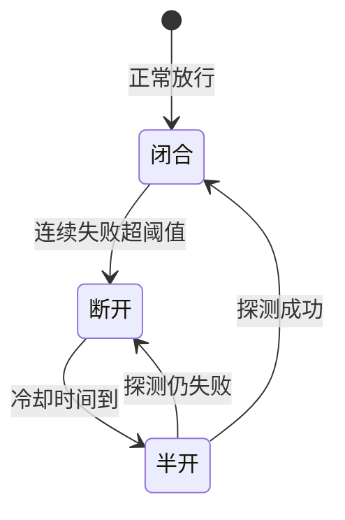

# 生产化与稳定性

前十二章教你造一个**正确**的 harness。这一章讲一件不同的事:把它**稳定地跑在规模化生产环境**里。这里的敌人不再是"逻辑对不对",而是并发、连接、故障、成本——一批只有上了量才会暴露的问题。一个在本地跑得欢的 harness，放到几千并发用户面前，往往先垮在这些工程细节上，而非模型能力。

> **回到任务**：前面 `parseDate` 任务是"单用户、单任务、跑通即可"。这一章设想的是:同一个 harness 同时服务几千个这样的任务，还要不崩、不泄漏、不烧钱失控。

## 瓶颈通常不在模型，而在 harness 自身

一个容易被忽视的事实:规模化之后，瓶颈**不一定在模型推理**——模型延迟、服务商配额、工具执行、harness 自身开销都可能成为瓶颈，具体是哪个**必须靠测量确定**（见下方"先量再优"）。而其中**最容易被低估、又最在你掌控内**的，往往是 harness 自己的工程实现。四个最典型的 harness 侧瓶颈:

| 瓶颈 | 症状 | 优化方向 |
| --- | --- | --- |
| **上下文重复组装** | 每轮都全量拼 system prompt + 全部工具 schema + 全历史 | 稳定前缀走 prompt 缓存（见 [CH5.2](../05-上下文/ch5-ctx-systemprompt.md)）；工具 schema 缓存复用 |
| **同步阻塞工具执行** | 一个慢工具（大文件读、慢命令）卡住整个循环 | 工具执行异步化 + 超时；可并行的 tool_use 并发跑 |
| **会话状态膨胀** | 长会话的完整历史常驻内存，并发一多就 OOM | 冷会话落盘、热会话内存；历史用 compact 压（见 [CH5.3](../05-上下文/ch5-ctx-compact.md)） |
| **持久化写放大** | 每个事件都同步落库，DB 成为瓶颈 | 批量/异步写日志；区分"必须落库"和"可丢弃"（见下 [持久化分层](#持久化分层存什么丢什么)） |

> **关键认知：先量再优**
>
> "瓶颈在 harness" 不等于"凭感觉改代码"。上生产前先接可观测（[CH10](../10-可观测/ch10-observability.md)）——每轮耗时拆成"模型等待 / 工具执行 / harness 开销"三段。你几乎总会发现:真正拖慢体验的是 harness 的组装与 I/O，而非模型。**没有度量的优化都是猜。**



*一轮 latency 拆成五段。规模化后，A/C/D/E 这些 harness 自身环节的累计开销，常常超过 B（模型）。优化要对着最大的那段下手。*

## 限流、熔断、降级:分层设计

规模化 harness 必须能"扛住洪峰、隔离故障、优雅退化"。三个机制各司其职，且要**分层**——不同层级的限流目的完全不同。

**先分清三件事**

- **限流（rate limit）**:主动控制"进来多少"，防止过载。
- **熔断（circuit breaker）**:某个下游（模型 API、MCP server）连续失败时，快速失败、停止打它，给它恢复时间。
- **降级（degradation）**:出问题时提供"次好"的服务，而非直接报错。

**限流要分四个层级**

| 层级 | 限什么 | 适用场景 |
| --- | --- | --- |
| **用户级** | 单用户单位时间的请求/token 配额 | 防单个用户刷爆、成本归因、套餐分级 |
| **会话级** | 单会话的最大轮数/总 token/时长 | 防单个任务失控空转烧钱（呼应 [CH9](../09-错误处理/ch9-errors.md) 循环卫生） |
| **工具执行级** | 并发工具数、单工具 QPS（Queries Per Second，每秒请求数）、危险工具频率 | 防工具 I/O 打爆下游（如疯狂调 Bash、外部 API） |
| **模型推理级** | 并发模型请求数、总 token 吞吐 | 适配 API 提供方的 rate limit，避免整体被 429 |

关键:**这四层不是重复，是不同目的**。用户级为公平与成本，会话级为防失控，工具级为保护下游，模型级为适配上游配额。少任何一层，都会在特定压力下暴露。

**熔断与降级怎么配合**



*熔断器三态。断开期间对该下游的调用立即失败（不再空等超时），既保护下游恢复，也避免大量请求堆在超时上拖垮自己。*

降级则是熔断触发后的"兜底动作"，例子:

- 主模型 429/超时 → 降级到备用模型或更小的模型（见 [CH11](../11-模型绑定/ch11-model-binding.md) 的 adapter seam）。
- MCP server 熔断 → 暂时禁用该工具，告诉模型"此能力暂不可用"，而非整个任务失败。
- 上下文服务不可用 → 退化到"无记忆"模式，仍能完成基本任务。

> **降级的底线：宁可少做，不可错做**
>
> 降级是"提供次好结果"，不是"提供错误结果"。比如模型不可用时返回"暂时无法处理，请稍后重试"是合格降级；而返回一个**看似正常实则没验证**的答案，比直接报错更危险。

## SSE 连接生命周期:断连即停

大多数 harness 用 SSE（Server-Sent Events）把流式结果推给客户端。但连接不是永远稳的——客户端断开、网络闪断、页面刷新，都会让"客户端不再接收"，而**后台任务可能还在跑**。这是规模化 SSE harness 最容易漏掉的资源泄漏源。

**三种断连场景与后台残留**

| 场景 | 客户端行为 | 若不处理的后台残留 |
| --- | --- | --- |
| **主动断开** | 用户关页面/点停止 | 循环仍在跑，继续烧 token、占并发、执行工具 |
| **网络闪断** | 连接意外中断 | 同上，且可能永远不"完成"，僵尸任务累积 |
| **页面刷新** | 断旧连接、开新连接 | 旧任务变孤儿；若新连接又发起任务，同一会话两个循环并发跑 |

共同危害:**后台任务和前台连接解耦后，不受控地消耗资源**——token、并发槽、工具副作用（可能已经改了文件、发了请求）。

> **先明确一个产品选择:断连该停，还是该续？**
>
> "断连即停"不是唯一正解，它取决于**任务形态**——这是一个需要显式决策的产品/架构策略，不是通用要求:
> - **交互式请求**（用户盯着看的一次问答）→ 断连即停最合适：人都走了，没必要继续烧钱。
> - **持久后台任务**（长时自主作业、批处理）→ 往往应**继续运行并支持重连**：断连只该解绑"推送通道"，不该杀死任务本身。OpenHands 事件流"断连续跑"（[CH2.3](../02-agent循环/ch2-loop-openhands.md)）正是为这个场景设计。
>
> 关键是**连接生命周期与任务生命周期是否绑定，要主动选择**。下面讲的是"交互式场景"下如何做到精准的"断连即停"；持久任务则反过来——要刻意让两者解绑。

**交互式场景："断连即停"的精准管控**

核心机制是把**连接生命周期绑定到任务生命周期**，用一个可传播的取消信号（cancellation token / AbortSignal）串起来:

```python
# 连接建立时创建取消信号，贯穿整个循环
async def handle_sse(request, session):
    cancel = CancelToken()
    request.on_disconnect(lambda: cancel.trigger())   # 断连 → 触发取消

    async for event in agent_loop(session, cancel):    # 循环每步都检查 cancel
        if cancel.triggered:
            await cleanup(session)                     # 停循环、回滚未提交状态、释放并发槽
            break
        yield sse(event)
```

要点:

1. **取消信号要传播到每一层**——循环、模型请求（中止流式）、工具执行（能中断的中断，如 kill 子进程）。只在循环顶层判断不够。
2. **区分"可中断"与"不可中断"的工具**。已经发出的写操作/网络请求可能无法回滚——所以危险工具执行前的**权限闸也是断连保护的一环**（[CH6](../06-权限安全/ch6-perm-principles.md)）。
3. **刷新场景要做会话去重**。同一会话的新连接到来时，先取消旧循环，避免"一个会话两个循环"。

### HTTP/1.1 → HTTP/2:对 SSE + Harness 的隐性影响

如果你的 SSE 服务从 HTTP/1.1 升级到 HTTP/2（常见于上网关/CDN 后），有几处**看不见但会咬人**的变化:

| 维度 | HTTP/1.1 | HTTP/2 | 对 harness 的影响 |
| --- | --- | --- | --- |
| **连接与并发** | 每个 SSE 占一条 TCP 连接，浏览器每域名约 6 条上限 | 多路复用，一条连接跑多个 stream | 并发 SSE 上限大幅放开——**服务端要按 stream 而非连接来计并发和限流** |
| **流取消** | 断开要关整条 TCP 连接 | 单个 stream 可独立取消，发 `RST_STREAM` | "断连即停"的信号载体变了——要监听 stream 级取消（`RST_STREAM`），而非只监听 TCP 断开 |
| **半关闭/复用** | 连接关了就全断 | 一个 stream 关闭不影响同连接其他 stream | 一个任务取消不该误伤同连接的其他任务——**取消粒度必须精确到 stream/任务** |

> **升级 HTTP/2 后必须复查的三件事**
>
> 1. **并发计量口径**:限流/并发数从"连接数"改成"stream 数"，否则原有阈值形同虚设。
> 2. **断连检测**:确认框架把 HTTP/2 的 `RST_STREAM` 正确映射成了 `on_disconnect`——很多"断连即停"在 1.1 下好好的，一升 2.0 就失灵，正因取消信号来源变了。
> 3. **后台任务归属**:多路复用下，多个任务共享连接，务必保证取消一个 stream 只停对应任务，不波及邻居。

## 企业级生产落地红线清单

把全课的取舍收成一份"红线"。分三档:**绝对不能做**、**上线必炸**、**仅限测试环境**。

**❌ 绝对不能做（架构性错误，做了迟早出大事）**

- 让 agent 在**无沙箱、无审批、可联网**的环境跑任意命令（[CH6](../06-权限安全/ch6-perm-principles.md)）——prompt injection + 数据外泄的直通车。
- 把**外部内容（文件、网页、MCP 返回）当可信指令**，不做数据/指令边界隔离（[CH6](../06-权限安全/ch6-perm-principles.md)）。
- **循环无任何终止兜底**（无 max_turns、无预算、无重复检测）——一次失控就能烧穿账单（[CH9](../09-错误处理/ch9-errors.md)）。
- 把**密钥/凭证明文塞进上下文或日志**——它会随历史、随持久化、随可观测四处扩散。

**💥 上线必炸（规模化后必然暴露）**

- SSE **断连不停后台任务**——僵尸任务累积，并发槽和 token 双泄漏（本章）。
- **无分层限流**——一个用户或一个失控会话就能拖垮全局（本章）。
- **无熔断**——某个下游（模型/MCP）抖动时，请求全堆在超时上，雪崩（本章）。
- **每轮全量重组上下文、不用缓存**——成本和延迟随会话长度线性爆炸（[CH5.2](../05-上下文/ch5-ctx-systemprompt.md)）。
- **持久化全量同步落库**——DB 写放大成为吞吐天花板（本章）。

**⚠️ 仅限测试环境（能用但绝不可进生产）**

- 用**内存存会话状态**、进程重启即丢——本地调试可以，生产必须可持久化恢复（[CH8](../08-状态持久化/ch8-state.md)）。
- **关掉所有权限审批图省事**——只应出现在完全隔离的测试沙箱。
- **无可观测裸跑**——测试可以，生产出问题时你会两眼一抹黑（[CH10](../10-可观测/ch10-observability.md)）。
- 把 **max_turns / 预算调到极高**做压力测试——测完必须调回合理值。

> **一句话红线原则**
>
> 生产 harness 的每一个"自主能力"，都必须配一个"兜底约束":能跑任意命令 → 配沙箱+审批；能无限循环 → 配终止兜底；能开后台任务 → 配断连即停；能长期运行 → 配持久化恢复。**能力与约束成对出现，是生产化的第一性原则。**

## 本章要点

1. **瓶颈在 harness 自身**，不在模型:上下文重组、同步工具、状态膨胀、写放大是四大典型——先量后优。
2. **限流分四层**（用户/会话/工具/模型），目的各不相同；配合**熔断**（隔离故障下游）和**降级**（提供次好而非错误结果）。
3. **SSE 断连即停**:用可传播的取消信号把连接生命周期绑定到任务生命周期；HTTP/2 下取消信号从"关连接"变成 `RST_STREAM`，计量口径从连接变 stream。
4. **生产红线**:能力与约束成对出现——每个自主能力都要配一个兜底约束。
