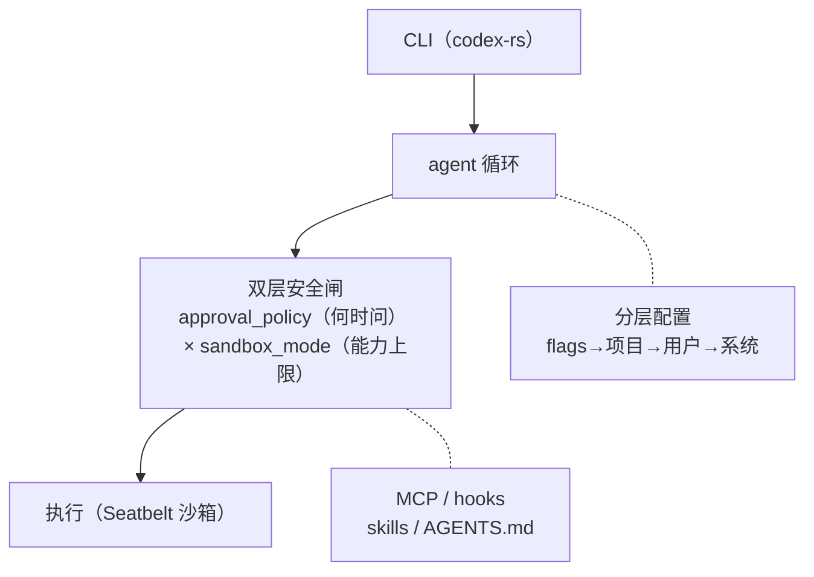

# Codex CLI 全景

Codex 和 Claude Code 同为 CLI，但它是 Rust 单二进制，且以**安全模型**见长——sandbox × approval 双层是业界标杆。这一页看它整体怎么组织，以及安全如何贯穿每一步执行。

**关于本页**：Codex CLI 为开源项目（Apache-2.0，`github.com/openai/codex`，Rust）。本页基于公开配置与文档讲解，图为原创重绘。

## 定位与场景

| 维度 | 说明 |
| --- | --- |
| 形态 | 终端 CLI，Rust 单二进制（codex-rs） |
| 技术栈 | ~98% Rust，分发为单个可执行文件 |
| 目标场景 | 本地开发，兼顾自动化；安全可精细配置 |
| 模型 | 可用 ChatGPT 账号或 API key；config 支持多 provider |
| 设计基调 | 双层安全（sandbox × approval）+ 分层配置 |

## 整体架构

> **说明：Codex 没有整体架构图，安全模型以文字+表格呈现。** 核实结果：Codex 官方**未提供**整体架构示意图。它的核心——安全模型——在官方文档里是**文字说明 + 一张组合矩阵表格**（把 `--sandbox` 三档 × `--ask-for-approval` 各档组合成预设），而非示意图。建议对照官方安全文档，本课下方的架构图与安全二维图均为**原创重绘**。
>
> 来源：<https://developers.openai.com/codex/security>

下面这张按 Codex 的配置与安全模型**原创重绘**，把它散在文档里的双层安全画成一张结构图：

*图 · Codex 整体架构：单二进制内：CLI → 循环 → **双层安全闸（approval × sandbox）** → 执行（Seatbelt）。分层配置和 MCP 在侧。安全闸是它区别于 CC 的核心特征。对应 CH6.2。*

## 请求处理全流程

| 步 | 机制 | parseDate 里发生什么 | 对应章 |
| --- | --- | --- | --- |
| 1 | 分层配置加载 | 合并 flags/项目 .codex/config.toml/用户/系统，定 sandbox 与 approval | CH6.2 |
| 2 | agent 循环 + AGENTS.md | 组装上下文，进入 ReAct 循环 | CH2/CH5 |
| 3 | 模型请求 | 调模型，解析工具调用 | CH3 |
| 4 | **sandbox_mode 判定** | workspace-write：改代码/跑测试放行；联网默认禁 | CH6.2 |
| 5 | **approval_policy 判定** | 危险操作（超出沙箱/需联网）暂停问用户 | CH6.2 |
| 6 | Seatbelt 沙箱执行（macOS） | 在系统级沙箱内跑 pytest | CH6.2/CH7 |
| 7 | 结果回写，循环续 | 直到测试绿 | CH2 |

> **安全是它的主角**：注意第 4、5 步——**Codex 把安全做成了执行路径上不可绕过的两道闸**。同为 CLI，Claude Code 偏"审批 + 可配自动批准"，Codex 则是"沙箱能力上限 × 审批边界"二维正交。这让它能表达"改代码全自由、联网才问我"这种 CC 较难精确表达的策略，也让它更适合"半自动化"场景。

## 核心模块清单

| 能力 | 机制 | 对应章 |
| --- | --- | --- |
| 安全（核心） | **sandbox_mode 三档**（`read-only` 只读 / `workspace-write` 可改工作区、区外只读、网络默认禁 / `danger-full-access` 全放开）**× approval_policy**；macOS Seatbelt 强制；网络单独管控 | CH6.2 |
| 配置 | 四层：CLI flags → 项目 .codex/config.toml → 用户 → 系统 | CH6.2 |
| 多 provider | config.toml 的 model_providers | CH11 |
| 扩展 | MCP、hooks、skills、AGENTS.md | CH4/CH5 |
| 循环/工具 | 内置文件读写 + shell，MCP 扩展 | CH2/CH4 |

## 取舍与边界

**Codex 的设计指纹**

- **安全**：沙箱 × 审批双层（最完备，适合半自动化）。
- **形态**：Rust 单二进制（分发简单、性能好）。
- **配置**：分层（团队可固定基线）。

一句话：**在 CLI 里把"安全"做到极致**。相比 Claude Code 的富工具深度护栏，Codex 更强调"系统级沙箱 + 二维安全策略"。适合既要本地开发、又要一定自动化且看重安全边界的团队。
