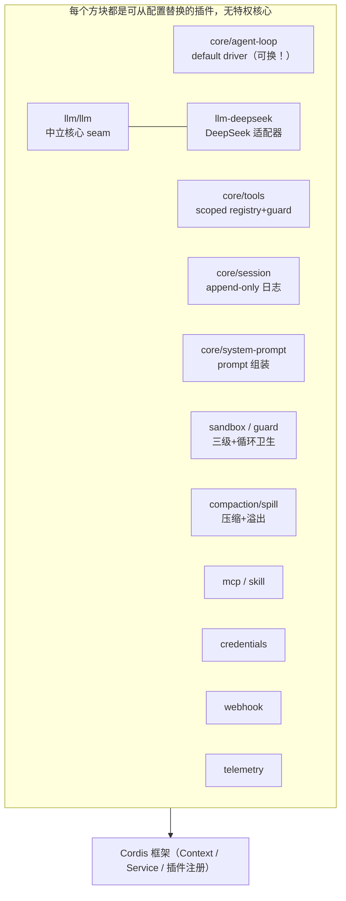

# deepseek-harness 全景

前三个案例是西方主流。deepseek-harness（dsh）代表另一种哲学：**everything is a plugin**——连 agent-loop、model adapter 都是可替换插件。这一页看"一切皆插件"如何贯穿整个 harness，以及面向中文生态的取舍。

**关于本页**：deepseek-harness 为开源项目（MIT，`github.com/deepseek-ai/deepseek-harness`）。基于其架构文档讲解，图为原创重绘。项目处 developer preview，API 可能变动。

## 定位与场景

| 维度 | 说明 |
| --- | --- |
| 形态 | 插件化 agent harness（dsh），TS monorepo（pnpm） |
| 底层框架 | Cordis（everything-is-a-plugin） |
| 目标场景 | 可深度定制/替换任意部件；面向中文生态、绑定 DeepSeek 模型 |
| 设计基调 | 无特权核心，每个部件都是可从配置替换的插件 |

## 整体架构：无特权核心

> **说明：deepseek 官方架构以文档描述为主（非图片）。** 官方 `docs/architecture.md` 用**文字**描述了 Cordis 插件化框架（"Everything is a Plugin"——模型适配器/工具注册表/会话日志/agent loop 皆插件）、Profiles & bundles、Core packages、Electron 桌面架构。是文本说明，非示意图。下方架构图为本课据此**原创绘制**。（注：默认分支为 `master`，非 main。）
>
> 来源：<https://github.com/deepseek-ai/deepseek-harness/blob/master/docs/architecture.md>

它最独特的一点（架构文档原话）：**"Every part of the product is a plugin, including the model adapter, the tool registry, the session log, and the agent loop itself... There is no privileged core to patch."** 连循环本身都是插件。

*图 · deepseek 插件化架构：Cordis 之上，连 agent-loop、model adapter 都是可替换插件。绿色块（llm/llm 与 llm-deepseek）是 llm 分层（中立核心 + DeepSeek 适配器，CH11）。对应你学过的各章能力，只是全做成了插件。*

> **本页承担该案例的全部深度 + 证据边界**：deepseek-harness 在全课只在 CH11（模型绑定）带过，**本页是它唯一的详细出场**，所以这里比其他案例讲得深一些。证据强度提示：本页对包结构、"一切皆插件"的**定性**描述来自官方 `docs/architecture.md`（确证）；而下面"插件注册/替换**具体怎么运作**"是基于 Cordis 框架的通用机制 + 该文档描述的**合理推断**，未逐行核对源码实现，请按"设计意图"而非"确证细节"理解。项目处 developer preview，API 会变。

## 深剖：Cordis 的插件注册与替换到底怎么工作

"一切皆插件"听着抽象，落到机制上是三件事。先给两个术语就地注解：

- **Cordis**：一个通用的插件式应用框架（源自 Koishi 生态），核心是一个 **Context（上下文）对象** + **Service（服务）注册表**。插件通过 Context 声明"我提供什么服务、依赖什么服务"，框架负责按依赖关系装配。deepseek-harness 把它当作整个 harness 的"骨架容器"。
- **scoped registry（作用域注册表）**：工具/服务不是全局一把梭，而是注册在某个作用域下，不同 agent/上下文只看到各自作用域内的条目（CH4.3 讲过）。

### ① 注册：插件向 Context 声明服务

每个部件（model adapter、tool registry、session log、甚至 agent-loop）都是一个插件，启动时向 Cordis 的 Context **注册自己提供的 Service**。比如 `llm-deepseek` 注册一个 "llm" 服务的 DeepSeek 实现，`core/tools` 注册 "tools" 服务。上层（如 agent-loop）通过 Context **按服务名取用**，而非直接 import 某个具体实现——这就是依赖倒置（CH11 那招）在框架层的体现。

### ② 替换：换实现 = 换注册的插件

因为上层只依赖"服务名 + 接口"，要换模型/换压缩策略/换循环，就是**让另一个插件注册同名服务**，配置里指定用哪个。"There is no privileged core to patch"（官方原话）的含义就是：没有哪块是"写死在核心里必须改源码才能换"的——全部通过插件注册表可换。

### ③ 组合：Profiles & bundles

官方文档提到 Profiles & bundles——把"一组插件 + 配置"打包成一个可复用的组合（如"DeepSeek + 某套工具 + 某压缩策略"），不同场景加载不同 bundle。这让"为不同用途裁剪出不同 harness 形态"变成配置问题而非改码问题。

> **和你 tinyharness 的对照**：你 CH4.4 写的装饰器注册表（`@tool`）+ CH11 抽出的 llm provider 接口，就是这套思想的**最小版**：注册表 = 极简的 Service registry，provider 接口 = 可替换的 adapter。deepseek 只是把"注册-取用-替换"做成了贯穿**每个部件**的统一框架（Cordis），而不只是工具和模型两处。理解了你的 tinyharness，就理解了 deepseek 插件化的内核——差别是覆盖范围和框架成熟度。

## 请求处理全流程

| 步 | 插件 | parseDate 里发生什么 | 对应章 |
| --- | --- | --- | --- |
| 1 | core/system-prompt | 组装 prompt + tool schema | CH5.2 |
| 2 | core/agent-loop（default driver） | 进入循环（此插件可整体替换） | CH2 |
| 3 | llm/llm → llm-deepseek | 经中立 seam 调 DeepSeek，适配器翻译 | CH11 |
| 4 | core/tools（scoped + guarded） | 作用域核对 → 守卫管线 → 执行读/写/bash | CH4.3 |
| 5 | sandbox / guard | 三级沙箱 + 防重复调用的循环卫生 | CH6.3/CH9 |
| 6 | compaction / spill | 近上限压缩 / 溢出到外部 | CH5.3 |
| 7 | core/session | append-only 事件日志（源头真相） | CH8 |

> **"一切皆插件"的代价与收益**：**收益**：极致可定制——想换循环逻辑、换模型、换压缩策略，都是替换一个插件，不动其他。**代价**：插件框架（Cordis）本身有学习和抽象成本，单个部件难做 CC 那样的极致专用优化（如 BashTool 的 18 文件 AST 安全，塞进通用插件不易）。这是"统一治理 vs 专用深度"取舍（CH4.3）在整个 harness 层面的放大。

## 核心模块清单

| 插件包 | 职责 | 对应章 |
| --- | --- | --- |
| `core/agent-loop` | 默认循环驱动（可替换） | CH2 |
| `core/tools` | 作用域注册表 + 守卫管线 | CH4.3 |
| `core/session` | append-only 事件日志 | CH8 |
| `core/system-prompt` | prompt + tool schema 组装 | CH5.2 |
| `llm/llm` + `llm-deepseek` | 中立核心 + DeepSeek 适配器 | CH11 |
| `sandbox/` + `guard/` | 三级沙箱 + 循环卫生 | CH6.3/CH9 |
| `compaction/` + `spill/` | 压缩 + 溢出 | CH5.3 |

## 取舍与边界

**deepseek 的设计指纹**

- **架构**：everything-is-a-plugin（极致可换，代价是框架成本）。
- **模型**：中立核心 + DeepSeek 适配（CH11）。
- **生态**：中英双语一等支持。

一句话：**用插件化换来极致的可定制与生态适配**。适合想深度改造、或深耕中文/DeepSeek 生态的团队。若你只想要个开箱即用的 CLI，它的插件框架就是额外负担——又一次印证"形态/目标决定取舍"。
