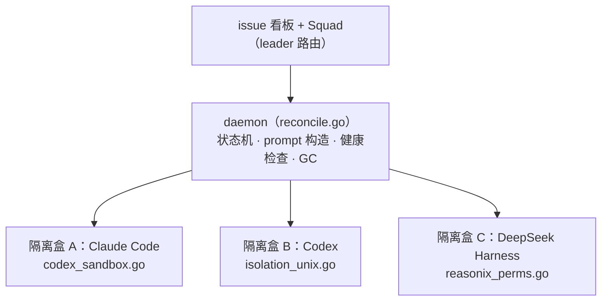
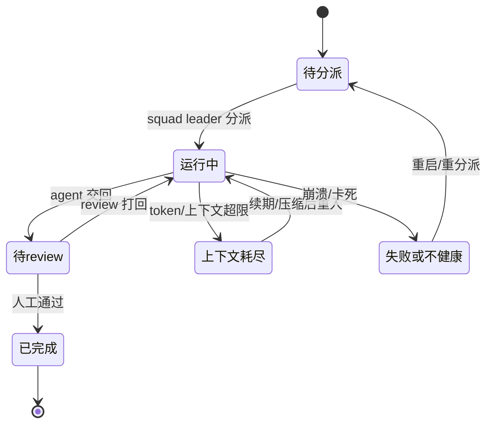

# multica 全景

前四个案例都是"包裹模型"的 harness。multica 是**另一个层次**——它自己不含模型循环，而是**编排一堆别的 harness**（Claude Code、Codex 等 26 个 CLI），把它们当"团队成员"。这一页看"harness 之上还有什么"。

**关于本页**：multica 为开源项目（Apache-2.0 + 附加条款，`github.com/multica-ai/multica`，Go 后端）。用户要求"只看核心 harness 部分"，故本页聚焦 Go daemon 的编排与隔离，不涉及前端/协作 UI。图为原创重绘。

## 定位：它在 harness 之上

| 维度 | 说明 |
| --- | --- |
| 形态 | 多 CLI 编排层 / 团队协作平台（Go 后端 + Next.js 前端） |
| 关键区别 | 自己**不含 LLM 循环**——"drives them; it doesn't ship them" |
| 编排对象 | 26 个异构 agent CLI（Claude Code、Codex、DeepSeek Harness 等） |
| 名字 | 致敬 1960s Multics 分时系统：把多 agent 分时复用进你的工作流 |

> **抽象层次的跃迁**：前四个案例回答"怎么造一个 harness"；multica 回答"**怎么把一堆 harness 组织成一支能协作的团队**"。它把每个 harness 当黑盒，通过**进程隔离 + issue 看板 + review gate** 协调。这是 CH12"多 agent"在跨 harness 层面的真实生产实现。

## 整体架构

### 官方 ASCII 架构图（署名引用）

下面是 multica 官方 README 的 Architecture 段那张 ASCII 架构图**原样引用**（源自 `github.com/multica-ai/multica`，Multica License，非商用学习引用，保留署名）。它展示完整链路；本课下方的原创图则聚焦用户要求的"核心 harness 部分"（Agent daemon 的编排与隔离）。

来源：<https://github.com/multica-ai/multica#architecture>

```text
        Web  ·  Desktop (macOS/Windows/Linux)  ·  iOS
                          │
                          ▼
   ┌──────────────┐   ┌──────────────┐   ┌──────────────────┐
   │   Next.js    │──>│  Go backend  │──>│   PostgreSQL     │
   │   frontend   │<──│  (Chi + WS)  │<──│   (17)           │
   └──────────────┘   └──────┬───────┘   └──────────────────┘
                             │  tasks over WebSocket
                      ┌──────┴───────┐
                      │ Agent daemon │  runs on your machine, next to your code
                      └──────┬───────┘
                             │  spawns
                      ┌──────┴───────────────────────────────┐
                      │  Claude Code · Codex · Cursor · …    │
                      │  (any of the 26 runtimes above)      │
                      └──────────────────────────────────────┘
```

> **两处订正**：① multica 许可证是 **"Multica License"**（Apache-2.0 正文 + 托管/商用嵌入/品牌附加限制，属 source-available），非纯 Apache-2.0。② 官方术语是 **Agent daemon / Agent runtime**；本课早期用的 "execenv" 是源码目录名，非官方对外用语——下文以官方术语为准。

### 本课原创重绘（核心 harness 部分）



*图 · multica 编排架构：每个 harness 关在自己的隔离盒里，Agent daemon 统一编排，review gate 人工把关。Agent daemon 是编排中枢，把每个异构 harness 关进独立隔离盒（源码在 `daemon/execenv/`，CH7.3 的"向外隔离"），靠 issue 看板 + squad + review 协调。它自己不含 LLM 循环。*

> **本页承担该案例的全部深度 + 证据边界**：multica 在全课只在 CH12（多 agent）带过，**本页是它唯一的详细出场**。证据强度提示：定位（"编排层、不含 LLM 循环"）、技术栈、官方 ASCII 架构图来自官方 README（确证）；但下面 **reconcile 状态机的具体状态迁移**，是基于源码**目录/文件命名 + daemon 编排语义**的推断（issue 级理解，非逐行核对实现）。请按"编排层通常要处理哪些状态"来理解，而非"multica 源码确切如此"。

## 深剖：reconcile 状态机在协调什么

先给两个术语就地注解：

- **reconcile（调谐）**：借自 Kubernetes 控制器的思想——**持续对比"期望状态"与"实际状态"，有差异就采取动作把实际状态推向期望**。multica 的 `reconcile.go` 就是这样一个调谐循环：期望是"这个 issue 应该被某 agent 做完并通过 review"，实际是"agent 现在处于什么状态"，daemon 反复调谐两者。
- **squad leader（小队 leader）**：一个负责**把 issue 路由/分派**给合适 agent 的角色（哪个 CLI 擅长、谁空闲），类似团队里的组长派活。

为什么编排层需要状态机而非简单的"调用-等返回"？因为被编排的是**异构、长时运行、会失败、会耗尽上下文**的外部 harness。daemon 至少要跟踪并调谐这样一组状态（要素为编排层通用职责，对应源码里的健康检查/GC/token 续期/上下文耗尽处理等文件）：



*图 · reconcile 状态迁移（推断）：主干：待分派 →（squad leader 分派）运行中 →（agent 交回）待 review →（人工通过）已完成。旁路：上下文耗尽 → 续期/压缩后重入；失败/不健康 → 重启或重新分派。daemon 的 reconcile 循环持续把实际状态推向"完成"。*

> **为什么这一层用"调谐"而非"函数调用"**：如果只是"调一个 agent 等它返回"，崩了、卡了、上下文满了就没人管了。**调谐循环的价值是"声明期望 + 持续纠偏"**：agent 挂了就重启/重分派、上下文耗尽就续期后重入、交回了就转入 review——daemon 不断巡检并把每个 issue 推向完成。这正是编排**长时运行、会失败的外部进程**时必须的健壮性，也是它 Go 代码里健康检查、GC、token 续期、`context_exhausted` 处理这些文件存在的原因。

## 一个 issue 的处理流程

multica 的"任务"单位不是一句 prompt，而是一个 **issue**。`parseDate` 若作为 issue 交给它：

| 步 | 机制 | 做什么 | 对应章 |
| --- | --- | --- | --- |
| 1 | issue 看板 + squad leader 路由 | 把"给 parseDate 加测试"这个 issue 指派给某个 agent（如 Claude Code） | CH12 |
| 2 | Agent daemon 起隔离盒 | 为该 agent 准备隔离环境（home/session/权限） | CH7.3 |
| 3 | daemon prompt.go 构造输入 | 把 issue 转成该 CLI 能吃的 prompt/命令 | — |
| 4 | 被编排的 harness 自己跑 | Claude Code 在盒子里跑它自己的循环（前四案例的内容） | 案例1-4 |
| 5 | reconcile.go 状态机协调 | 跟踪进度、健康检查、上下文耗尽处理、token 续期 | CH8/CH9 |
| 6 | review gate | agent 交回结果 → 人工 review 把关 → 合并 | CH12 |

> **它怎么不违反"写须收敛"（CH12）**：关键：multica 不让多个 agent 并行改**同一份**代码。每个 agent 领**各自独立**的 issue、在**各自隔离**的运行环境里工作，最后通过 **review gate（人工把关）** 收敛。这是"写须收敛"的团队版实现：不靠单线程，而靠**任务分解 + 进程隔离 + 人工 review**，把并行的写限制在互不冲突的边界内。

## 核心模块清单（仅 harness 相关）

| 模块 | 职责 | 对应章 |
| --- | --- | --- |
| `server/internal/daemon/` | 编排中枢：reconcile 状态机、prompt 构造、健康检查、GC | CH12 |
| `daemon/execenv/` | 为每个异构 CLI 做隔离：codex_sandbox/isolation_unix/windows/reasonix_permissions | CH7.3 |
| `daemon/runtime_mcp.go`、`remote_mcp_broker.go` | MCP 桥接 | CH4 |
| `context_exhausted_test.go` 等 | 上下文耗尽处理、token 续期（容错） | CH8/CH9 |
| `dispatch/`、`cli/`、`selfexec/` | 任务分发、CLI、自更新 | CH12 |

**工程严谨性范例**：multica 的 Go 代码**测试极其密集**（几乎每个源文件配 `_test.go`）。作为"生产级 agent 运行时工程"的样本，它示范了这类系统该有的工程规范——大量隔离/权限/容错逻辑都有对应测试兜底。

## 取舍与边界

**multica 的设计指纹**

- **层次**：harness 之上的编排层（不含自己的循环）。
- **隔离**：向外——把一堆异构 harness 各自关进隔离盒。
- **协调**：issue/squad/review gate（而非共享上下文）。
- **形态**：团队级协作平台。

一句话：**当你需要多个（可能异构的）agent 像团队一样协作、且要人工把关时，才需要这一层**。对单人单任务，它是彻底的过度设计。它回答的是全课最后一个问题——"harness 之上还能有什么"。
