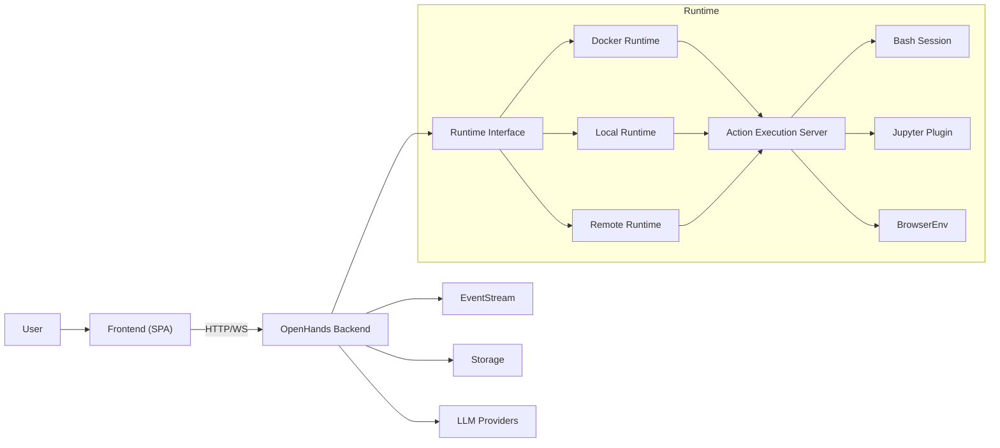
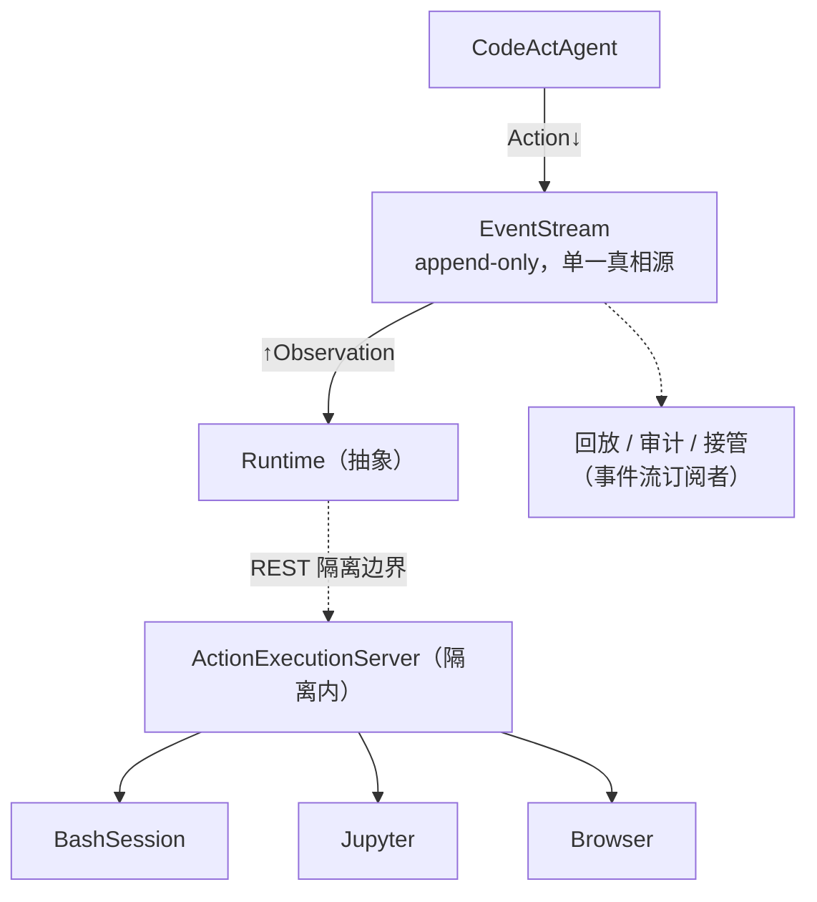

# OpenHands 全景

Claude Code 是"你终端里的 CLI"，OpenHands 是"能无人值守跑的自主平台"。同样完成 `parseDate` 任务，它的骨架是事件流 + Runtime 抽象，处处为"可审计、可接管、可分布"服务。这一页把它串成整体。

**关于本页**：OpenHands 为开源项目（MIT，`github.com/OpenHands/OpenHands`）。本页基于公开架构讲解，图为原创重绘，具体以仓库当前版本为准。

## 定位与场景

| 维度 | 说明 |
| --- | --- |
| 形态 | 自主 agent 平台（Web UI + 后端），原名 OpenDevin |
| 技术栈 | Python 后端 + TS 前端 |
| 目标场景 | 长时间自主运行、要审计/回放/接管、要能换执行后端（本地/容器/远程） |
| 设计基调 | 事件驱动循环 + Runtime 抽象 + 一切皆可序列化 |

## 整体架构

### 官方后端架构图

下面是 OpenHands 官方文档里那张系统架构图，直接用其**官方 Mermaid 源码**渲染（源自 `docs.openhands.dev/usage/architecture/backend`，项目 MIT 许可，非商用学习引用，已标注出处）。它画出 Frontend、**EventStream**、**Runtime**（Docker/Local/Remote）、**Action Execution Server**、Bash/Jupyter/Browser、LLM Providers 的关系——与本课讲的骨架完全对应。

来源：<https://docs.openhands.dev/usage/architecture/backend>

### 本课原创重绘（简化版）

下面这张是按官方架构**原创重绘**的简化版，聚焦本课强调的"事件流 + Runtime 隔离"主干，并标注了 `parseDate` 任务的数据流向：

*图 · OpenHands 整体架构：Agent 与 Runtime 围绕 EventStream；Runtime 经 REST 隔离边界连到 ActionExecutionServer 分发执行；回放/审计/接管只是事件流的订阅者。对应 CH2.3 + CH7.2。*

## 请求处理全流程

| 步 | 机制 | parseDate 里发生什么 | 对应章 |
| --- | --- | --- | --- |
| 1 | Agent.step(history) | 看事件流历史，产出 Action（先 read 文件） | CH2.3 |
| 2 | 写入 EventStream | FileReadAction 落到流上 | CH2.3 |
| 3 | Runtime.execute() 经 REST | Action 跨隔离边界进 ActionExecutionServer | CH7.2 |
| 4 | BashSession 等执行 | 在容器里读源码 / 跑 pytest | CH7.2 |
| 5 | Observation 写回流 | 命令输出/报错回到 EventStream | CH2.3 |
| 6 | Agent 看新 Observation | 基于报错产出下一个 Action（改测试） | CH9 |
| … | 循环由事件写入推进 | 直到 Agent 产 AgentFinishAction | CH2.3 |

> **和 Claude Code 对照**：同一个 `parseDate` 任务、同样的 ReAct 循环，但机制迥异：CC 是生成器 `yield` 事件、状态在栈上；OpenHands 是 Action/Observation 落在**可序列化的事件流**上、状态在流里。正因如此，OpenHands 白拿了可回放、可接管、可换 Runtime——这些在 CC 里都要额外费劲实现。**骨架相同（ReAct），机制不同（生成器 vs 事件流），源于场景不同（CLI vs 自主平台）。**

## 核心模块清单

| 模块 | 一句话职责 | 对应章 |
| --- | --- | --- |
| `EventStream` | append-only 事件总线，循环中枢 + 单一真相源 | CH2.3 |
| `Action` / `Observation` | 可序列化的"想做的事"/"环境反馈" | CH2.3 |
| `CodeActAgent` | 主 Agent 实现：看历史产 Action | CH2.3 |
| `Runtime` 抽象 → Docker/Local/Remote | 可插拔执行后端，经 REST 隔离 | CH7.2 |
| `ActionExecutionServer` | 隔离环境内的执行者，分发到 Bash/Jupyter/Browser | CH7.2 |
| Skills（原 microagents） | 渐进式披露的上下文 + AGENTS.md | CH5 |

## 取舍与边界

**OpenHands 的设计指纹**

- **循环**：事件驱动（可回放/接管/分布，代价是复杂度高）。
- **执行**：Runtime 抽象 + 容器/远程（强隔离、可复现、可扩展）。
- **形态**：自主平台。

一句话：**为"无人值守、大规模、要审计"这个形态做的取舍**。它比 CC 重，但换来了 CLI 给不了的能力。如果你只是想在本地敲个命令，它的事件流+容器就是过度设计——反之亦然。这正是"没有最好，只有最适合"。
