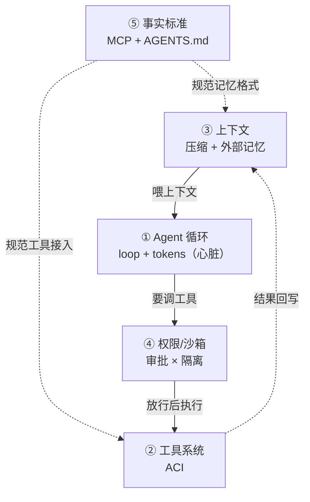
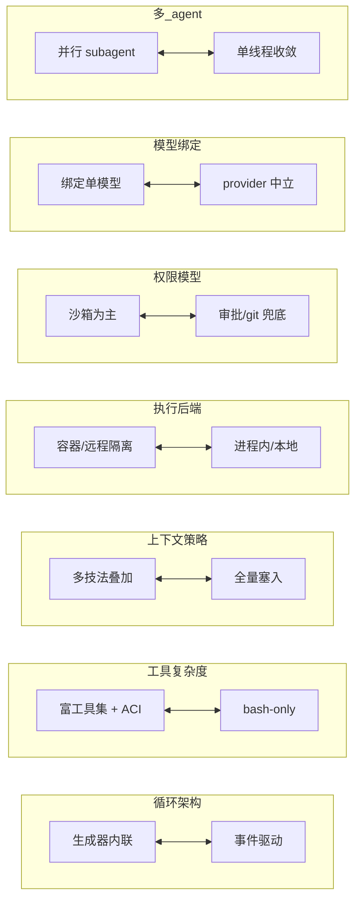
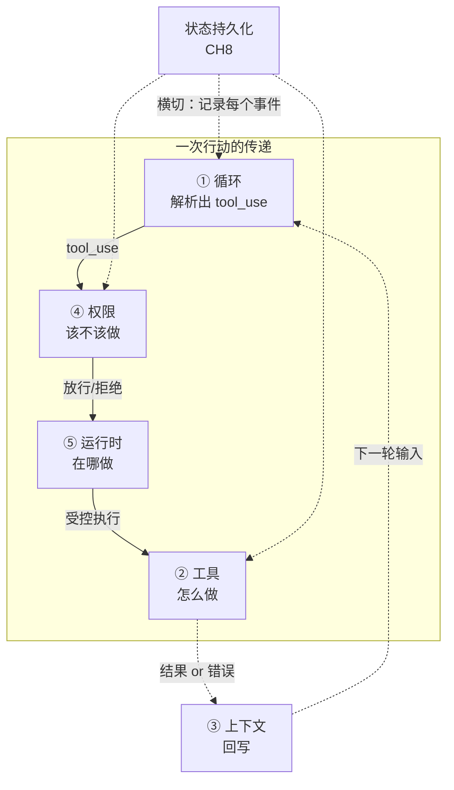

# 融会贯通：共性与取舍地图

全课走完，该把五个案例、十二章内容打通了。剥开所有差异，harness 的不变内核是什么（道）？各家为何选择不同、怎么选（术）？这一页给你两样能带走的东西：五大共性，和一张七维取舍地图。

## 五大共性：所有 harness 的最大公约数（道）

五个案例：CLI、自主平台、安全标杆、插件化、编排层，形态各异。但剥开差异，不变的内核只有五条。**掌握这五点 = 掌握 harness 的"道"**：

*图 · 五大共性的真实关系：循环居中驱动，上下文供数、权限把关、工具执行、结果回流成环；事实标准（MCP/AGENTS.md）横切规范"工具接入"和"记忆格式"两处。这不是一张清单，而是一台运转的机器——任何新 harness 都能用这五条 + 这套连线解剖。*

## 七维取舍地图（术）

共性是"都要做什么"，取舍是"各自怎么选"。这张表是全课的浓缩——遇到任何 harness，在七行上给它打点，就得到它的"设计指纹"。

*图 · 七维取舍地图（全课核心）：七个设计维度的两极。给任何 harness 在这七行打点，即得其"设计指纹"。理解每个选择的依据，就理解了它为谁而设计。*

| 维度 | 一极 | 另一极 | 选择依据 |
|---|---|---|---|
| [循环架构](../02-agent循环/ch2-loop-paradigms.md) | 生成器内联 | 事件驱动外置 | 是否需持久化/分布式/接管 |
| [工具复杂度](../04-工具系统/ch4-tools-aci.md) | 富工具集 + 强 ACI | bash-only 极简 | 目标模型能力（越强越可简） |
| [上下文策略](../05-上下文/ch5-ctx-principles.md) | 多技法叠加 | 全量塞入 | 任务长度/成本敏感度 |
| [执行后端](../07-运行时/ch7-rt-principles.md) | 容器/远程隔离 | 进程内/本地 | 安全需求 vs 启动开销 |
| [权限模型](../06-权限安全/ch6-perm-principles.md) | 沙箱为主 | 审批/git 兜底 | 自动化 vs 交互；是否可信 |
| [模型绑定](../11-模型绑定/ch11-model-binding.md) | 绑定单模型 | provider 中立 | 优化深度 vs 迁移自由 |
| [多 agent](../12-多agent/ch12-multi-agent.md) | 并行 subagent | 单线程收敛 | 读为主 vs 写为主 |

## 形态决定取舍

| 形态 | 场景 | 典型取舍组合 |
|---|---|---|
| **CLI**（Codex/Aider/CC） | 本地、单用户、要快、交互 | 生成器内联 + 本地/子进程 + 审批为主 + 低延迟 |
| **自主平台**（OpenHands） | 长时自主、要审计/接管/复现 | 事件驱动 + 容器/远程 + 沙箱为主 + 可回放 |
| **绑定生态**（deepseek/Gemini） | 深耕某模型/生态 | 绑定优化（适配器保中立）+ 生态一等支持 + 插件化 |
| **编排层**（multica） | 团队级、多异构 agent、要把关 | 不含自己循环 + execenv 隔离 + issue/review |

> **最重要的心智模型**
>
> **没有"最好的 harness"，只有"最适合某场景的取舍组合"。** 你造 tinyharness 时的每个选择（生成器循环、富工具、审批为主、单 agent），都是"CLI 形态"的合理默认。要改造成 OpenHands 那样，就把七维地图里几行翻到另一极——并承担对应代价。

## 关键接缝：职责之间怎么对接

七维地图讲的是每个职责**各自**怎么选，但真正决定 harness 能不能跑顺的，是职责**交界处**的对接——这些"接缝"往往是 bug 和设计分歧的高发地。全课散落各章的接缝，在这里汇成一张图:

*四条最关键的接缝：① 循环↔权限（tool_use 出来先过闸，不直接执行）② 权限↔运行时（放行的动作交给受控环境）③ 工具↔上下文（结果/错误回写，闭合 ReAct）④ 状态持久化横切所有职责（每个事件都记一笔，支撑崩溃恢复）。*

| 接缝 | 谁给谁 | 传递什么 | 出错会怎样 |
|---|---|---|---|
| 循环 → 权限 | [CH2](../02-agent循环/ch2-loop-paradigms.md)→[CH6](../06-权限安全/ch6-perm-principles.md) | 解析出的 tool_use（工具名+参数） | 漏了这道闸 = agent 无审批直接跑危险命令 |
| 权限 → 运行时 | [CH6](../06-权限安全/ch6-perm-principles.md)→[CH7](../07-运行时/ch7-rt-principles.md) | 放行的动作 + 该在哪个隔离级执行 | 权限放行但运行时没隔离 = 沙箱形同虚设 |
| 工具 → 上下文 | [CH4](../04-工具系统/ch4-tools-aci.md)→[CH5](../05-上下文/ch5-ctx-principles.md) | 执行结果 / 格式化后的错误 | 结果格式化差 = 模型读不懂、无法自纠（[CH9](../09-错误处理/ch9-errors.md)） |
| 状态 ↔ 全体 | [CH8](../08-状态持久化/ch8-state.md) 横切 | 每个事件的 append-only 记录 | 不记录 = 崩溃后无法恢复、无法回放审计 |

> **为什么接缝比部件更重要**
>
> 单个职责做对不难，难的是**交界处的契约**：循环必须"先问权限再执行"而非直接跑；工具结果必须"回写成模型能读的格式"而非扔个异常；状态必须"在每个环节都记一笔"而非只记结尾。这些契约就是 harness 从"能跑"到"跑得稳"的分水岭——也是你读任何一个真实 harness 源码时，最该盯住的地方。

## 四条贯穿全课的主线

**主线一 · 复杂度是场景逼出来的**
循环可 300 行，工具可只有 bash。复杂度都花在上下文/权限/运行时这些"场景要求"上。做 harness 先问"我的场景需要哪些复杂度"，别照搬标杆。

**主线二 · 模型越强，harness 越可简化**
SWE-agent→mini 的演进、绑定 harness 的精准适配，都说明：别为今天的模型弱点过度设计，要押注模型能力的演进。

**主线三 · 用抽象化解伪二选一**
Runtime 抽象化解"安全 vs 可换环境"；适配器化解"绑定 vs 中立"；事件流化解"执行 vs 审计接管"。遇到对立取舍，先问"能不能加一层抽象让两边都要"。你在 CH3/7/11 反复用的都是同一招：依赖倒置。

**主线四 · 读可并行，写须收敛**
多 agent 之争的解，也统一了子 agent 隔离与并发执行。

## 趋势与结语

- **模型变强 → harness 变薄**：ACI、护栏的边际收益递减。但**上下文管理、权限安全、运行时隔离不会消失**——它们是环境约束，不随模型变强而消失。
- **生态收敛**：MCP、AGENTS.md 成事实标准，三级沙箱、compact 机制趋同。
- **编排层崛起**：multica 这类"编排一堆 harness"的层出现，下一个战场可能在"多 agent 团队协作"。

> **结语：你带走了什么**
>
> 你带走的不是"某个 harness 怎么用"，而是一套**可迁移的分析与建造能力**：用五职责解剖任意 harness、用七维地图给它画设计指纹、用四条主线做判断、并能亲手造一个。
>
> 新的 harness 会不断出现，但它们逃不出这五大共性、七个维度。**你已经有了看穿它们的框架。**
