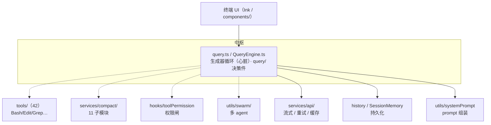

# Claude Code 全景

前面 CH2-10 是按主题横切 Claude Code，这一页把它**纵向串成整体**——从你敲下一句话，到它调度循环、工具、压缩、权限、子 agent，完整走一遍。这是把散落的知识点拼成"一个真实 harness 长什么样"的整合页。

**关于本页源码**：基于 Claude Code 泄露 source map 还原（来源与合规边界见[附录 C](appendix.md)）。只讲架构、模块职责与文件定位，图为原创重绘，不复制真实源码。

## 定位与场景

| 维度 | 说明 |
| --- | --- |
| 形态 | CLI（终端 agent），也有 IDE 集成 |
| 技术栈 | TypeScript / Bun，终端 UI 用 Ink（React for CLI） |
| 目标场景 | 开发者本地、单用户、交互式、低延迟 |
| 模型 | 为 Claude 深度定制（prompt、thinking block 处理） |
| 设计基调 | 生成器循环 + 审批为主 + 就在你终端里跑 |

## 整体架构

> **说明：Claude Code 闭源，无官方架构图。** Claude Code 是闭源产品，官方未公开整体架构图。下方架构图是本课基于泄露 source map 还原的源码目录结构**原创绘制**（来源与合规边界见[附录 C](appendix.md)），只表达模块划分与调度关系，不代表官方设计文档。

*图 · CC 整体架构：query 循环是中枢，向下调度工具、压缩、权限、多 agent，并依赖 api（交互）、history（持久化）、systemPrompt（组装）几层。对应你学过的 CH2-10。*

## 请求处理全流程

把 `parseDate` 任务在 Claude Code 里走一遍，串起所有模块：

| 步 | 模块 | 做什么 | 对应章 |
| --- | --- | --- | --- |
| 1 | `utils/systemPrompt` + AGENTS.md | 分段组装 system prompt，加载项目记忆 | CH5.2 |
| 2 | `query()` → `queryLoop()` | 进入生成器主循环 | CH2.2 |
| 3 | `services/api/` | 流式调 Claude，增量解析 tool_use，失败重试 | CH3 |
| 4 | `hooks/toolPermission` + BashTool AST | 执行前判权限：pytest 放行 / 危险命令问用户 | CH6 |
| 5 | `tools/`（Read/Edit/Bash） | 读源码、写测试、跑 pytest | CH4 |
| 6 | `services/compact/` | 历史近上限时 microCompact/autoCompact | CH5.3 |
| 7 | `history` / JSONL | 每轮追加落盘，可中断恢复 | CH8 |
| 8 | `query/tokenBudget` + `QueryGuard` | 判终止 / 防空转，循环直到测试绿 | CH2.2/CH9 |

> **整合视角**：看这张表——你之前每章学的一个"点"，在这里串成了一条"线"。**一个真实 harness 就是这些模块围着 query 循环协同工作。**你的 tinyharness 已经有了其中大部分的最小版：循环（CH2）、交互（CH3）、工具（CH4）、压缩（CH5）、权限（CH6）、运行时（CH7）、持久化（CH8）、错误（CH9）、观测（CH10）。差别只在成熟度，不在骨架。

## 核心模块清单

| 模块 | 关键文件 | 一句话职责 |
| --- | --- | --- |
| 循环 | `src/query.ts`、`QueryEngine.ts`、`query/` | 生成器驱动 + 抽出的终止决策 |
| 工具 | `src/tools/`（42）、`BashTool/`（18 文件） | schema+执行+护栏，Bash 有 AST 安全 |
| 上下文 | `src/services/compact/`（11）、`SessionMemory/` | 分级压缩 + 会话记忆 |
| Prompt | `src/utils/systemPrompt.ts`、`constants/systemPromptSections.ts` | 分段组装 |
| 交互 | `src/services/api/`（withRetry、promptCacheBreakDetection、StreamingToolExecutor） | 流式/重试/缓存 |
| 权限 | `src/hooks/toolPermission/` | hook 式审批 |
| 持久化 | `src/history.ts`、`utils/conversationRecovery.ts` | JSONL + 中断恢复 |
| 多 agent | `src/utils/swarm/` | 子 agent 隔离 + 摘要回传 |

## 取舍与边界

**Claude Code 的设计指纹**

- **循环**：生成器内联（简洁、低延迟，但难跨进程接管）。
- **工具**：富工具集 + 每工具深度护栏（强但散）。
- **权限**：审批为主（用户在场）。
- **模型**：偏绑定 Claude（深度定制）。
- **多 agent**：单 harness 内 subagent（读密集）。

一句话：**为"开发者本地、单用户、交互式"这个形态，做了一整套自洽的取舍**。它不适合"无人值守大规模跑"——那是 OpenHands 的地盘（下一页）。
