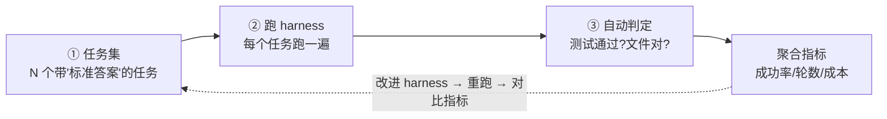

# 可观测与自建评测

你的 harness 现在能跑、能扛错。但它跑得**好不好**？一次运行调了几次模型、花了多少钱、在哪一步卡住？改了 prompt 后成功率是升是降？看不见，就无法改进。这一章讲 tracing、成本追踪，以及最关键的——如何搭建你自己的评测。

> **回到任务**：[任务地图](lifecycle.md)贯穿全程的"可观测"。`parseDate` 任务跑完了，但你想知道：它转了几圈？哪圈最慢？花了多少 token？如果你改进了 system prompt，新版本在 100 个类似任务上是更好还是更差？这一章让这些问题可回答。

## 看不见就改不动

agent 是个黑盒：同样的输入，可能这次 3 轮搞定、下次 15 轮还在绕。要改进它，先得能**看清它做了什么**。可观测三件事：

- **Trace（轨迹）**：一次运行的完整时间线——每轮调了什么模型、解析出什么工具、执行结果、耗时。
- **成本**：每次调用的 input/output token、换算成钱。
- **评测**：在一批任务上量化"成功率、平均轮数、平均成本"，用于对比不同版本。

## Trace：把一次运行变成可查的时间线

回忆 CH2.3：OpenHands 的事件流本身就是一条完整 trace（每个 Action/Observation 都在流上）。这是事件驱动的又一个红利——**天生可观测**。生成器循环（Claude Code）则需要主动埋点，把每轮的关键信息记下来。

一条 trace 长什么样：

```text
run_id: abc123  task: "给 parseDate 加时区单测"
├─ turn 1  [model 1.2s, 850 tok]  → tool_use: read_file(utils.py)
│          [tool 0.01s]           → 找到 parseDate 定义
├─ turn 2  [model 2.1s, 1200 tok] → tool_use: write_file(test_parse.py)
│          [tool 0.01s]           → 已写入
├─ turn 3  [model 1.8s, 1400 tok] → tool_use: bash("pytest")
│          [tool 3.2s]            → FAILED: AssertionError  ← 卡点!
├─ turn 4  [model 2.0s, 1600 tok] → tool_use: write_file(修正)
└─ turn 5  [model 1.5s, 900 tok]  → 完成（无 tool_use）
   总计: 5 轮, 5950 tok, 12.8s, $0.04
```

**trace 能回答的问题**：有了这条 trace，你能看出：turn 3 的 pytest 是最慢的一步（3.2s）、也是唯一失败点；整个任务 5 轮 6k token。如果某类任务经常卡在 turn 3，你就知道要优化"让模型第一次就写对测试"。**没有 trace，你只能盲猜。**

## 成本追踪：每一轮都在花钱

接 CH3.2 的 token 计数：模型响应的 `usage` 字段给了每次调用真实的 input/output token。乘以单价，累加，就是这次运行的成本。

**成本是设计的反馈信号**：成本追踪不只是记账，它**反向指导设计**：

- 如果发现 input token 每轮暴涨 → 上下文没压好（回 CH5）。
- 如果缓存命中率低 → prompt 前缀不稳定（回 CH3.2/5.2）。
- 如果轮数过多 → 工具设计或 ACI 有问题（回 CH4）。

**成本是把前面所有章节的设计质量量化出来的一把尺子。**

## 自建 eval loop：harness 开发的科学方法

这是本章的重头，也是"达到开发水平"的分水岭。**你没法靠"感觉"改进 harness**——改了 prompt 觉得"好像好点了"是不可靠的。你需要一个评测集，用数字说话。

不要只把 SWE-bench 当"别人的排行榜"——要学会**搭自己的**。一个最小 eval loop 三步：



*图 10-1：最小 eval loop——任务集 → 跑 harness → 自动判定 → 聚合指标。改进后重跑对比，用数字确认是真进步还是错觉。这是 SWE-bench（FAIL_TO_PASS/PASS_TO_PASS 判定）方法论的自建版。*

**判定要客观可自动化**：借 SWE-bench 的智慧（CH7.3），判定别靠人肉看，要**可自动化的客观标准**——对编码任务，最好的判定就是"**预置的测试是否通过**"（FAIL_TO_PASS）+ "有没有搞坏别的"（PASS_TO_PASS）。对 `parseDate` 这类任务，你的 eval 集里每个任务都配一份"标准测试"，agent 跑完后自动执行标准测试，通过即成功。客观、可重复、能自动跑。

## 动手：给 tinyharness 加 trace + 跑自评

```python
# trace.py + eval.py（骨架）
# trace：循环里每轮记一条
TRACE = []
def trace(turn, dt, tokens, action):
    TRACE.append({"turn":turn,"sec":round(dt,2),"tok":tokens,"action":action})
def trace_summary():
    return {"turns":len(TRACE),"total_tok":sum(t["tok"] for t in TRACE),
            "total_sec":sum(t["sec"] for t in TRACE)}

# eval：一批任务，自动判定
EVAL_SET = [
  {"task":"给 parseDate 加时区单测", "check":"pytest test_parse.py"},
  # ... 更多任务，每个配一个"通过即成功"的检查命令
]
def run_eval():
    results = []
    for case in EVAL_SET:
        TRACE.clear()                            # 关键：每个任务前清空，否则指标会跨任务累加
        setup_clean_workspace(case)              # 干净环境（CH7）
        loop(case["task"])
        ok = subprocess.run(case["check"], shell=True).returncode == 0
        results.append({"task":case["task"], "pass":ok, **trace_summary()})
    rate = sum(r["pass"] for r in results) / len(results)
    print(f"成功率 {rate:.0%}，平均 {avg_turns(results):.1f} 轮")
```

## 里程碑 9 · 自测清单

- [ ] 每轮记录 trace（轮次/耗时/token/动作）
- [ ] 能打印一次运行的成本汇总
- [ ] 有一个哪怕只有 3-5 个任务的 eval 集，能自动跑出成功率
- [ ] 判定是客观可自动化的（跑测试，不靠人看）
- [ ] 能演示"改一处→重跑 eval→用数字看是否变好"

恭喜，你已具备科学改进 harness 的能力。CH11-12 补高级话题，然后总装成完整 harness。

## 本章要点

1. **看不见就改不动**：可观测 = trace + 成本 + 评测。
2. **Trace** 把一次运行变成可查时间线（事件驱动天生有，生成器循环需埋点）。
3. **成本**是量化前面所有设计质量的尺子，反向指导优化。
4. **自建 eval loop**（任务集→跑→自动判定→聚合）是科学改进 harness 的方法，判定要客观（跑测试）。这是"达到开发水平"的分水岭。
