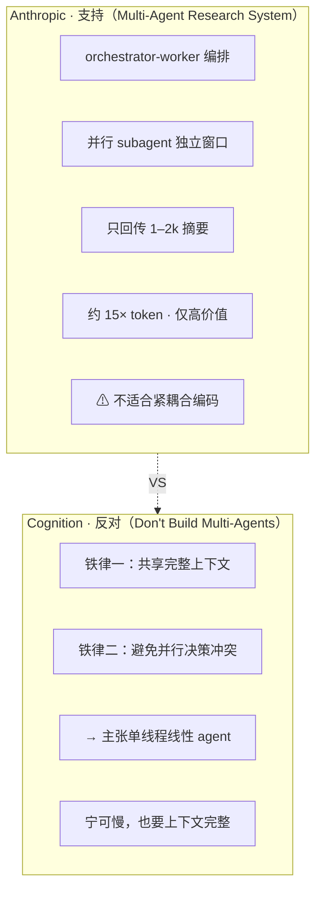

# 多 Agent 编排与协作

单 agent 你已经会造了。那多个 agent 协作呢？这是当前最有争议的话题——两家顶尖团队给出了几乎相反的结论。理解它们为何都对，你就掌握了"何时该上多 agent、怎么上"的判断力。

## 两篇针锋相对的文章

把它们并置，是理解多 agent 的最佳方式：

*图 12-1：两篇同期（2025-06）、结论相反的文章。分歧根源不是谁对谁错，而是任务类型不同。*

**官方博客配图说明——Anthropic《How we built our multi-agent research system》**：原文配有 orchestrator-worker 架构图与 token 消耗对比，建议对照理解"并行 subagent 独立窗口探索、压缩回传"的编排，以及为何约 15× token。链接：[anthropic.com/engineering · Multi-Agent Research System](https://www.anthropic.com/engineering/multi-agent-research-system)

**它们矛盾吗？** 表面矛盾，实则各自对。分歧根源是**任务类型**：Anthropic 讲 research（本质是**读**，可分割——五个 subagent 各查一块，互不干扰）；Cognition 讲 coding（有大量**写**和相互依赖，难分割——两个 agent 同时改代码，假设会冲突）。

## 提炼：读可并行，写须收敛

> **全课几条线索的交汇点**
>
> **读操作（探索、检索、分析）** 可以并行 subagent + 上下文隔离 + 摘要回传。
> **写操作（修改、决策、有依赖的动作）** 应当收敛到单线程 + 完整上下文。

**决策指引**：要 agent"调研问题、并行看多个文件"→ 大胆并行 subagent；要 agent"改一套相互关联的代码"→ 保持单线程；混合任务 → **先并行读（收集信息），再单线程写（基于完整信息决策）**。这条原则也统一了 CH5.1 的子 agent 隔离和 CH7 的并发执行。

## multica：跨 harness 编排的真实形态

源码位置 `server/internal/daemon/`。multica 的层次更高一层——它自己不含 LLM 循环，而是**编排 26 个异构 harness**（Claude Code、Codex 等），把每个 CLI 当"团队成员"：指派 issue → agent 自动接单 → 在受控 runtime 跑（CH7 execenv）→ 评论进度 → 交回 review。

> **它怎么"收敛写"**
>
> multica 的协调**不违反 Cognition 铁律**——它不让多个 agent 并行改同一份代码。每个 agent 领自己的 issue、在隔离 runtime 工作，通过 **issue 看板 + squad + review gate（人工把关）** 来收敛，而非共享上下文。这是"写须收敛"的另一种实现：不靠单线程，而靠**任务分解 + 隔离 + review**，把并行的写限制在互不冲突的边界内。

## Claude Code：单 harness 内的 subagent

源码位置 `src/utils/swarm/` + `coordinator`。Claude Code 走 Anthropic 路子：在**一个 harness 内**协调子 agent，subagent 有独立上下文，完成后回传摘要给主 agent（正是 CH5.1 技法③的落地）。用途：派"去大代码库调研 X"这类**读密集子任务**，子 agent 隔离窗口翻一遍，只带结论回来，主上下文保持干净。

| 维度 | 单 harness 内 subagent（CC） | 跨 harness 编排（multica） |
| --- | --- | --- |
| 编排对象 | 同一 harness 的子 agent | 多个异构完整 harness |
| 耦合度 | 紧（共享进程/工具） | 松（进程级隔离，异构） |
| 协调机制 | 代码内 coordinator | issue 看板 + review gate |
| 冲突避免 | 摘要回传（不并行写） | 任务隔离 + review |
| 适合 | 读密集子任务、主上下文保鲜 | 团队级、异构、要人工把关 |

## 何时值得上多 agent + 本章小结

> **决策清单**
>
> 多 agent 有明确代价：**token 成本显著上升** + 编排复杂度 + 冲突风险。上之前问四个问题：
>
> 1. 任务能分解成**互相独立**的子任务吗？不能 → 别拆（单线程）。
> 2. 子任务**读**为主还是**写**为主？读 → 并行 subagent；写 → 收敛或 multica 式隔离+review。
> 3. 价值高到**值这笔额外成本**吗？不值 → 单 agent。
> 4. 需要**异构 agent 协作**吗？需要 → multica 式编排层；不需要 → 单 harness subagent 够了。

> **关于"15× token"这个数字**
>
> 这个常被引用的倍率来自 Anthropic 那篇博客，但要看清它的原始语境：**它的对比对象是"普通聊天对话"，不是"单 agent 系统"；而且是他们那个特定研究系统的观察值**。所以别把"15×"当成"多 agent vs 单 agent"的通用门槛——你的多 agent 相对单 agent 到底贵多少，取决于你的任务分解方式、子 agent 数量、上下文隔离策略，可能远小于也可能不同于 15×。**正确做法：用 CH10 的成本追踪在你自己的任务上实测两种方案的差距，而不是套用一个固定倍率。**

**要点：**

1. 多 agent 最有争议：**Anthropic（挺）vs Cognition（反）**，分歧根源是任务类型（研究=读 vs 编码=写）。
2. 提炼：**读可并行，写须收敛**——统一了子 agent 隔离与并发执行。
3. **multica** 靠 issue/review 收敛并行的写；**CC subagent** 靠隔离窗口+摘要回传服务读密集子任务。
4. 多 agent 是升级而非默认，用决策清单判断是否值得。
