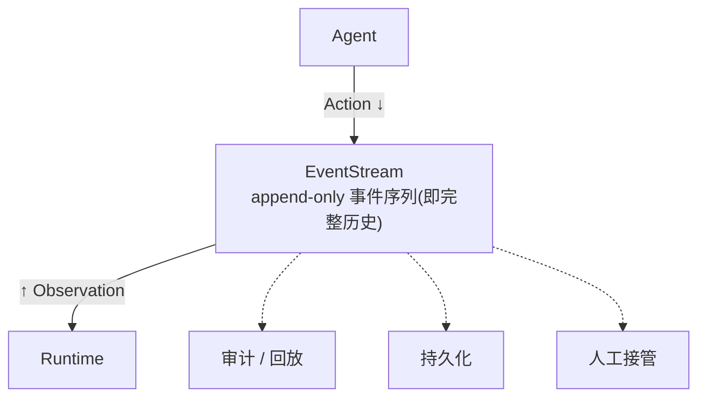

# OpenHands:事件驱动的循环

同样是 ReAct 循环,OpenHands 长得和 Claude Code 完全不同。它没有一个显眼的 `while`,而是一条 append-only 的事件流。这一节看它如何把控制流"外置"到总线上,以及这样换来了什么。

> **关于本节源码**
>
> OpenHands 为开源项目(MIT,`github.com/OpenHands/OpenHands`)。本节基于其公开架构讲解,代码为教学示意。具体文件以仓库当前版本为准([附录 B](appendix.md) 有导航)。

## 回到任务

还是[任务地图](lifecycle.md)第 ③~⑤ 步那圈循环。同一件事——读源码、写测试、跑、看报错——如果用 OpenHands 来做,内部不是"生成器转圈",而是"Agent 往事件流里写一个'跑测试'的 Action,Runtime 执行后写回一个'报错'的 Observation,Agent 看到又写下一个 Action"。同样的 ReAct,不同的机器。

## 核心:一条 append-only 的事件流

OpenHands 的循环中枢是 **EventStream**——一条只追加(append-only)的事件序列。所有参与者都围着它转:

- **Agent** 消费事件流的历史,产出一个 **Action**(它想做的事),写入流。
- **Runtime** 订阅到 Action,执行它,产出一个 **Observation**(环境反馈),写回流。
- Agent 又看到新 Observation,产出下一个 Action……**循环由"事件写入"驱动,而非一段内联代码**。



*图 2.3-1:OpenHands 把控制流外置到 EventStream:Agent 产 Action、Runtime 产 Observation,循环由事件写入推进。事件流是单一真相源,任何组件都能订阅它;审计、持久化、人工接管都只是"多一个订阅者"。*

## 两个核心概念:Action 与 Observation

整个 OpenHands 建立在这对概念上。理解它们,就理解了这个 harness 的骨架:

| 概念 | 是什么 | 例子(parseDate 任务) |
| --- | --- | --- |
| **Action** | Agent 想做的一件事,一个结构化对象 | `CmdRunAction("pytest tests/")`、`FileEditAction(...)`、`FileReadAction(...)` |
| **Observation** | 执行 Action 后环境的反馈 | `CmdOutputObservation("FAILED ... AssertionError")`、`FileReadObservation(源码内容)` |

关键:**Action 和 Observation 都是可序列化的数据对象,不是函数调用**。这是它能被存下来、传出去、回放的前提——你没法序列化一个"正在执行的函数栈",但可以序列化"一个描述要跑什么命令的对象"。

```python
# Agent 侧:看历史,产出下一个 Action
class CodeActAgent:
    def step(self, history) -> Action:
        response = llm(build_messages(history))   # 调模型
        return parse_action(response)             # 解析成 Action 对象

# 主控:事件流驱动,不是 while 内联
def run(agent, runtime, event_stream):
    while not done(event_stream):
        action = agent.step(event_stream.history())  # A. 产 Action
        event_stream.add(action)                      # 写入流
        obs = runtime.execute(action)                 # B. Runtime 执行 → CH7
        event_stream.add(obs)                          # 写回流
    # 任何订阅者(UI/持久化/审计)都在旁听这条流
```

虽然这里也有个 `while`,但注意重心:**状态在 `event_stream` 里,不在调用栈里**。这一点差异,决定了下面所有能力。

## 一圈怎么转:回到 parseDate

把我们的任务套进去,一圈就是:

1. Agent 看历史(目前只有用户任务)→ 产出 `FileReadAction(找到 parseDate)`
2. Runtime 执行 → 产出 `FileReadObservation(源码内容)`,写回流
3. Agent 看到源码 → 产出 `FileEditAction(写测试文件)`
4. Runtime 执行 → `FileEditObservation(写入成功)`
5. Agent → `CmdRunAction("pytest")` → Runtime → `CmdOutputObservation(报错)`
6. Agent 看到报错 → 产出修正的 `FileEditAction`……直到测试绿、Agent 产出 `AgentFinishAction`

和 Claude Code 转的圈数、干的事完全一样(都是 ReAct)。差别只在:**这里每一步都是一条落在流上的事件,而非生成器栈里的一次 yield。**

## 事件流让什么变简单了

> **先拆清四件独立的事,别混为一谈**
>
> "生成器 vs 事件流"不是非此即彼的对立,它们各自只回答其中一部分问题。一个 harness 至少要处理四个**正交**的维度:
>
> ① **控制流**:谁驱动"调模型→执行→回写"这一圈(生成器 `yield` / 事件写入触发)。
> ② **状态表示**:agent 历史长什么样(调用栈上的局部变量 / 可序列化的事件对象)。
> ③ **持久化**:状态怎么落盘、怎么读回。
> ④ **执行部署**:执行体在哪跑、和主逻辑是否同进程。
>
> 事件流真正直接给你的,只是 **②(状态天然可序列化)**。而 ①③④ 会因为 ② 变简单,但**不是白送**。

更准确的说法:

- **持久化**:生成器方案**也能**持久化(把 messages 数组落盘即可,CC 就这么做,见 [CH8](ch8-state.md))。事件流的优势是"状态本就是事件序列,存下来即是完整可回放的历史",少一层"把栈上状态提取出来"的转换——是**更省事**,不是"生成器做不到"。
- **可接管 / 分布式**:事件总线让"多一个订阅者"变容易,但总线本身要解决**事件顺序、重复投递(幂等)、崩溃恢复、以及副作用如何处理**——这些是事件驱动引入的**新工程成本**,不是免费的。往流里插一个事件容易,保证插进去后整个系统状态一致,不容易。
- **执行部署**:Agent/Runtime 能跨进程,靠的是 ④ 的 REST 边界([CH7](ch7-rt-openhands.md)),事件流是配合而非充分条件。

所以结论应该是:OpenHands 选事件流,是为"长时间自主、要审计、要接管"这个场景**把 ①③④ 的实现成本前移到了一个统一的总线抽象里**——你付出总线的复杂度(顺序/幂等/恢复),换来这些能力更好组织。CC 选生成器,是为 CLI 场景把控制流写得最简单直接,持久化则单独做。**两者是不同场景下的不同权衡,不是谁"白拿"了谁做不到的东西。**

## 与生成器循环的正面对比

| 维度 | 生成器内联(Claude Code) | 事件驱动(OpenHands) |
| --- | --- | --- |
| 状态在哪 | 生成器调用栈上 | 事件流里(可序列化) |
| 流式交织 | yield 天然 | 需在事件层单独处理 |
| 持久化/回放 | 要额外做 | 天然(流即历史) |
| 分布式/换 Runtime | 别扭(单进程) | 强(Agent/Runtime 解耦) |
| 人工接管 | 要插审批钩子 | 天然(往流里插事件) |
| 代码复杂度 | 中(线性可读) | 高(总线+订阅+事件类型) |
| 最适合 | CLI、单用户、低延迟 | 自主平台、要审计/接管/分布式 |

> **没有谁更好,只有谁更合适**
>
> 两者都是忠实的 ReAct 实现。生成器把控制流塞进代码换来简洁与低延迟(CLI 的诉求);事件流把控制流搬到总线换来可回放/可接管/可分布式(自主平台的诉求)。**你的 harness 该选哪种,取决于它要跑在哪、给谁用。**这条"形态决定取舍"的主线,会贯穿全课到[融会贯通](synthesis.md)。

## 本节小结

> **要点**
>
> 1. OpenHands 循环中枢是 **EventStream**(append-only),控制流外置到总线。
> 2. 两个核心概念:**Action**(Agent 想做的事)/ **Observation**(环境反馈),都是可序列化对象。
> 3. 循环由"事件写入"推进,状态在流里而非调用栈里。
> 4. 三能力(可持久化回放、可解耦分布式、可人工接管)因事件流**更好组织,但不是白送**——总线要自己解决顺序/幂等/恢复。
> 5. 与生成器方案是"形态决定取舍"——CLI 选生成器,自主平台选事件流。
