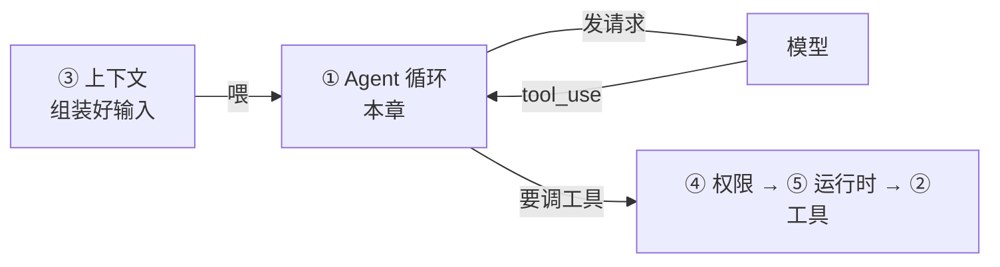
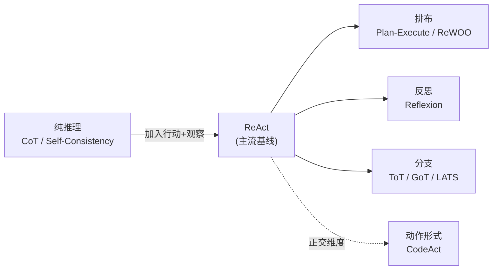

# 循环机制与推理范式

循环是 harness 的心脏。这一节先分清两个常被混为一谈的层次——"循环机制"和"推理范式",再看清循环要解决的三个设计问题,以及 ReAct 之外还有哪些范式、为什么编码 agent 几乎都选 ReAct。

## 回到任务

在[任务地图](lifecycle.md)里,这一章覆盖的是循环那个大虚线框——第 ③~⑤ 步反复转圈的部分。我们那条 `parseDate` 任务之所以能"读源码→写测试→跑→看报错→改→再跑",靠的就是这个循环转了好几圈。本节先讲清"循环到底是什么、里面跑的是什么思想"。

**本章在系统中的位置**

*循环居中:上游从上下文拿到组装好的输入，向模型发请求；模型要调工具时，循环把它交给下游的权限→运行时→工具这条执行链。循环是唯一贯穿全程的"心脏"（[全景协作图见 intro](intro.md)）。*

## 先分清:范式 ≠ 循环

你在别处会同时听到"ReAct"和"agent 循环",它们很容易混。记住一句话:**它们不在同一层。**

> **两个层次**
>
> **推理范式** = agent *应该怎么想、怎么做*(思想)。
> **agent 循环** = 让这套想法 *反复跑起来* 的控制流代码(机制)。
>
> 循环是容器,范式是容器里跑的逻辑。绝大多数 agent 循环,本质就是把某个范式(通常是 ReAct)用代码固化下来。

一个类比:**范式是菜谱**(先切、再炒、尝味、调整),**循环是照着菜谱一遍遍执行的厨房机器**。换菜谱(范式),机器还是那台;机器的马力、何时停(控制流),是另一回事。这一节两块都讲:先讲机器(第 2-4 节),再讲菜谱(第 5 节)。

## 循环要解决的三个设计问题

循环的骨架人人会写:`while(没完成){ 看→想→做→记 }`。但真要做一个能用的 harness,有三个绕不开的问题——它们决定了后面 Claude Code 和 OpenHands 为什么长得完全不同。

**问题一 · 控制流放哪**

模型一轮的输出里,可能有文本、也可能有一或多个工具调用(tool_use)。谁来驱动"执行工具 → 把结果塞回去 → 再调模型"?两种答案:控制流**内联**在一段代码里(生成器/递归),或**外置**到一个事件总线(谁往流里发事件,谁推进循环)。这是本章两大主角(CC vs OpenHands)的核心分野。

**问题二 · 何时停**

模型这一轮不再要工具、只输出文本 → 通常意味任务完成(自然终止)。但你还得处理:达到最大轮数、用户中断、上下文超限、连续报错空转。终止条件设计不好,agent 要么早停(没干完就撒手),要么空转(反复无效调用烧钱)。

**问题三 · 流式怎么交织**

现代模型是流式输出的。harness 可以边接收 token 边解析 tool_use 块,一旦某个工具调用完整就立即执行,不必等整条消息生成完。这对交互体验和并发执行很关键,但也让循环代码变复杂。[CH3](ch3-io-streaming.md) 会专门拆这块。

## 深挖问题二:为什么用"有无 tool_use"判停

"何时停"看似是个工程细节,背后其实有很扎实的依据。为什么循环的自然终点,偏偏是"模型这一轮不再发工具调用"?依据分三层,从**协议层 → 范式层 → 任务层**层层递进。核心是一句话:**"有没有 tool_use",就是模型在告诉你它还想不想继续行动。**

**协议层:tool_use 是模型表达意图的唯一信号**

模型每一轮的输出,内容只有两类:

- **文本**(text)——它在"说话",对用户讲结论。
- **一或多个工具调用**(tool_use)——它在"要求行动",想读文件、写代码、跑命令。

harness 无法读模型的"心",只能读它的**输出结构**。而模型唯一能表达"我还需要跟环境交互"的方式,就是发出 tool_use 块。所以:

> 有 tool_use = 模型说"我还有事要做,帮我执行、再把结果给我"。
> 无 tool_use(只有文本) = 模型说"我不需要再动手了,这是我的答复"。

判 tool_use,本质是**读取模型自己声明的意图**,而不是 harness 替它猜任务完没完成。

**范式层:循环是 ReAct 的固化,退出条件自然落在"行动"上**

前面说过,循环是容器,ReAct 是容器里跑的逻辑。ReAct = Reason(推理)→ Act(行动)→ Observe(观察)的交错闭环,**推进循环的驱动力就是"模型决定采取一个行动"**。当模型不再产生行动(Act),闭环就没有下一步可走——循环自然到达终点。所以退出条件不是随便挑的,它**直接对应 ReAct 的本质**:判 tool_use,就是判"ReAct 的 Act 环节是否还在发生"。

**任务层:"停止行动"由模型定,"任务成功"要另外验收**

这里必须厘清一个极易教错的心智模型——**"无 tool_use"只说明循环该停，不等于任务已完成**。要把三件事分开:

| 判断 | 由谁决定 | 依据 |
| --- | --- | --- |
| **本轮要不要继续行动** | 模型 | 输出里有没有 tool_use |
| **循环是否停止** | harness 的控制策略 | 无 tool_use，或触发兜底（轮数/预算/中断） |
| **任务是否成功** | 独立验收 | 客观信号：测试通过、编译过、结果比对 |

编码任务几乎必然要"改一下再看"，报错**事先不可知**，所以"下一步做什么"只能交给模型（它看完最新 tool_result 才知道）。但**模型停止发 tool_use，可能是真做完了，也可能是它误以为做完了、或放弃了**。因此循环停止后，严谨的做法是**再过一道独立验收**（跑预置测试等），用客观信号确认成败——绝不能把"模型停了"直接当成"任务成了"。这与[动手章](ch2-loop-build.md)里"模型本轮结束 / 循环停止 / 任务验收成功"三态区分，以及 [CH10](ch10-observability.md) 的自动判定是同一件事。

**为什么用 tool_use 作"循环是否停"的信号**

明确了 tool_use 只决定"循环该不该继续"（不决定"任务成没成"）后，再看它为何是这个信号的最佳选择:

| 候选"循环停止"信号 | 问题 |
| --- | --- |
| harness 用规则猜"任务完成" | harness 不理解任务语义，猜不准（任务成败该交给独立验收，不是循环信号） |
| 固定跑 N 轮 | 简单任务浪费轮次，复杂任务不够用 |
| 模型输出某个关键词(如 "DONE") | 脆弱、不可靠，模型措辞不稳定 |
| **无 tool_use(只有文本)** | **模型对"是否还要行动"的结构化声明，稳定可靠** |

一句话收束:**判 tool_use,是把"任务完没完成"的裁决权交还给唯一有资格判断的一方——模型自己;而 tool_use 的有无,是它在协议层能给出的、最稳定的意图信号。** 至于"问题二"里提到的最大轮数、预算、中断、空转,则是防止模型判断失灵时的**安全网**——正常靠"无 tool_use"退出,异常靠这些兜底。harness 如何从流式输出里增量解析出 tool_use 块,见 [CH3](ch3-io-streaming.md);Claude Code 把这些兜底条件抽成独立模块单独管,见 [CH2.2](ch2-loop-claude-code.md) 与 [CH9](ch9-errors.md)。

## 推理范式全景:循环里跑的是什么"思想"

上面讲的是"机器"(循环机制)。现在讲"菜谱"(范式)。ReAct 是当前 coding agent 最主流的范式,但绝不是唯一。按"**和 ReAct 的关系**"分族,脉络最清楚。

### 一、纯推理(有 Reason,无 Act)

- **CoT(Chain-of-Thought)**:只让模型一步步想,不调工具、不观察外部。**ReAct = CoT + 行动 + 观察**——CoT 是 ReAct 去掉"手脚"的版本。适合纯推理题(数学、逻辑),不适合要跟环境交互的 agent。
- **Self-Consistency**:对同一问题采样多条 CoT,投票取最一致的答案。用"多次独立思考取共识"换准确率,仍无行动。

### 二、规划与执行的排布

- **Plan-and-Execute(先规划,后执行)**:先一次性列出完整计划(步骤 1..N),再逐步执行。与 ReAct 的区别——ReAct "想一步做一步"(交错),它"想完全部再动手"。**取舍**:全局更连贯、省 token;但计划与现实不符时纠错慢。适合步骤清晰、环境稳定的任务。
- **ReWOO(Reasoning WithOut Observation)**:把推理和观察彻底解耦——planner 写带占位符的完整计划,worker 并行填空,solver 汇总。**卖点**:大幅减少 LLM 调用、省钱省延迟;代价是不能根据中途观察动态改计划。

### 三、自我反思 / 迭代改进

- **Reflexion**:在 ReAct 上加一层——任务失败后,让模型用自然语言反思"我哪错了",写进记忆,重试时带上。相当于"带口头强化的 ReAct"。这个思想后面 [CH5](ch5-ctx-principles.md) 会再遇到(保留错误痕迹帮模型自纠)。

### 四、线性 vs 分支探索

- **Tree of Thoughts (ToT)**:不再直线地想,而是展开成树——每步生成多个候选想法,评估、剪枝、回溯,探索多条路径。适合搜索/试错难题,代价是 token 与延迟爆炸。
- **Graph of Thoughts (GoT)**:ToT 的推广,想法之间可合并成图。
- **LATS(Language Agent Tree Search)**:集大成——ToT 树搜索 + MCTS（Monte Carlo Tree Search，蒙特卡洛树搜索）+ ReAct 的行动观察。最强也最贵。

### 五、正交的一维:动作的"表达形式"

**CodeAct**(arXiv 2402.01030)不替代上面任何一个,只是换了动作长什么样:ReAct 的 Action 通常是结构化工具调用,CodeAct 让模型**直接写代码当动作**。它可套在 ReAct 循环里跑——正交关系,不冲突。mini-swe-agent 的 bash-only 是其极端形态。

*图 2.1-1:推理范式脉络。ReAct 居中作主流基线,四条分支分别改进"排布 / 反思 / 分支探索 / 动作形式";CodeAct 是正交维度,可与任一范式组合。纯推理范式因缺"行动+观察"不适合编码;ToT/LATS 太贵少用。*

## 为什么编码 agent 主流是 ReAct 变体

> **关键**
>
> 1. 编码要跟环境反复交互(编译、跑测试、看报错)→ **必须有"行动+观察"**,直接排除纯 CoT/ToT。
> 2. Plan-and-Execute / ReWOO 在编码里用得少——代码任务几乎必然要按报错动态改计划,这正是 ReAct 的强项。
> 3. Reflexion 的思想被**吸收**进 harness(保留错误痕迹、重试机制),很少作为独立范式实现。
> 4. ToT/LATS 太贵,生产级 coding agent 基本不用完整版。
> 5. → **现实:ReAct 打底,按需借用其他范式的思想**,而非整个替换。

回到我们的 `parseDate` 任务:模型写完测试要跑一下(行动)、看到报错(观察)、据此改测试(下一轮推理)——这个"改一下再看"的闭环,就是 ReAct 在编码场景不可替代的原因。你没法"先规划好全部再一次执行",因为报错内容事先不可知。

## 本节小结

> **要点**
>
> 1. **范式 ≠ 循环**:范式是"怎么想",循环是让它反复跑的"机制"。
> 2. 循环三设计问题:**控制流放哪、何时停、流式怎么交织**。
> 3. 推理范式分五族;**编码 agent 主流是 ReAct 变体**,因为编码必须有"行动+观察"且要按报错动态改计划。
> 4. 接下来两节,看两个真实 harness 如何用完全不同的"机器"实现同一个 ReAct 思想。
