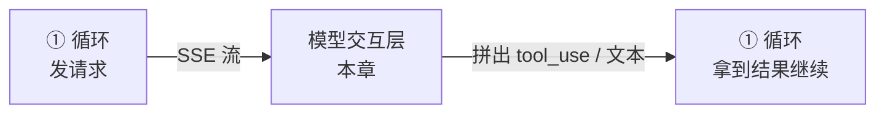
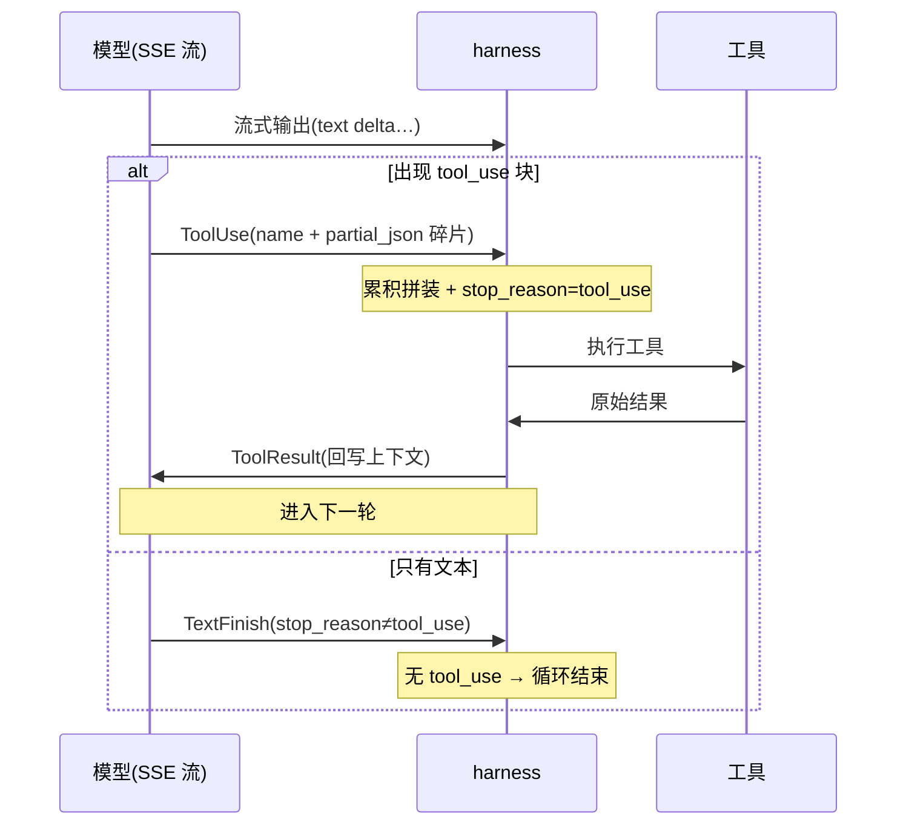
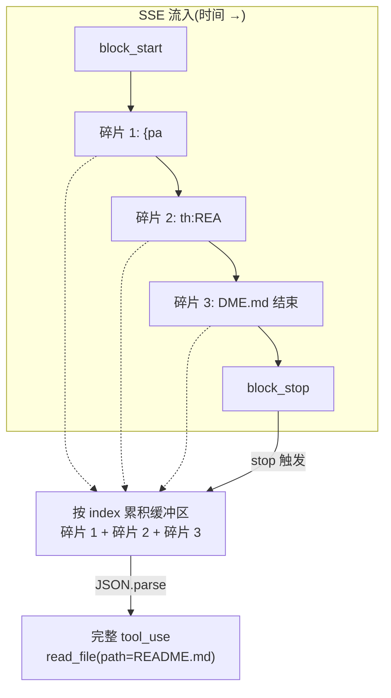

# 流式收流与 tool_use 解析

CH2 的最小循环用的是"等整条响应"的非流式调用——玩具够用,生产不行。真实 harness 全都流式:边接收 token 边解析,一旦某个工具调用完整就立即执行。这一节讲清流式协议怎么收、tool_use 怎么从碎片里拼出来。

## 回到任务

[任务地图](lifecycle.md)第 ④~⑤ 步:"流式调用模型 → 解析出 tool_use"。这是循环每一圈的第一件事。我们那条 `parseDate` 任务里,模型说"我要读文件"这个决定,不是一次性蹦出来的,而是 token 一个个流回来、harness 一边拼一边认出来的。本节就拆这个"拼与认"的过程。

**本章在系统中的位置**



*模型交互层夹在循环的"发请求"和"拿结果"之间:它把模型流式吐出的碎片拼装成完整的 tool_use（或判定为纯文本结束）。它是循环①内部的一段机制，服务于"循环↔模型"这条供数链的下半程（[全景协作图见 intro](intro.md)）。*

## 为什么必须流式

三个理由,缺一不可:

- **体验**:用户要立刻看到字往外冒,而不是盯着空白等 30 秒。
- **并发**:模型可能一轮里要调多个工具。流式让你在第一个工具调用一解析完就开跑,不必等整条消息生成完(3.4 讲)。
- **可中断**:用户按 Ctrl-C,流式能立刻停;非流式已经付了整条的钱。

**代价**

流式的代价是:模型的输出**不再是一个完整 JSON,而是一串碎片(chunk)**。工具调用的名字、参数会被切成好几段陆续到达。harness 必须自己把碎片拼回完整结构——这就是本节的核心难点。

## SSE 事件序列长什么样

主流模型 API(Anthropic/OpenAI 等)用 **SSE(Server-Sent Events)** 推流。你会收到一串带类型的事件,而非一个 JSON。以 Anthropic Messages API 为例,一次带工具调用的响应大致是这样的事件序列:

```text
message_start                      # 消息开始
content_block_start  (index=0, type=text)      # 一个文本块开始
content_block_delta  (text: "我来")            # 文本增量…
content_block_delta  (text: "读一下文件")
content_block_stop   (index=0)
content_block_start  (index=1, type=tool_use, name="read_file", id="tu_1")
content_block_delta  (partial_json: '{"pa')    # 工具参数被切碎!
content_block_delta  (partial_json: 'th":"REA')
content_block_delta  (partial_json: 'DME.md"}')
content_block_stop   (index=1)                  # 这个 tool_use 完整了
message_delta        (stop_reason: "tool_use")
message_stop
```

关键观察:`read_file` 的参数 `{"path":"README.md"}` 被切成了 `'{"pa'` + `'th":"REA'` + `'DME.md"}'` 三段 `partial_json`。**单独任何一段都不是合法 JSON**,必须按 index 累积拼接,直到 `content_block_stop` 才能解析。

### 三种输出形态与时序

从这串事件里，harness 要识别出模型这一轮的**输出形态**。归结起来只有三种，它们决定循环走向:

| 形态 | 谁产生 | 作用 | 在循环里的位置 |
| --- | --- | --- | --- |
| **ToolUse** | 模型 | "我要调某个工具"，含工具名 + 参数 | 一轮的产出，触发工具执行 |
| **ToolResult** | harness | 工具执行结果，回写进上下文 | 夹在两轮之间，喂给下一轮 |
| **TextFinish** | 模型 | 只输出文本、不再要工具 | 循环的自然终点（见 [CH2](ch2-loop-paradigms.md)） |

注意 **ToolResult 永远由 harness 产生**，不来自模型流——它是"执行完 ToolUse 后"harness 塞回去的。而 ToolUse 和 TextFinish 是模型输出的**两种互斥结局**:这一轮要么以 tool_use 收尾（继续循环），要么以纯文本收尾（`stop_reason` 不是 `tool_use`，结束循环）。



*SSE 场景下三态的时序:文本增量先流出；若中途出现 tool_use 块，harness 拼装后执行工具、回写 ToolResult 进下一轮；若整轮只有文本，则 TextFinish 结束循环。判定的依据是 `stop_reason` 与"有无 tool_use 块"。*



*图 3.1-1:工具参数被切成多个 `partial_json` 碎片。harness 按 index 把它们累积进缓冲区,直到 `content_block_stop` 才 `JSON.parse` 成完整工具调用。*

## 增量拼装:从碎片到 tool_use

拼装逻辑的核心是一个"按 index 累积"的状态机。伪代码:

```python
class StreamParser:
    def __init__(self):
        self.blocks = {}       # index -> {type, name, id, buffer}
        self.text = ""

    def feed(self, event):
        if event.type == "content_block_start":
            self.blocks[event.index] = {"type": event.block.type,
                "name": event.block.get("name"), "id": event.block.get("id"),
                "buffer": ""}
        elif event.type == "content_block_delta":
            b = self.blocks[event.index]
            if event.delta.type == "text_delta":
                self.text += event.delta.text            # 实时给 UI
                yield ("text", event.delta.text)
            elif event.delta.type == "input_json_delta":
                b["buffer"] += event.delta.partial_json  # 累积碎片
        elif event.type == "content_block_stop":
            b = self.blocks[event.index]
            if b["type"] == "tool_use":
                args = json.loads(b["buffer"])            # 此刻才合法
                yield ("tool_use", ToolUse(b["name"], b["id"], args))
```

**真实实现**

好消息:Anthropic/OpenAI 官方 SDK 已内置这套累积逻辑,通常你能直接拿到 `stream.text_stream` 和一个"最终组装好的 message"对象,不用手写状态机。**但你必须理解它在做什么**——因为 [3.2](ch3-io-reliability.md) 的缓存、重试都建立在"知道流被切成了什么"之上,而 [CH9](ch9-errors.md) 的错误恢复要处理"流断在半截"的情况。

## 边解析边执行:StreamingToolExecutor

流式最大的红利是**并发**。Claude Code 有一个 `src/services/tools/StreamingToolExecutor.ts`(一个 `class StreamingToolExecutor`),职责就是:一边从流里解析出 tool_use,一边把已完整的工具调用**立即派去执行**,而不是等全部解析完。

回到 `parseDate`:如果模型一轮里说"我要同时读 3 个相关文件",非流式要等 3 个 tool_use 全部生成完才能开始;流式则第 1 个一拼好就开读,3 个可以并发跑。对多工具轮次,这是实打实的提速。

```python
async def stream_and_execute(sse_stream, tools):
    parser = StreamParser()
    pending = []                                  # 正在执行的工具任务
    async for event in sse_stream:
        for kind, payload in parser.feed(event):
            if kind == "text":
                render(payload)                   # UI 实时渲染
            elif kind == "tool_use":
                pending.append(spawn(execute(payload, tools)))  # 立即开跑,不等
    return await gather(pending)                  # 收齐所有工具结果
```

## 本节小结

> **要点**
>
> 1. 生产 harness 必须流式:为体验、并发、可中断。
> 2. 流式的代价:响应变成 SSE **碎片**,工具参数被切成多段 `partial_json`。
> 3. 解析核心:**按 index 累积缓冲,到 `content_block_stop` 才 JSON.parse**。官方 SDK 已内置,但你要懂原理。
> 4. 流式红利是并发:`StreamingToolExecutor` 边解析边把完整工具调用立即派去执行。
> 5. 下一节:调用不总是成功——重试、缓存、token 计数。
