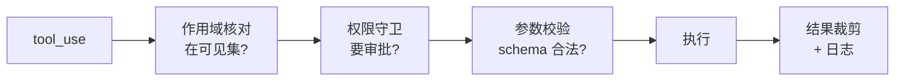

# deepseek 工具管线：作用域注册 + 守卫式执行

Claude Code 把每个工具做成独立目录、护栏散在各处。deepseek-harness 走了另一条路：工具注册进一个"作用域注册表",执行统一走一条"守卫管线"。同样的 ACI 目标,不同的组织哲学。

> **关于本节源码**：deepseek-harness 为开源项目（MIT,`github.com/deepseek-ai/deepseek-harness`）。本节基于其架构文档讲解,代码为教学示意。项目处 developer preview,API 可能变动,以仓库当前版本为准。

> **回到任务**：还是[任务地图](lifecycle.md)第 ⑥/⑦ 步"权限检查 → 执行工具"。上一节看了 Claude Code 怎么组织工具,这一节看同一件事的另一种架构——理解"工具系统还能怎么设计",你才能为自己的场景做对选择。

## 另一种组织方式：一切皆插件

deepseek-harness 的底层理念是 "everything is a plugin"——包括工具。它的工具核心在 `packages/core/tools`,架构文档把它的职责概括为一句话：**"scoped tool registry and guarded execution pipeline"**（作用域工具注册表 + 守卫式执行管线）。

拆开这句话就是本节两个主角：**注册表（工具怎么被登记和发现）** + **守卫管线（工具怎么被安全执行）**。

## scoped registry：工具的作用域

"scoped（作用域）"是关键词。工具不是全局一把梭,而是**按作用域注册和可见**——不同的 agent、不同的上下文,能看到的工具子集不同。

**作用域注册（还原思路,伪代码）：**

```python
# 插件把工具注册到注册表,并声明它属于哪个作用域
registry.register(read_tool,  scope="readonly")
registry.register(write_tool, scope="write")
registry.register(bash_tool,  scope="write")

# 一个只读 agent 只能拿到 readonly 作用域的工具
tools = registry.tools_for(agent_scope="readonly")
# → 只有 read_tool,write/bash 根本不可见
```

> **作用域 vs 事后拒绝**
>
> 注意差别：一个只读 agent**压根看不到**写工具,而不是"看到了但执行时被拒"。这比"先给再拒"更安全、也更省 token（模型不会浪费 token 去尝试一个注定被拒的工具）。这对多 agent 场景（[CH12](ch12-multi-agent.md)）尤其重要——给子 agent 精确的工具子集,是隔离的一部分。

## guarded pipeline：统一的守卫管线

"guarded（守卫）"是第二个关键。工具调用不是直接执行,而是穿过一条**统一的管线**：执行前经过一系列守卫（权限、参数校验、作用域核对）,执行后可能有结果裁剪、日志记录。



*图 4.3-1：守卫式执行管线,每次工具调用统一穿过作用域核对 → 权限 → 参数校验 → 执行 → 结果裁剪。护栏集中在管线,而非散在每个工具内部。*

这与 Claude Code 的 BashTool 护栏是**同一个思想的不同实现**：都要"执行前把关"。区别是——CC 把护栏做进每个工具内部（BashTool 自带 18 个安全文件）,deepseek 把护栏抽成一条所有工具共用的管线。

## 与 Claude Code 对比：专用深度 vs 统一治理

| 维度 | Claude Code（工具各自为政） | deepseek（注册表+管线） |
| --- | --- | --- |
| 护栏位置 | 散在每个工具内部 | 集中在统一管线 |
| 专用深度 | 极强（BashTool 专属 AST 分析） | 受管线通用性约束 |
| 加新工具 | 写一个完整目录 | 注册一个插件即可 |
| 作用域隔离 | 靠工具集配置 | 注册表原生支持 |
| 一致性 | 各工具风格可能不一 | 管线保证统一 |

> **没有绝对优劣**
>
> CC 的"每个工具深度定制"换来极强的专用护栏（BashTool 的命令语义分析很难塞进通用管线）,代价是护栏散落、加工具重。deepseek 的"注册表+管线"换来一致性、易扩展、原生作用域,代价是单个工具难做极致定制。**选哪种,取决于你的工具是"少而深"还是"多而广"。**

## 本节小结

1. deepseek 工具核心 = **scoped registry（作用域注册表）+ guarded pipeline（守卫式执行管线）**。
2. **作用域**：不同 agent 看到不同工具子集,压根看不到 = 比"看到再拒"更安全省 token。
3. **守卫管线**：所有工具共用一条"作用域→权限→校验→执行→裁剪"管线,护栏集中。
4. 与 CC 对比：**专用深度（散落、定制强）vs 统一治理（集中、易扩展）**。
5. 下一节动手时,我们借 registry 思想给 tinyharness 做一个小注册表。
