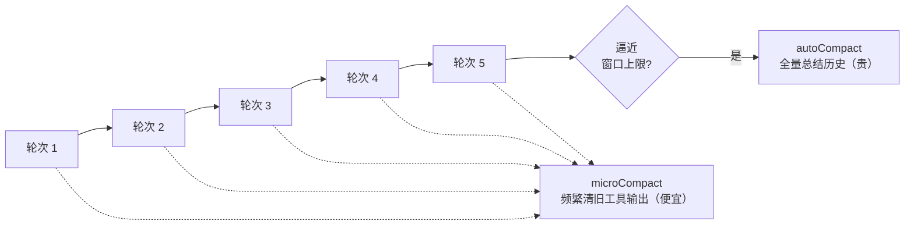
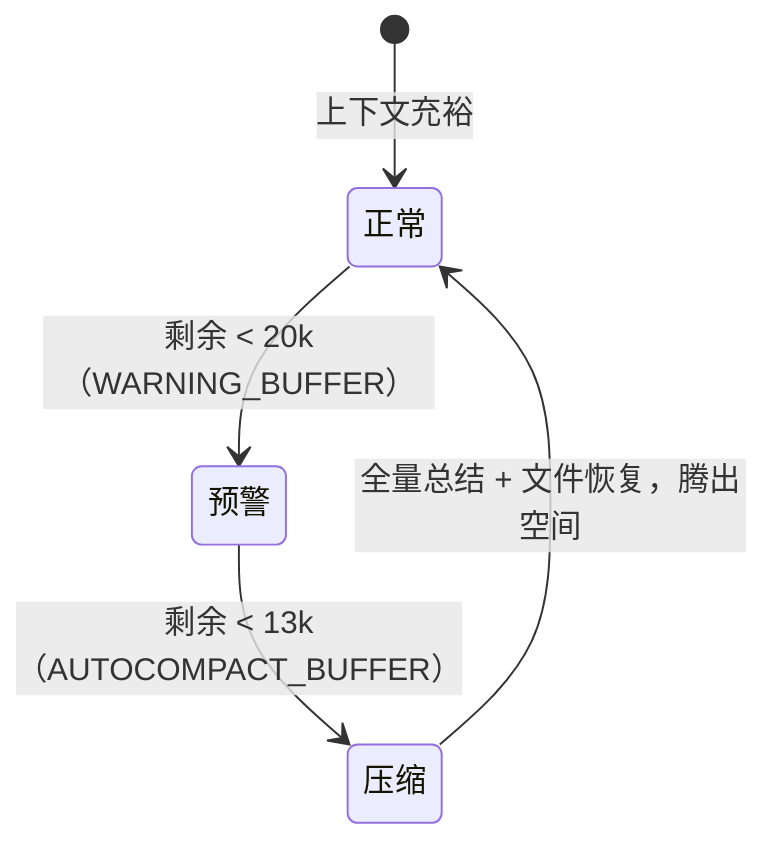

# Claude Code compact 子系统深剖

压缩说起来是"把历史总结成摘要"，但生产级实现远不止一个函数。Claude Code 的 `compact/` 有 11 个子模块，分两级压缩、精确的阈值触发、压缩后还要把关键文件重新拉回来。这是把 5.1 理论落成真实代码的最佳样本。

> **关于本节源码**
> 基于 Claude Code 泄露 source map 还原（来源见[附录 C](appendix.md)）。文中的常量数值（如 buffer token 数）为从源码识别的事实，代码块为原创伪代码示意，不复制真实实现。

> **回到任务**
> [任务地图](lifecycle.md)第 ⑤/⑫ 步"必要时压缩"。`parseDate` 任务跑到十几轮，上下文里堆了源码全文、几屏 pytest 输出。compact 就是在这时悄悄把旧的、已用完的内容压掉，腾出空间让任务继续——而且要小心别把"当前正在修的那个报错"也压没了。

## 11 个子模块全景

`src/services/compact/` 目录，各模块分工：

| 子模块 | 职责 |
| --- | --- |
| `autoCompact.ts` | 自动压缩：算有效窗口、判断何时触发全量压缩 |
| `microCompact.ts` | 微压缩：细粒度清理旧工具输出（代价小、频繁） |
| `apiMicrocompact.ts` | 对接 API 侧的上下文管理能力 |
| `sessionMemoryCompact.ts` | 会话记忆维度的压缩配置 |
| `grouping.ts` | 按 API 轮次给消息分组（压缩的操作单位） |
| `compact.ts` | 压缩主流程 + 压缩后恢复的预算常量 |
| `postCompactCleanup.ts` | 压缩后清理 |
| `prompt.ts` | 生成"请总结以上历史"的压缩提示词 |
| `compactWarningHook.ts` / `State` | 接近阈值时的预警 |
| `timeBasedMCConfig.ts` | 基于时间的微压缩配置 |

> **一眼看懂设计**
> 光看这个清单就能读出设计哲学：压缩不是"满了才一刀切"，而是**分级（auto/micro）、有预警（warning）、有操作单位（grouping 按轮分组）、压完还要善后（cleanup + 恢复）**。你的 tinyharness 先实现最简单的 autoCompact 即可，但要知道生产级长这样。

## 两级压缩：auto 与 micro

核心是两级，代价与频率不同：

- **microCompact（微压缩）**：频繁、代价小。针对性清掉**旧的、已经用完的工具输出**——比如三轮前读的文件全文，现在早用不上了，用一个占位符（源码里有 `[Old tool result content cleared]` 一类的标记）替换掉内容，保留"这里曾读过某文件"的骨架。
- **autoCompact（全量压缩）**：当上下文逼近窗口上限，做一次大的：把大段历史交给模型总结成摘要，替换原文。代价大（要多调一次模型），但能腾出大空间。



*图 5.3-1：microCompact 频繁做细粒度清理（便宜），autoCompact 在逼近窗口时做一次全量总结（贵）。分级让压缩既及时又不过度。*

## 阈值与触发：留多少缓冲

autoCompact 不是等真的满了才压——那太晚。它**提前留缓冲**。从 `autoCompact.ts` 能看到关键常量：

- `AUTOCOMPACT_BUFFER_TOKENS = 13_000`：距窗口上限还剩约 13k token 时就触发压缩，不等真满。
- `WARNING_THRESHOLD_BUFFER_TOKENS = 20_000`：还剩 20k 时就开始预警（compactWarningHook）。
- `getEffectiveContextWindowSize(model)`：不同模型窗口不同，动态取有效大小。

触发判断（伪代码，还原 autoCompact 思路）：

```python
def should_autocompact(used_tokens, model):
    window = get_effective_context_window(model)
    if used_tokens > window - WARNING_BUFFER:   # 剩 20k：预警
        emit_warning()
    if used_tokens > window - AUTOCOMPACT_BUFFER:  # 剩 13k：压缩
        return True
    return False
```

上下文占用随对话增长，会依次跨过两条阈值线：



*图 5.3-2：占用越过 20k 缓冲线先预警，越过 13k 缓冲线触发全量压缩，压缩后回到正常区间。*

> **为什么留缓冲而不是压到满**
> 因为压缩本身要调模型、要生成摘要，这也消耗 token。如果等到真满才压，可能连"做压缩这次请求"都放不下了。**提前 13k 触发，是给压缩操作本身留出工作空间**。这是个容易踩的坑——你的 tinyharness 设阈值时别设成"满了才压"，要留余量。

## 保留什么：压缩后的文件恢复

压缩最难的不是"压掉什么"，而是"**别把还需要的东西压没了**"。Claude Code 有一个巧妙设计：压缩后主动把关键文件**重新拉回来**。`compact.ts` 里能看到这组预算常量：

- `POST_COMPACT_MAX_FILES_TO_RESTORE = 5`：压缩后最多恢复 5 个文件
- `POST_COMPACT_TOKEN_BUDGET = 50_000`：恢复内容总预算 50k token
- `POST_COMPACT_MAX_TOKENS_PER_FILE = 5_000`：单个文件最多恢复 5k token

> **这个设计的精妙**
> 压缩把历史总结成摘要后，agent 正在编辑的那几个文件的**全文**就丢了（只剩摘要里一句"改了 test_parse.py"）。但下一步 agent 很可能还要接着改它！所以压缩后，harness 在预算内（5 文件/50k）把**最近最相关的文件重新读回上下文**。
> 这解决了压缩的核心矛盾：**既要腾空间（压掉旧的），又不能丢掉正在用的（恢复关键的）**。这就是 5.1 说的"哪些高信号必须留"的工程答案——不是靠猜，而是靠"压完再把最相关的拉回来"。

另外源码里对 **thinking block（模型推理块）** 的保留也有专门处理——某些内容在压缩时要特殊对待，不能无脑丢。这些细节合起来，就是"压缩不是无脑截断"的真正含义。

## 本节小结

1. compact 是 11 个子模块的子系统，不是一个函数：**分级、预警、按轮分组、善后、恢复**。
2. **两级压缩**：microCompact（频繁清旧工具输出，便宜）+ autoCompact（逼近窗口全量总结，贵）。
3. **提前留缓冲**（距上限 13k 触发压缩、20k 预警），给压缩操作本身留工作空间。
4. **压缩后恢复**（最多 5 文件/50k 预算）：解决"腾空间 vs 别丢正在用的"矛盾，是"保留什么"的工程答案。
5. 下一节动手：给 tinyharness 加最小可用的阈值压缩 + 外部记忆。
