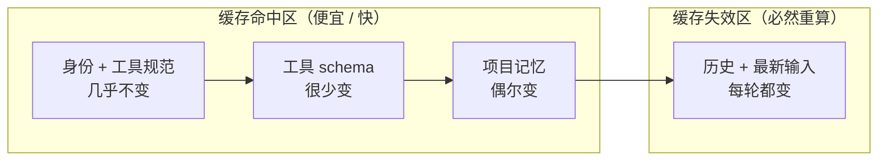

# system prompt 组装

你的 tinyharness 每轮发给模型的到底是什么？不只是用户那句话。system prompt、工具 schema、项目记忆、历史——它们怎么拼、按什么顺序拼，直接决定 agent 行为和缓存命中率。这一节拆开这个"组装"过程。

> **回到任务**
> [任务地图](lifecycle.md)第 ②/③ 步"加载记忆 → 组装 system prompt"。`parseDate` 任务开始前，harness 要先告诉模型：你是谁、有哪些工具、这个项目的约定（用 pytest、测试放哪）。这些信息怎么组织，是模型能否正确开工的前提。

## 喂给模型的到底是什么

CH2 的 tinyharness 太天真——它只发 `[{"role":"user","content":任务}]`。真实 harness 每次请求发的是一个精心组装的结构：

```text
request = {
  system: [                        # ← system prompt，由多段拼成
    身份与总体指令,
    环境信息（OS/cwd/日期）,
    工具使用规范,
    项目记忆（AGENTS.md/CLAUDE.md）,
    ...
  ],
  tools: [全部工具的 schema],        # ← 模型据此知道能调什么
  messages: [历史对话 + 最新输入],    # ← 变动的部分
}
```

"组装"就是把这些来源不同、变动频率不同的信息，拼成一个结构、按对的顺序排好。

## 分段组装：systemPromptSections

Claude Code 把 system prompt 拆成一个个**段（section）**来管理。`src/constants/systemPromptSections.ts` 定义各段，`src/utils/systemPrompt.ts` 的 `buildEffectiveSystemPrompt(...)` 负责把它们拼成最终的 system prompt。

> **为什么分段**
> 分段的好处：① **可条件组装**——有些段只在特定模式/环境下加入（如 plan 模式加特定指令）。② **可复用与测试**——每段独立，好维护。③ **可控顺序**——这是下一节缓存的关键。你的 tinyharness 可以先做个最简单的：把身份、工具规范、项目记忆各写成一个字符串常量，按序拼接。

分段组装（伪代码，还原 `buildEffectiveSystemPrompt` 思路）：

```python
def build_system_prompt(ctx):
    sections = []
    sections.append(IDENTITY_SECTION)              # 稳定
    sections.append(TOOL_USAGE_SECTION)            # 稳定
    if ctx.plan_mode:
        sections.append(PLAN_MODE_SECTION)         # 条件
    sections.append(env_section(ctx.os, ctx.cwd, ctx.date))  # 半稳定
    sections.append(load_project_memory(ctx.cwd))  # 项目记忆，见下
    return "\n\n".join(sections)
```

## 顺序即缓存：稳定的放前面

这是 5.1 KV-cache 友好性的直接落地。system prompt 各段的**排列顺序**不是随意的——它决定缓存命中率。按变动频率从前到后排列：



*图 5.2-1：按变动频率从左到右排列。稳定的身份/工具规范/schema 在前吃满缓存，每轮变动的历史与输入在后。这样缓存前缀最长、命中率最高。*

> **一个真实陷阱**
> 如果你把"当前时间"放进 system prompt 开头，**每一轮缓存全失效**——因为前缀每秒都在变。正确做法：要么不放，要么放到最后（变动区）。这个细节能让长会话的成本差好几倍。你的 tinyharness 组装 system prompt 时，务必按"稳定→变动"排序。

## AGENTS.md：项目记忆怎么加载

"项目记忆"这一段，内容来自项目里的 `AGENTS.md` / `CLAUDE.md` 文件——这是 5.1"外部记忆"技法的产品化形态，也是**事实标准**（五案例几乎全支持）。

- **分层加载**：系统级 → 用户级（`~/.claude/`）→ 项目级（仓库根），逐层合并。
- **作用**：把"应该始终知道的项目约定"（用什么测试框架、代码风格、禁做什么）沉淀到文件，而非每次对话重讲。
- 回到 `parseDate`：agent 之所以知道"用 pytest、测试放 tests/"，就是因为项目 AGENTS.md 里写了，组装时被加载进 system prompt。

> **给 tinyharness 加记忆**
> 最简单的实现：启动时读一下当前目录的 `AGENTS.md`（存在的话），塞进 system prompt 的项目记忆段。就这么简单，你的 agent 立刻"懂规矩"了。

**管理策略：加载不是越多越好**

"分层加载"听起来简单，但真用起来有两个绕不开的取舍——它们决定记忆是帮手还是负担。

**取舍一：记忆越多，注意力越稀释。** 记忆段占的每一个 token，都在挤占任务本身的上下文预算，也在稀释模型的注意力（呼应 5.1"上下文会腐烂"）。所以记忆该收**稳定、高频命中的项目级约定**（测试框架、代码风格、禁做的事），而不是把整份设计文档、长篇背景倒进去。一个实用判据：

> **该进记忆 vs 该进消息**
>
> 一条信息，如果**每个任务都用得上**（如"本项目用 pytest"）→ 进记忆段。如果只服务**当前这一次任务**（如"这次帮我改 parseDate"）→ 走消息/临时上下文。分不清这条线，记忆只会越堆越臃肿，既费预算又拖累准确率。

**取舍二：多层冲突怎么合并。** 系统级、用户级、项目级三层都可能对同一件事有规定。主流做法是**就近覆盖**——越靠近 cwd 的层级优先级越高（项目级压用户级、用户级压系统级），像 CSS 层叠。这样团队共享的项目 `AGENTS.md` 能被个人的本地偏好在无害范围内微调，同时保证项目硬约定不被随意推翻。

## 本节小结

1. 每次请求 = **system（多段）+ tools schema + messages**，不只是用户那句话。
2. Claude Code 用 **分段（sections）+ buildEffectiveSystemPrompt** 组装，好处是可条件组装、可复用、可控顺序。
3. **顺序即缓存**：按变动频率"稳定→变动"排列，缓存前缀最长、命中最高。时间戳放开头是大忌。
4. **AGENTS.md** 分层加载，是"外部记忆"的产品化标准形态。
5. 下一节：当历史还是涨到快爆时，compact 子系统怎么压。
