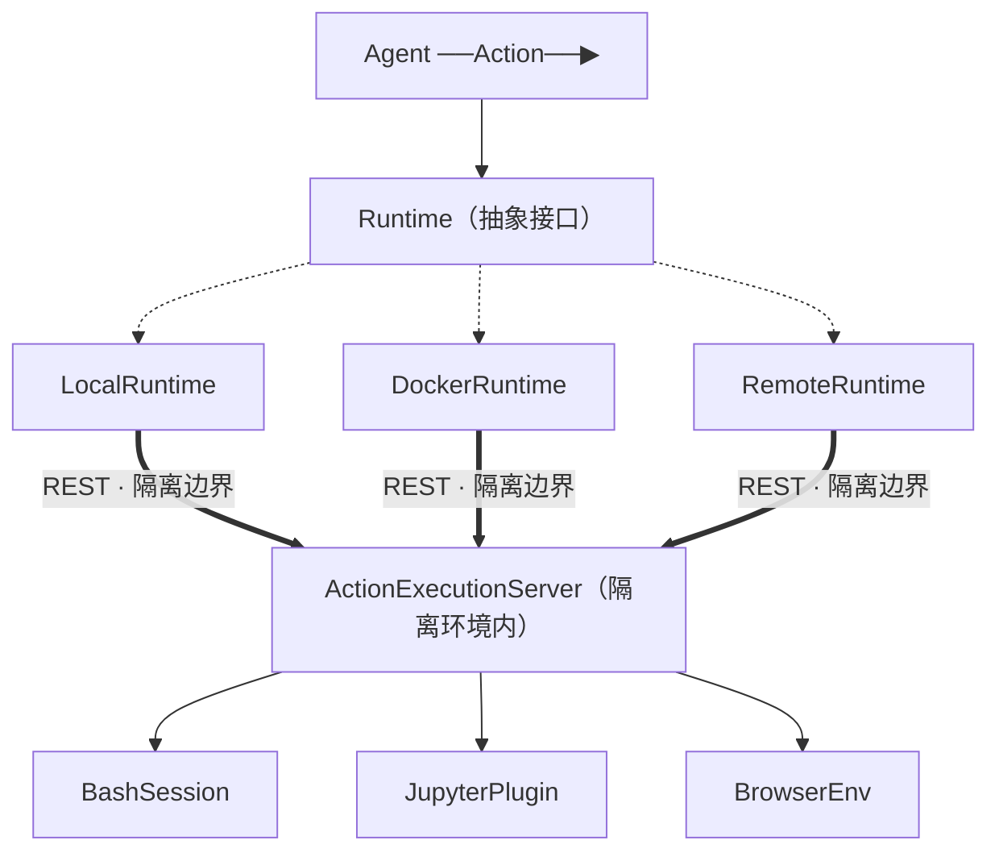

# OpenHands Runtime 分层深剖

OpenHands 把 7.1 的 Runtime 抽象做成了教科书级实现：一个抽象接口，派生 Local/Docker/Remote 三种后端，全都通过统一的 REST 边界连到隔离环境内的执行服务。换后端对 agent 侧零改动。

> **关于本节**：OpenHands 为开源项目（MIT）。本节基于其公开架构讲解，代码为教学示意，具体以仓库当前版本为准（[附录 B](appendix.md) 有导航）。

> **回到任务**：接 CH2.3——OpenHands 用事件驱动循环，Agent 产 Action、Runtime 产 Observation。那个"Runtime"具体怎么执行 `parseDate` 任务里的 `pytest`？本节拆开它：Action 如何跨过隔离边界、在容器里跑、把结果送回来。

## 分层全景

接上 CH2.3 的事件驱动：Agent 把 Action 交给 Runtime，Runtime 负责真正执行。它的分层是：



*图 7.2-1：Runtime 抽象接口派生 Local/Docker/Remote，全部经统一 REST 边界连到隔离环境内的 ActionExecutionServer，再分发到 Bash/Jupyter/Browser。*

## 关键设计：统一 REST 边界

最妙的地方：无论哪种 Runtime，都通过**同一个 REST 接口**连到隔离环境内的执行服务。这道 REST 边界就是"隔离线"——线内（执行）和线外（agent 主逻辑）可以是不同进程、甚至不同机器。

- **LocalRuntime**：执行服务跑在本地（弱隔离，快）。
- **DockerRuntime**：执行服务跑在容器里，主进程经 REST 通信（强隔离）。
- **RemoteRuntime**：执行服务跑在远程机器（强隔离 + 可扩展）。

三者对 agent 侧长得一模一样——都是"往 REST 发 Action，收回 Observation"。

## ActionExecutionServer：隔离环境内的执行者

这是跑在隔离环境**内部**的一个服务。它接收 Action，分发到具体执行器，返回 Observation：

- **BashSession**：执行 shell 命令（`pytest` 在这里跑）。
- **JupyterPlugin**：执行 Python 代码（有状态的 notebook 内核）。
- **BrowserEnv**：浏览器操作。

```python
# Runtime 抽象与两个实现（教学示意）
class Runtime:                          # 抽象接口
    def execute(self, action) -> Observation: ...

class DockerRuntime(Runtime):
    def execute(self, action):
        # 往容器里的 ActionExecutionServer 发 REST 请求
        return http_post(self.container_url + "/execute", action.to_json())

class LocalRuntime(Runtime):
    def execute(self, action):
        return http_post("http://localhost:PORT/execute", action.to_json())

# agent 循环完全不关心是哪个：
obs = runtime.execute(action)          # runtime 可以是任意一种
```

## 威力：换后端零改动 + 与事件流的契合

**两个漂亮之处**：

1. **换后端零改动**：开发时用 LocalRuntime（快），跑不可信代码用 DockerRuntime，规模化用 RemoteRuntime——agent 循环一行不改。这就是 7.1 说的依赖倒置的回报。
2. **与事件驱动天然契合**：回忆 CH2.3，OpenHands 的 Action/Observation 本就是可序列化对象。它们能**跨 REST 边界传输**正是因为可序列化——事件流（CH2.3）和 Runtime 抽象（本节）是同一套设计哲学的两面：把一切变成可传输的数据，组件就能解耦、分布。

这解释了为什么 OpenHands 能做"云端跑、断连续跑、审计回放"——Runtime 的 REST 隔离 + 事件流的可序列化，合起来支撑了自主平台的全部高级能力。

## 本节小结

1. OpenHands：**Runtime 抽象接口 → Local/Docker/Remote 三派生 → 统一 REST 边界 → ActionExecutionServer → Bash/Jupyter/Browser**。
2. **REST 边界即隔离线**：线内执行、线外主逻辑可跨进程/机器。
3. 三后端对 agent 侧一模一样，**换后端零改动**。
4. 与事件流**同一哲学**：把一切变可序列化数据 → 组件解耦、可分布。
5. 下一节看 multica 的"向外隔离"和 SWE-bench 的分层镜像，并给 tinyharness 做可插拔 runtime。
