# Mermaid时序图控制语法完全指南

时序图（Sequence Diagram）是Mermaid中用于展示对象间交互顺序的核心图表类型，而控制语法则是实现复杂流程逻辑（如分支、循环、并行等）的关键。本文将详细介绍Mermaid时序图的5类核心控制块语法，每类均配套易于理解的典型业务场景案例，帮助快速掌握并应用于实际开发文档中。

## 一、基础概念铺垫

在学习控制语法前，先明确时序图的2个基础要素，确保案例可直接运行：

- **参与者（Participant）**：交互的对象，可用`participant`定义（普通对象）或`actor`定义（用户角色），支持别名简化表述。

- **消息流向**：用`->>`表示同步消息（实线带箭头），`-->>`表示异步消息（虚线带箭头），是交互的基础载体。

所有控制块均遵循“**起始关键字+逻辑描述+内容块+end结束**”的统一结构，可嵌套使用实现复杂逻辑。

## 二、核心控制块语法详解

### 1. 抉择控制：alt（条件分支）

**作用**：实现“二选一”或“多选一”的条件分支逻辑，类似编程语言中的`if-else`，适用于存在明确分支条件的交互场景。

#### 语法格式

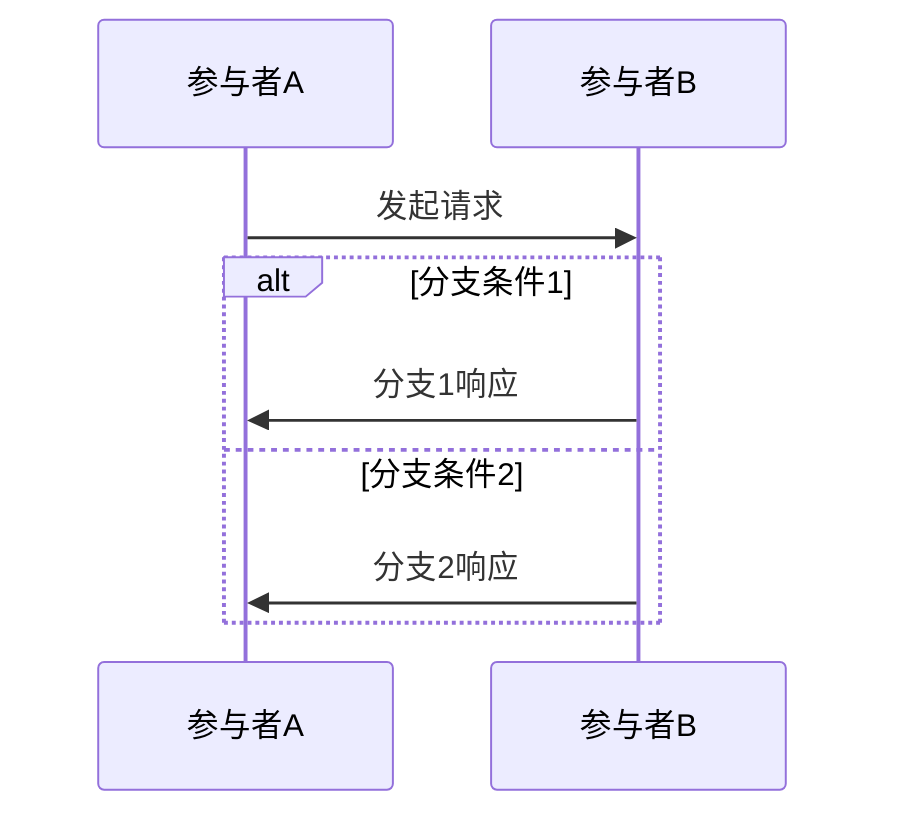

#### 典型案例：用户登录验证

场景：用户输入账号密码后，系统验证凭证有效性，分“验证通过”和“验证失败”两个分支，是最经典的条件交互场景。

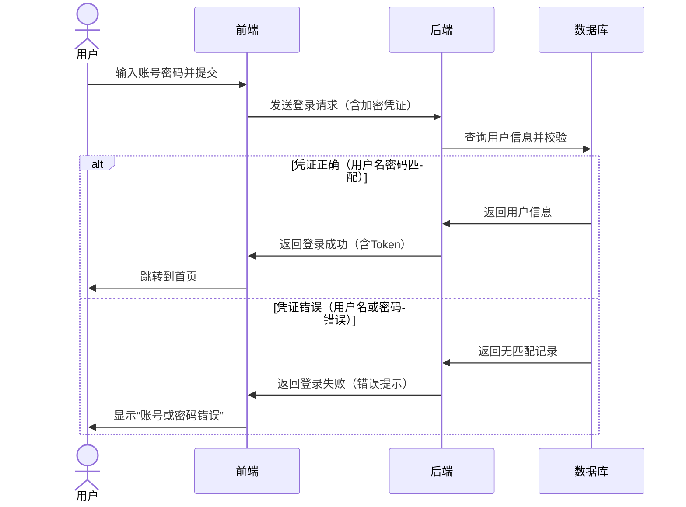

#### 案例解析

- 分支触发条件：数据库校验凭证的结果，是客观且明确的判断依据。

- 交互完整性：每个分支都包含“请求-处理-响应”的完整链路，符合实际业务流程。

- 语法关键点：`alt`后需标注分支条件，多个分支用`else`分隔，最终用`end`闭合。

### 2. 循环控制：loop（重复执行）

**作用**：实现“满足条件时重复执行”的逻辑，类似`while`循环，适用于定时任务、重试机制等场景。

#### 语法格式

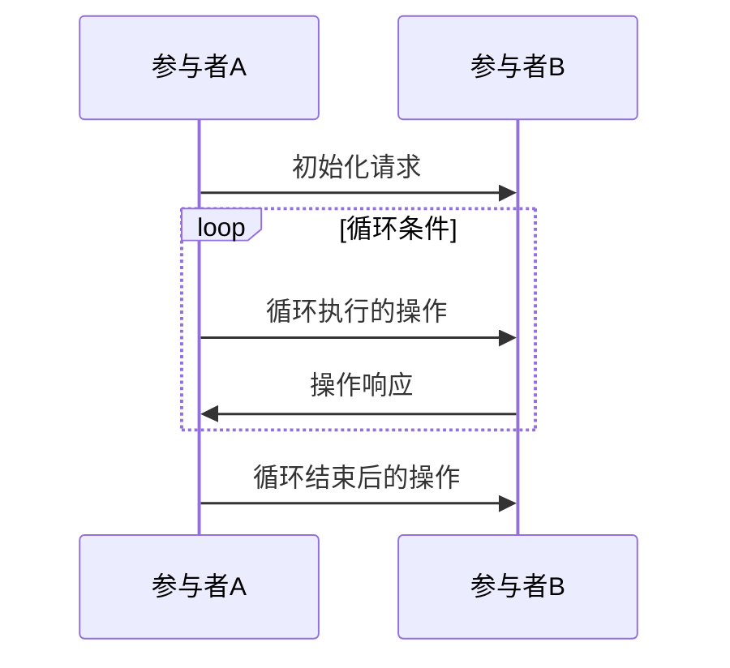

#### 典型案例：消息重试机制

场景：系统发送消息后未收到响应，触发重试逻辑，最多重试3次，超过则提示失败，是分布式系统中常见的可靠性保障场景。

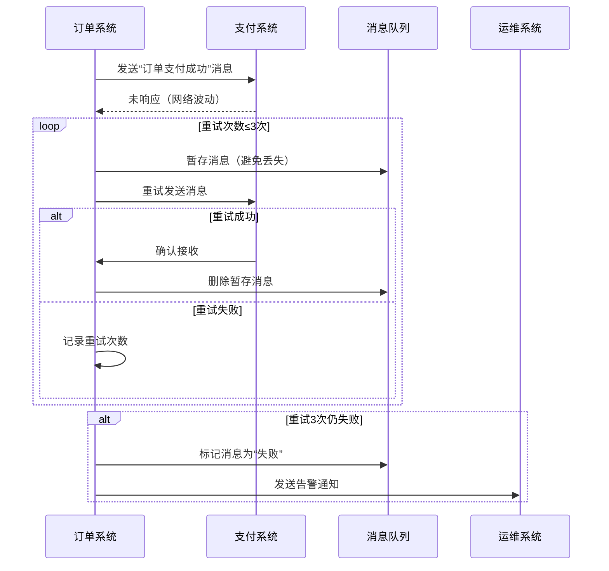

#### 案例解析

- 循环条件明确：以“重试次数≤3次”为终止条件，符合实际业务中的重试策略。

- 嵌套使用：循环内部嵌套`alt`分支判断重试结果，并用`break`实现“成功即退出循环”的逻辑。

- 语法关键点：`loop`后需标注循环条件，循环体内容需完整，用`end`闭合。

### 3. 可选控制：opt（条件执行）

**作用**：实现“满足条件时执行，不满足则跳过”的逻辑，类似单分支`if`，适用于非必需的附加操作场景。

#### 语法格式

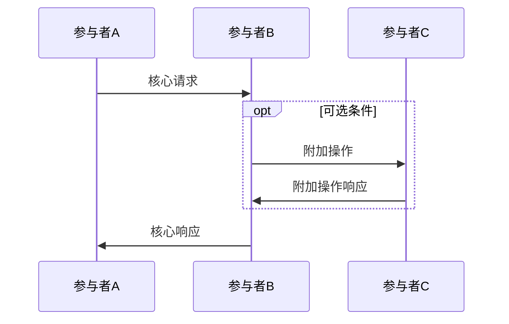

#### 典型案例：订单支付附加优惠

场景：用户支付订单时，若持有优惠券则自动抵扣，无优惠券则直接支付，优惠券抵扣为可选操作，不影响核心支付流程。

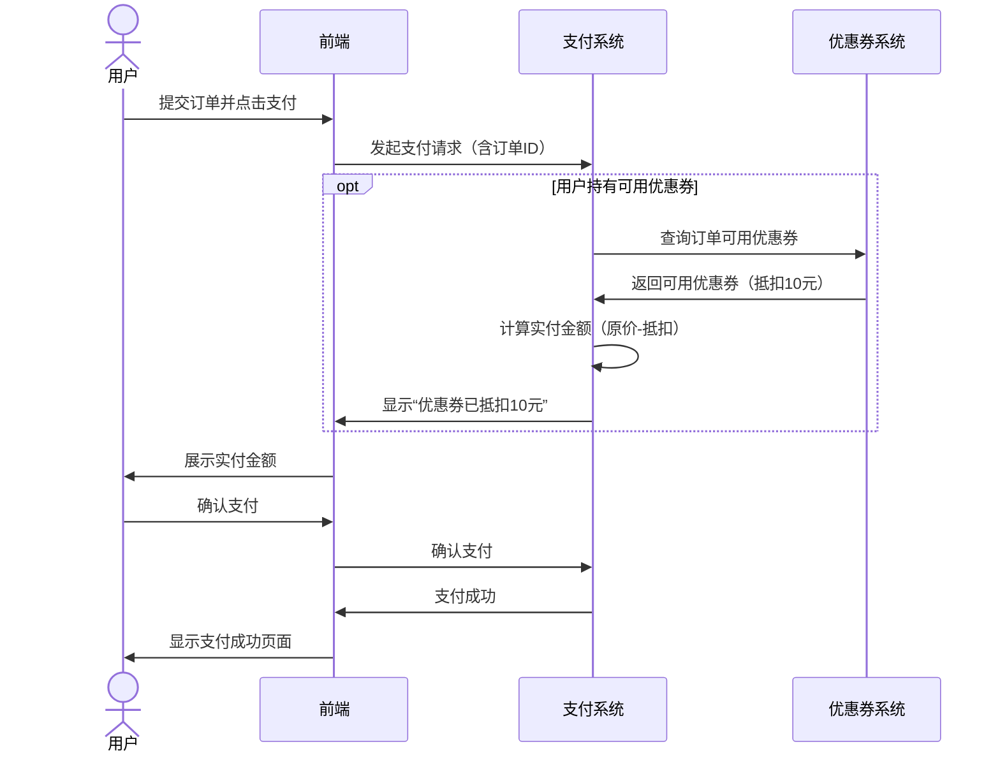

#### 案例解析

- 可选性体现：无优惠券时直接跳过优惠券查询流程，不影响核心的支付链路。

- 业务合理性：附加操作（优惠券抵扣）与核心操作（支付）相关联，符合用户实际使用场景。

- 语法关键点：`opt`后标注触发条件，仅当条件满足时执行内部逻辑，用`end`闭合。

### 4. 并行控制：par（同时执行）

**作用**：实现“多个操作同时执行，全部完成后再继续”的逻辑，适用于多模块协同处理的场景。

#### 语法格式

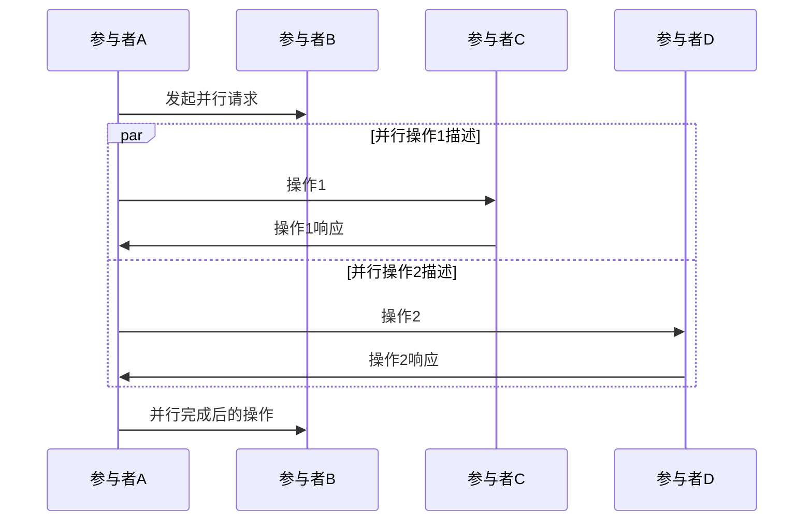

#### 典型案例：APP初始化加载

场景：用户打开APP后，系统同时加载“用户信息”“首页推荐”“消息通知”三个模块，全部加载完成后显示首页，是提升APP启动体验的常见优化场景。

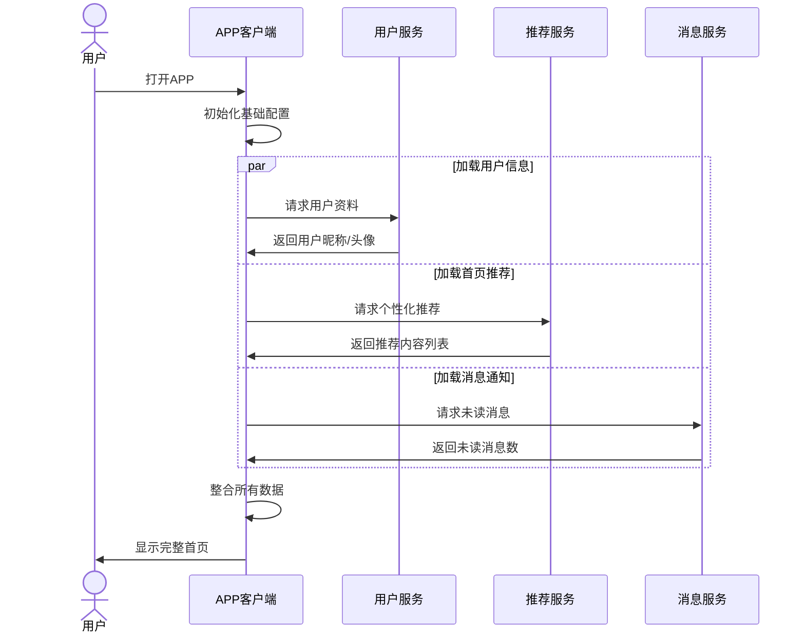

#### 案例解析

- 并行合理性：三个加载操作相互独立，无依赖关系，适合并行执行以缩短总耗时。

- 同步点清晰：用`end`标记并行操作的结束，确保所有模块加载完成后再展示首页。

- 语法关键点：多个并行操作用`and`分隔，每个操作块可包含完整的交互链路。

### 5. 临界控制：critical（独占执行）

**作用**：实现“资源竞争场景下独占执行”的逻辑，确保同一时间只有一个操作能访问临界资源，适用于库存扣减、余额修改等场景。

#### 语法格式

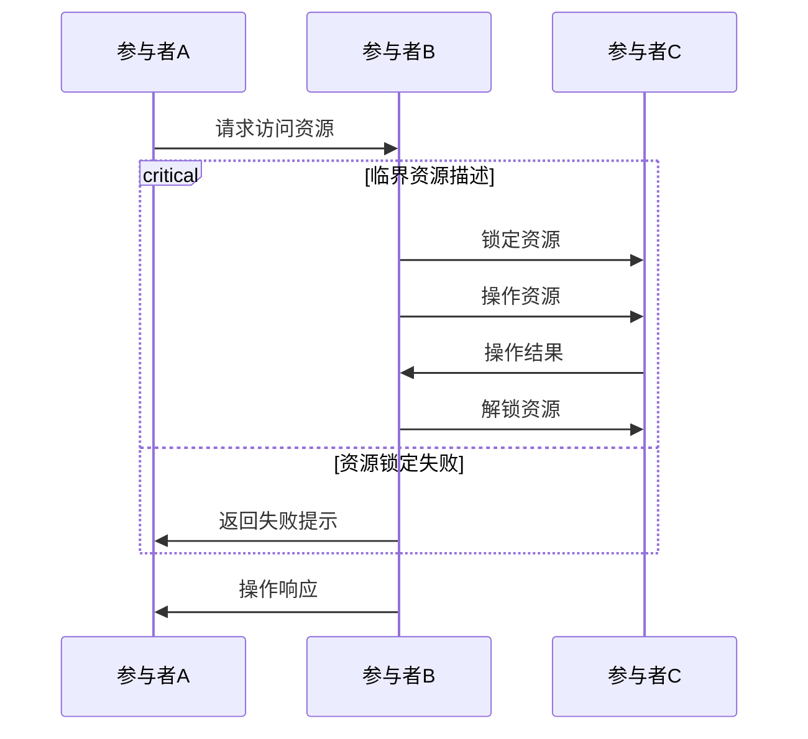

#### 典型案例：商品库存扣减

场景：双11期间多个用户同时抢购同一商品，需确保库存不超卖，核心是保证库存扣减操作的原子性，是电商系统中的核心并发场景。

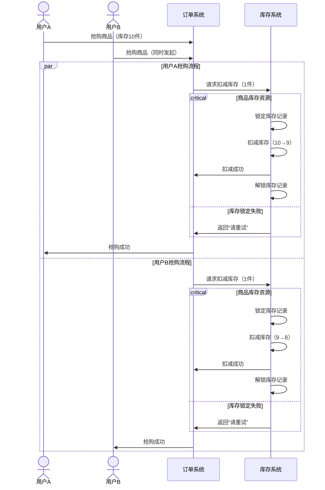

#### 案例解析

临界资源明确：以“商品库存记录”作为临界资源，锁定后其他请求需等待解锁，避免超卖。失败处理：通过`option`定义锁定失败的降级策略（提示重试），增强系统稳定性。语法关键点：`critical`后标注临界资源，内部包含“锁定-操作-解锁”的原子化流程。

## 三、控制块嵌套使用规则

实际业务场景往往需要多控制逻辑组合，嵌套使用需遵循“内层控制块完全包含于外层控制块”的原则，以下为常见嵌套场景示例：

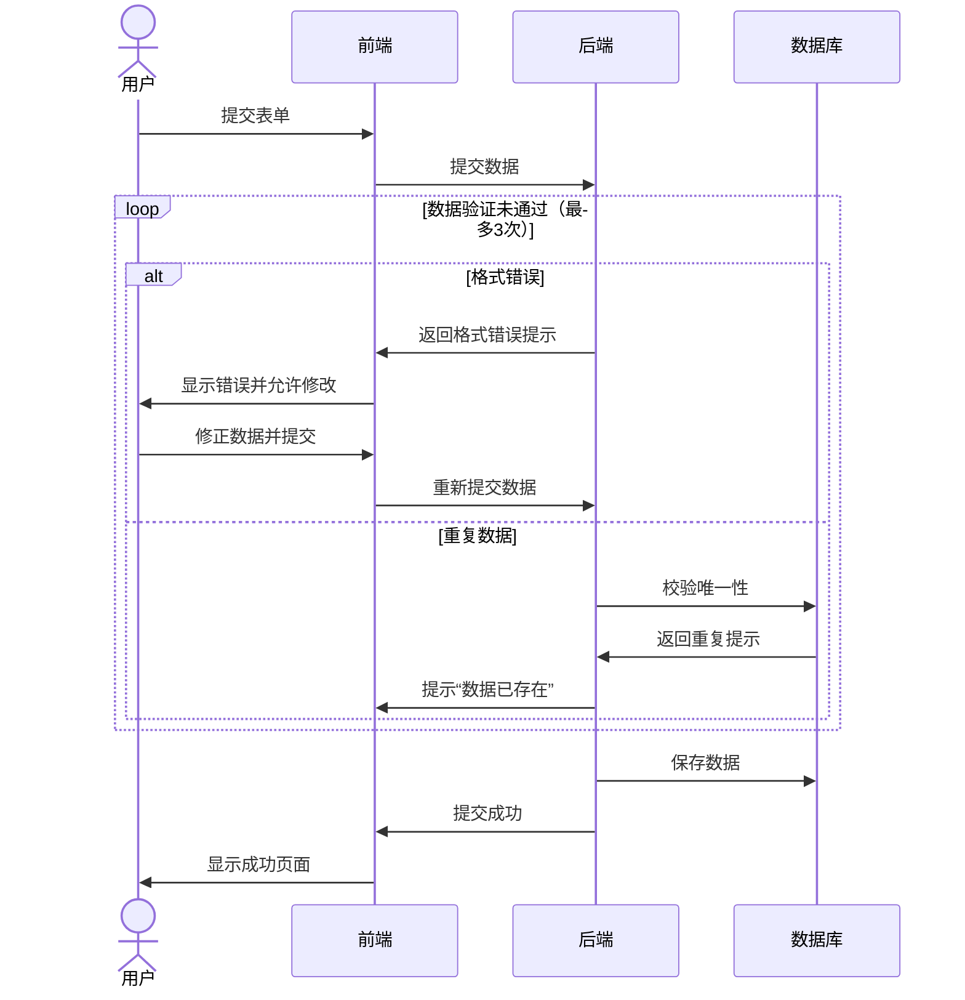

## 四、语法速查表

|控制块类型|核心关键字|核心作用|典型场景|
|---|---|---|---|
|抉择控制|alt + else + end|多条件分支|登录验证、权限判断|
|循环控制|loop + end|重复执行|消息重试、定时任务|
|可选控制|opt + end|条件执行（单分支）|优惠券抵扣、附加服务|
|并行控制|par + and + end|多操作同时执行|APP初始化、多模块查询|
|临界控制|critical + option + end|独占访问资源|库存扣减、余额修改|
## 五、工具推荐与验证方法

- **在线编辑器**：Mermaid Live Editor（[https://mermaid.live/](https://mermaid.live/)），支持实时编写和渲染，语法错误会自动提示。

- **IDE插件**：VS Code安装“Markdown Preview Mermaid Support”插件，可在Markdown文档中预览时序图。

- **验证技巧**：复杂逻辑建议先拆解为单个控制块验证，再逐步嵌套组合，避免因嵌套层级过多导致语法错误。